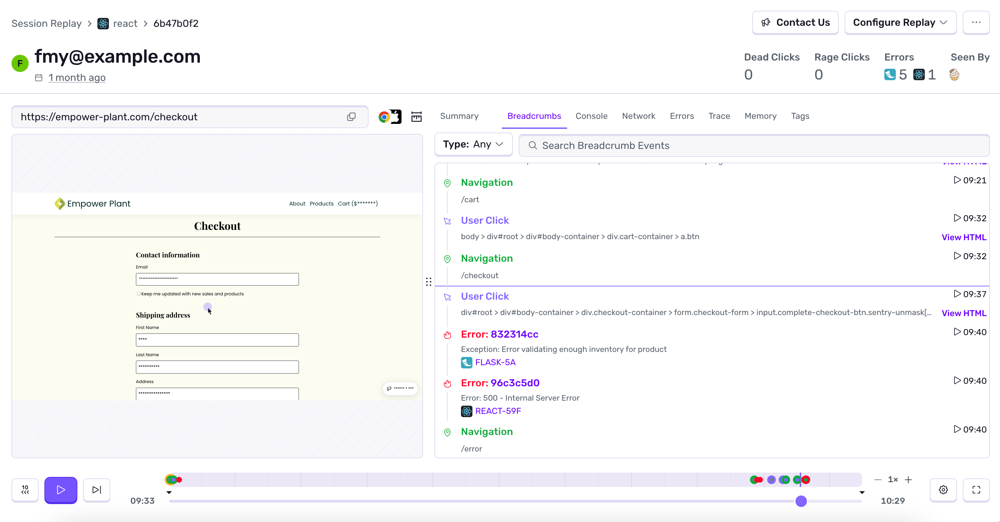
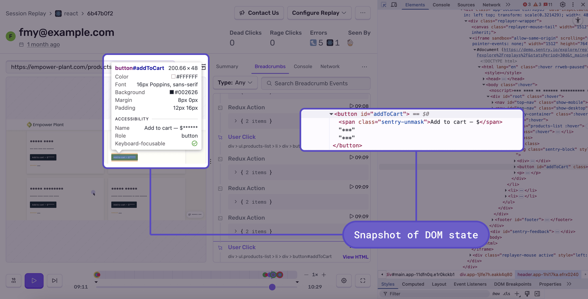

Session Replay allows you to see video-like reproductions of user sessions which can help you understand what happened before, during, and after an error or performance issue occurred. You'll be able to gain deeper debugging context into issues so that you can reproduce and resolve problems faster without the guesswork. As you play back each session, you'll be able to see every user interaction in relation to network requests, DOM events, and console messages. It’s effectively like having [DevTools](https://developer.chrome.com/docs/devtools/overview/) active in your production user sessions. 

Session Replay for web now includes an AI-powered replay summary that automatically analyzes what happened during a user session, and gives a short play-by-play to help debug issues faster. Rather than watch an entire replay, you can now get a quick overview of what happened and focus on the specific interactions that led to the issue. **Note: This feature is currently in Beta, which means that this feature is still in-progress and may have bugs. We recognize the irony.**

Replays are integrated with other parts of the Sentry product so you can see how the user experience is impacted by errors and slow transactions. You'll see session replays associated with error events on the [Issue Details](/product/issues/issue-details/) page, and those associated with slow transactions on the [Transaction Summary](/product/insights/overview/transaction-summary/) page. For [backend error replays](/product/explore/session-replay/web/getting-started/#replays-for-backend-errors), any contributing backend errors will be included in the replay's timeline, [breadcrumbs](https://docs.sentry.io/product/issues/issue-details/breadcrumbs/), and errors.



## What is Session Replay?

A session replay is **not** a video recording. It’s a video-like reproduction of a user session, built using the [rrweb recording library](https://www.rrweb.io/). Replays are created from snapshots of your web application’s DOM state (the browser’s in-memory representation of HTML). When each snapshot is played back, you'll see a video-like recording of what the user did throughout their entire session. The user session includes any pageloads, refreshes, and navigations that happened while the user was on your site.



The start of a session replay recording can be triggered by:

- A user session being part of a sampling rate, as controlled by [`replaysSessionSampleRate`](/platforms/javascript/session-replay/#sampling). (When a user loads a page, a decision is made whether to sample it or not.)
- An error occurring during a session that’s not being recorded. The session is then recorded based on [`replaysOnErrorSampleRate`](/platforms/javascript/session-replay/#sampling).
- Manually calling the [`replay.start()`](/platforms/javascript/session-replay/understanding-sessions/#manually-starting-replay) method.

The end of a session replay recording can be triggered by:

- User inactivity within the tab or page that’s being recorded. (It's considered inactivity when a user doesn’t click or navigate around the site for more than 15 minutes. Mouse scrolls, mouse movements, and keyboard events don’t currently qualify as activity.)
- User closing the tab or page that's being recorded.
- A recording reaching the maximum replay duration limit. (Currently, this is 60 minutes.)
- Manually calling the [`replay.stop()`](/platforms/javascript/session-replay/understanding-sessions/#manually-stopping-replay) method.

<Alert>

Unlike [sessions](/product/releases/health/#session) on the **Releases** page, user sessions in Session Replay can span multiple page loads.

</Alert>

## Supported SDKs

Session Replay supports all browser-based applications.
This includes static websites, single-page aplications, and also server-side-rendered. This includes frameworks such as:
[Django](/platforms/python/integrations/django/),
[Spring](/platforms/java/guides/spring-boot/),
[ASP.NET](/platforms/dotnet/guides/aspnetcore/),
[Laravel](/platforms/php/guides/laravel/),
[Express](/platforms/javascript/guides/express/) and
[Rails](/platforms/ruby/guides/rails/).
If you don't use `npm` or `yarn`, you can use [our Loader `script` tag](/platforms/javascript/install/loader/) on your main HTML template.

The Sentry SDK that records the replay runs on the client's browser, and it’s built-in to `@sentry/browser` and our browser framework SDKs:

- [Vanilla JavaScript](/platforms/javascript/session-replay/)
- [Angular](/platforms/javascript/guides/angular/session-replay/)
- [Astro](/platforms/javascript/guides/astro/session-replay/)
- [Capacitor](/platforms/javascript/guides/capacitor/session-replay/)
- [Electron](/platforms/javascript/guides/electron/session-replay/)
- [Ember](/platforms/javascript/guides/ember/session-replay/)
- [Gatsby](/platforms/javascript/guides/gatsby/session-replay/)
- [Next.js](/platforms/javascript/guides/nextjs/session-replay/)
- [React](/platforms/javascript/guides/react/session-replay/)
- [Remix](/platforms/javascript/guides/remix/session-replay/)
- [Svelte](/platforms/javascript/guides/svelte/session-replay/)
- [SvelteKit](/platforms/javascript/guides/sveltekit/session-replay/)
- [Vue](/platforms/javascript/guides/vue/session-replay/)

<Include name="session-replay-for-backend-errors.mdx" />

Make sure you've set up [trace propagation](/product/sentry-basics/concepts/tracing/#trace-propagation) in your backend projects. For example:

```javascript
Sentry.init({
  dsn: "___PUBLIC_DSN___";
  tracePropagationTargets: ["https://myproject.org", /^\/api\//],
});
```

<Include name="session-replay-for-backend-support.mdx" />