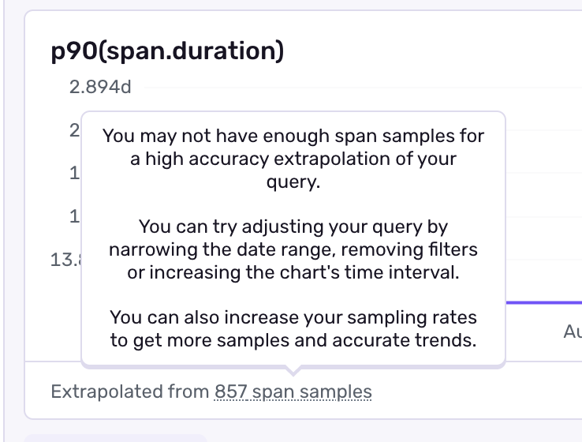

The [**Trace Explorer**](https://sentry.io/orgredirect/organizations/:orgslug/traces/) in Sentry is designed to make performance investigation easier and more intuitive. You can now explore span samples, visualize span attributes, and aggregate your data with flexible queries and filters. This guide will walk you through the key concepts and features of the Trace Explorer.


## Key Concepts

### Traces

- A trace represents a series of transactions or requests through a single system. This includes things like user browser sessions, HTTP requests, DB queries, middleware, caches and more.
- It captures a series of operations (_spans_) that show how different parts of your application interacted during each transaction.
- Each trace is identified by a **Trace ID**, which you can use to follow a request across services or projects.
- A [distributed trace](/platforms/javascript/tracing/trace-propagation/#what-is-distributed-tracing) is made of transactions and spans that traverse multiple servers, clients, edge workers, and other parts of your system. It is assembled by passing the Trace ID through browser headers.

### Spans

- A _span_ represents an individual operation within a trace. This could be a database query, HTTP request, or UI rendering task.
- Each span has:
  - **Attributes**: Key-value pairs like `http.method`, `db.query`, `span.description`, or custom attributes like `cart.value`, provide additional context that can be useful for debugging and investigating patterns. These are either numbers or strings. Note: numeric span attributes can be used to calculate **span metrics**, shown below.
  - **Duration (`span.duration`)**: The time the operation took, used to measure performance.

### Span Metrics

- [Span metrics](/concepts/key-terms/tracing/span-metrics/) are derived from applying a function to your span attributes (default or custom), like `p50(cart.value)` or `sum(ai.token_use)`, over a granular time frame. This calculation extrapolates metrics that then populate dashboards and alerts. based on that rolling time window.
- These 'metrics' aren't stored separately from your span data. Rather, they're queried on the fly. This reduces your need to manage, ingest, and store custom metrics.

## Practical Examples

- **See your changes in action**: Search for `span.domain is localhost:XXXX` and sort by Timestamp to see traces from your dev environment.
- **Diagnosing slow pages**: Search for `span.op:navigation` and visualize `p90(span.duration)` to pinpoint slow page loads.
- **Finding problematic API calls**: Aggregate by `http.url` and filter where `avg.(span.duration) > 2s` to identify slow external API calls.
- **Database query analysis**: Aggregate by `db.query` and sort by `avg(span.duration)` to find inefficient queries.

With these tools, the new Trace Explorer gives you powerful ways to understand your application's performance, identify bottlenecks, and make informed optimizations.

<Alert>
  You plan type determines your query window: Developer: 7 days | Team: 14 days | Business: 30 days.
</Alert>

## Browsing Span and Trace Samples

Trace Explorer allows you to browse span and trace samples and inspect them. Here's how:

1. **Search for Samples**:
   - Use the search bar to filter results based on default or custom attributes, tags, and strings like `http.request_method is "GET`
   - **Edit and add** columns in the span samples table to view any attribute
   - **Sort** by clicking the column header to toggle between ascending and descending
   - Switch between **Span Samples** and **Trace Samples** tabs depending on your focus.
1. **Inspect Samples**:

   - Clicking on a **Span ID** or **Trace ID** opens the **Trace Waterfall View**, showing the sequence of operations and their durations.
   - You can explore individual spans in detail or see the trace's overall structure.

<Arcade src="https://demo.arcade.software/5W4Ra0nvz6eufKmnybix?embed" />

## Visualizing Span Attributes

Trace Explorer makes it easy to visualize metrics aggregated from any span attribute.

1. **Set Up Visualization**:
   - Use the **Visualize** section to add metrics like `avg(span.duration)` or `p90(span.duration)` to the same chart by clicking **Add Series** or a different chart by clicking the **+** icon.
   - You can also create custom visualizations like:
     - **P90 of span durations**: Useful for identifying outliers.
     - **Average cache size**: Analyze attributes specific to backend spans.
2. **Filter Your Data**:
   - Refine your visualization by applying filters in the search bar, such as `span.op:db` to focus on database spans or `http.status_code:500` for errors.

The line chart updates dynamically as you apply filters, helping you track trends and identify anomalies.

<Arcade src="https://demo.arcade.software/6goWASyLCX3jx0kjKRMB?embed" />

## Aggregating Span Data

Dive deeper into your data with aggregation capabilities in Trace Explorer.

1. Click into the **Aggregates** tab.

2. **Group By Attributes** to investigate patterns.

   - Try `http.method` to compare GET vs POST performance, `db.table` to find slow database operations, `span.op` to investigate patterns in your traces, or custom tags like cart value, CPU or memory usage, or anything else you can think of.

3. **Filter and sort your aggregates** just like you would for transactions by querying in the search bar. Sort the table of aggregates by clicking the column headers (default: `timestamp`.)

4. **View sample traces** that fit your aggregates by clicking the stack icon to the left side of the table rows. Use this to find outliers, debug issues, and find complex performance optimizations.

<Arcade src="https://demo.arcade.software/rgVB85wJiopGNPO3KFJS?embed" />

## Create Alerts and Dashboard Widgets From Queries or Compare Queries

You can create Alerts and Dashboard widgets from your queries by clicking the "Save As" button:


You can also run side-by-side comparisons of different queries to analyze changes or differences in span data.

## Practical Examples

- **Diagnosing slow pages**:
  - Search for `span.op:navigation` and visualize `p90(span.duration)` to pinpoint slow page loads.
- **Finding problematic API calls**:
  - Group by `http.url` and filter where `avg(span.duration) > 2s` to identify slow external API calls.
- **Database query analysis**: Group by `db.query` and sort by `avg(span.duration)` to find inefficient queries.

## How Sampling Affects Queries in Trace Explorer

You can use Sentry's SDKs to sample spans and control the volume of data sent to Sentry. Not every span gets captured when sampling is enabled, but Sentry will still give you accurate aggregate results by extrapolating the sampled data.

### How It Works

Every span sent to Sentry includes its **sampling rate**. We also derive the **sampling weight**, which is the inverse of the rate and indicates the number of original spans that this sample represents.

For example:

- At a rate of _10%_, the weight is _10_.
- At a rate of _50%_, the weight is _2_.
- At a rate of _100%_, the weight is _1_.

All spans you send us after sampling get stored.

When you run queries in Trace Explorer, Sentry uses the sampling weight to compute counts, averages, and percentiles.

### Example

Let's say you query for spans where `span.op:db` and get **2 spans** in the results:

{" "}

<table>
  <colgroup>
    <col />
    <col />
    <col />
    <col />
    <col />
  </colgroup>
  <thead>
    <tr>
      <th>span_id</th>
      <th>span.op</th>
      <th>span.duration</th>
      <th>sampling_factor</th>
      <th>sampling_weight</th>
    </tr>
  </thead>
  <tbody>
    <tr>
      <td>a1b2c3</td>
      <td>db</td>
      <td>100ms</td>
      <td>0.1</td>
      <td>10</td>
    </tr>
    <tr>
      <td>d4e5f6</td>
      <td>db</td>
      <td>200ms</td>
      <td>0.5</td>
      <td>2</td>
    </tr>
  </tbody>
</table>

### Counts

Since each span was sampled with different weights, Sentry extrapolates the **count**:

```plaintext
10 + 2 = 12 estimated spans
```

Trace Explorer will display **Count: 12**.

### Sums

Similarly, Sentry incorporates the weight into **sum**:

```plaintext
10 * 100ms + 2 * 200ms = 1.4s
```

Trace Explorer will display **Sum: 1.4ms**.

### Averages and Percentiles

Averages and percentiles are **weighted**. You don't just average the 2 spans -- Sentry accounts for the fact that they represent a larger dataset. For example, the weighted average works like this:

```Plaintext
(100ms * 10 + 200ms * 2) / (10 + 2) = 117ms (This is the average duration shown)
```

Sentry treats this as a representation of the average across all 12 estimated spans. You can trust that metrics like `avg()` and `p90()` reflect your services' true health, adjusted for sampling.

### Sampling Warnings

If your sampling rate is **too low** for an accurate extrapolation (for example, keeping less than 5% of an already low number of spans), Sentry may show a **low sampling rate warning**. This lets you know that extrapolation might be less reliable, especially for more restrictive queries.

<div style={{width: '450px'}}>

</div>

Even if you sample your spans, **Trace Explorer's extrapolation gives you reasonably accurate answers** for counts, averages, and percentiles -- without you needing to do anything extra.

Note: In case you want to see unextrapolated aggregates for a query you can disable extrapolation using the settings icon above the chart.

With these tools, the new Trace Explorer gives you powerful ways to understand your application’s performance, identify bottlenecks, and make informed optimizations.

