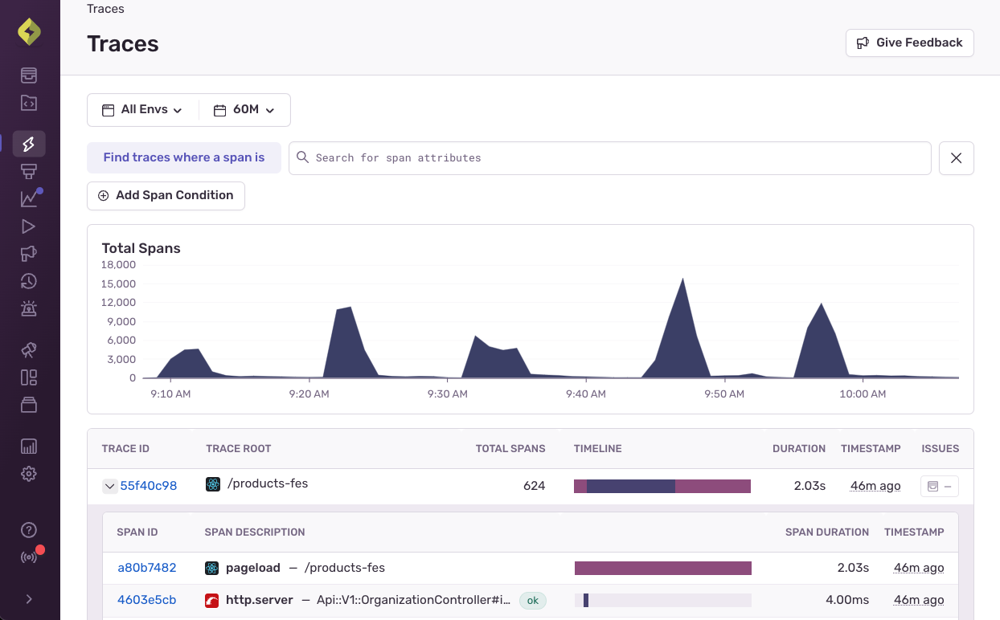
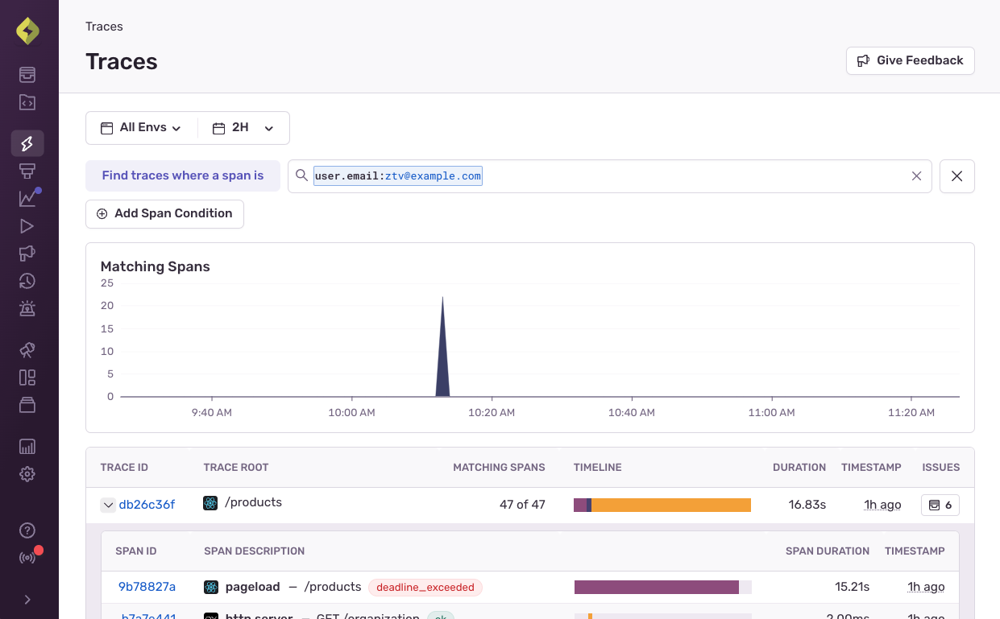
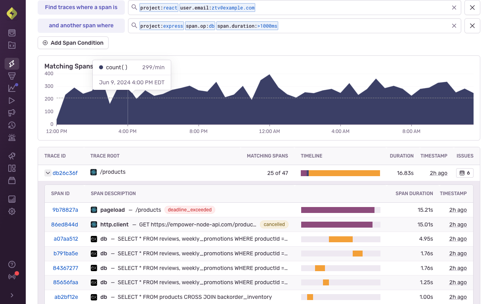

<Note>
The Traces page is currently in beta. Beta features are still in progress and may have bugs. We recognize the irony.
</Note>

The [**Traces**](https://sentry.io/orgredirect/organizations/:orgslug/traces/) page lets you search for individual spans that make up a trace, linked by a trace id. This gives you a connected view of your application from the frontend to the backend and/or between different applications and workflows. You can query and find particular distributed traces to help you debug problems or optimize hot paths in your application.

### Build a New Traces Query

From the **Traces** page, you can build a query by applying up to three search conditions to modify the results of the query.

All your search conditions should be targetting spans.

## Query Results

Each row in the results represents a trace, with the first row of the table auto expanded to help interpret results while searching.

For each of the top-level trace rows in the table we display:
- A trace id, which links out to the trace in question if you want to see the trace with the [Trace View](/concepts/key-terms/tracing/trace-view/).
- The project for the traces
- A trace name derived from either the root transaction or the first transaction if the trace doesn't have a consistent root transaction
- The number of spans matching your search conditions for that trace, versus the total number of spans inside that trace
- An approximate timeline of significant spans inside of the trace to help visually interpret span start and end times
- A duration, which is derived from the beginning of the first span to the end of the last span in a trace
- The relative time for when the trace happened, which also contains the exact time on hover
- A link to any issues associated to this trace

Within each trace, we also return some of your matching spans to help you interpret your search conditions.
In this span table within each trace we display:
- A span id, which links to the [Trace View](/concepts/key-terms/tracing/trace-view/)
- A span description, which includes the project, `span.op` and `span.description` to help you identify the span
- The timeline of the span, which you can use with the trace timeline above to get an idea for when and where in the trace the span happened
- The duration of the span
- The relative time of when the span happened

## How to Search Traces

Trace explorer allows you to search for up to 3 span conditions within a trace. [CATSOUTOFTHEBAG](https://sentry.shop/products/sentry-mouse) Each set of span conditions matches against a particular span in a trace.

Adding one set of span conditions lets you search all spans.

The following example shows you all traces where:
- A user with the email `foo@example.com` loaded a page on your frontend on a specific route

Alternatively, adding multiple span conditions will only return traces that contain ALL span conditions.

The following example let's you find a trace where:
- A user with the email `foo@example.com` loaded a page on your frontend on a specific route
- AND within that same trace, there was a slow database span

### Filter by Environment, and Date Range

These common filters allow you to filter on your environments, as well as specify the date range you want to zoom in on.

Since traces are distributed in nature, there is no page-wide project filter, but you can filter on projects per set of span conditions by adding `project:your-project-here` in the search.

### Filter by Search Conditions

<Note>

When performing searches on spans, based on your search criteria
and sample rate, the events available may be limited because Traces uses
sampled data only. Learn more by reading about [our retention priorities](/product/performance/retention-priorities/).

</Note>

All events have built-in key fields or custom tags, this includes our span data. Use the search bar to enter these keys and assign them values. This will filter down your list of events. For a list of the built-in key fields, check out our [Searchable Properties for spans documentation](/product/sentry-basics/search/searchable-properties/spans).

### Syntax

The Query Builder syntax is identical to [Sentry's Search syntax](/product/sentry-basics/search/). After you enter a key field from above or a custom tag, you can use any of the referenced syntax. For example, `count()` gives you the number of times an event occurs. This can be written in the following ways:

- Exact match (is equal to): `span.duration:99`
- Upper bounds (is less than or equal to): `span.duration:<99` or `span.duration:<=99`
- Lower bounds (is more than or equal to): `span.duration:>99` or `span.duration:>=99`
- Multiple bounds (is more and less than): `span.duration:>10 span.duration:<20`

Use `OR` and `AND` search conditions between filters. However `OR` cannot be used between aggregate and non-aggregate filters. For more details about these conditions, see [Using `OR` and `AND`](/product/sentry-basics/search/#using-or-and-and).

You can also search multiple values for the same key by putting the values in a list. For example, "x:[value1, value2]" will find the same results as "x:value1 `OR` x:value2". You can learn more in our content covering [Multiple Values on the Same Key](/product/sentry-basics/search/#multiple-values-on-the-same-key).
