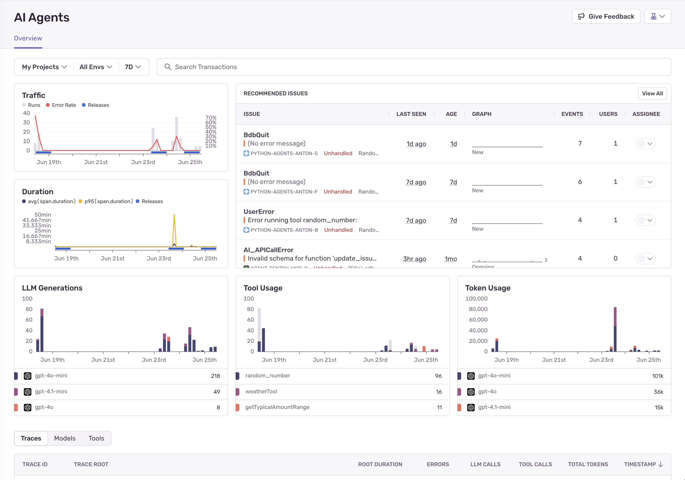

<Include name="feature-stage-beta-ai-agents.mdx" />

Sentry's AI Agent monitoring tools help you understand what's going on with your AI agent workflows. They automatically collect information about agent runs, tool calls, model interactions, and errors across your entire AI pipeline—from user interaction to final response.

## Example AI Agent Monitoring Use Cases

- Your AI agent is failing silently during tool execution, and you want to trace the complete agent flow to identify where it's breaking.
- Users report that your AI agent is returning unexpected or malformed responses, and you need to debug the full context of prompts, model calls, and outputs.
- Your AI agent workflows are experiencing performance issues, and you want to identify which steps (model calls, tool usage, or custom logic) are causing bottlenecks.

## Get Started

To use AI Agent Monitoring, you must have an existing Sentry account and project set up. If you don't have one, [create an account here](https://sentry.io/signup/).

Learn how to [set up Sentry for AI Agents](/product/insights/agents/getting-started/).
