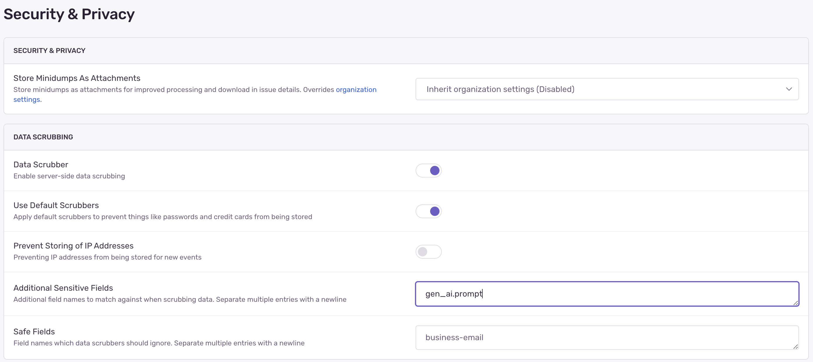

By default, Sentry AI agent integrations respect your SDK's PII (Personally Identifiable Information) settings:

- **When Send Default PII is disabled** (default): Only metadata like model names, token counts, tool names, and execution times are collected
- **When Send Default PII is enabled**: Full inputs, outputs, prompts, and responses from AI models and tools are captured

## Data Scrubbing and Protection

<Alert level="info">

Sentry has built-in [Server-Side Data Scrubbing](/security-legal-pii/scrubbing/server-side-scrubbing/) that automatically detects and removes common sensitive data like credit card numbers, social security numbers, and passwords from most event data.

However, Following AI agent span attributes may not be fully protected by these scrubbers.

- `gen_ai.prompt`
- `gen_ai.request.messages`
- `gen_ai.tool.input`
- `gen_ai.tool.output`
- `gen_ai.response.tool_calls`
- `gen_ai.response.text`
- `gen_ai.response.object`

</Alert>
If you wish to enable Data Scrubbing for any of these fields you can add them to **Additional Sensitive Fields** in **Security & Privacy** settings.



## Overriding Collection Settings

Using Vercel AI SDK you can override the global PII settings for specific AI operations by setting `recordInputs` and `recordOutputs` to `true`:

```javascript
const result = await generateText({
  model: openai("gpt-4o"),
  prompt: userQuery,
  experimental_telemetry: {
    isEnabled: true,
    recordInputs: true,
    recordOutputs: true,
  },
});
```
