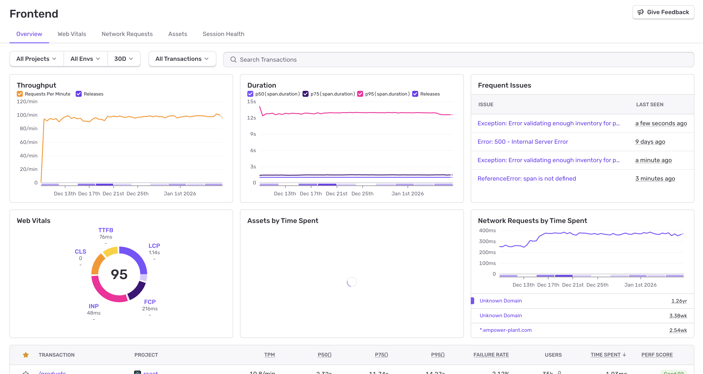
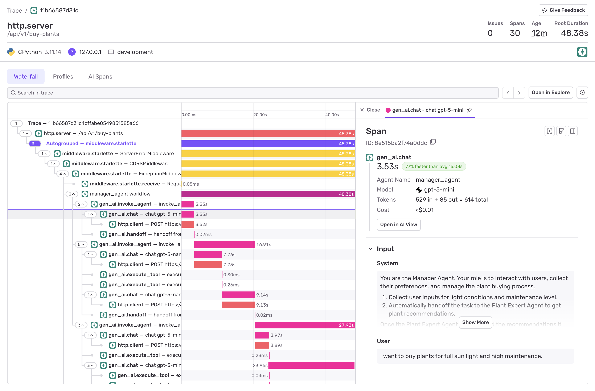

The [AI Agents Insights](https://sentry.io/orgredirect/organizations/:orgslug/insights/ai/agents/) dashboard provides a comprehensive view of your AI workflows, allowing you to monitor executions, track model costs and token usage, analyze tool calls, and get insights into recent errors. After you've [configured the Sentry SDK](/product/insights/ai/agents/getting-started/) for your project, data from your AI systems will start flowing into the dashboard, giving you actionable insights into their behavior and performance.

At the top of the page, you will be able to navigate between the three tabs: [Overview](#overview), [Models](#models) and [Tools](#tools).

## Overview

The Overview tab is the landing page for monitoring your AI workflows:

The dashboard displays the following key widgets:

- **Traffic**: Shows agent runs over time, error rates, and releases to track overall activity and health
- **Duration**: Displays response times for your agent executions to monitor performance
- **Issues**: Highlights recent errors and problems that need attention, including agent failures and exceptions
- **LLM Calls**: Count of LLM generations over time
- **Tokens Used**: Token usage by top models
- **Tool Calls**: Tool call volume and trends

Below these widgets is a traces table with detailed distribution information:

Click on any trace to open the [abbreviated trace view](#abbreviated-trace-view) in a drawer.

## Models

The Models tab displays Model Cost, Tokens Used, and Token Types widgets, as well as all used models with durations and token usage:

## Tools

The Tools tab displays Tool Calls and Tool Errors widgets, as well as all used tools with durations and errors:

## Abbreviated Trace View

Opens as a drawer when clicking any trace, showing essential details:

- **Agent Invocations**: Each agent execution and nested calls
- **LLM Generations**: Language model interactions with token breakdown
- **Tool Calls**: External API calls with inputs and outputs
- **Handoffs**: Agent-to-agent transitions and human handoffs
- **Critical Timing**: Duration metrics for each step
- **Errors**: Any failures that occurred

Click **"View in full trace"** for comprehensive debugging details.

## Detailed Trace View

Shows complete agent workflow with full context:

This detailed view reveals:

- **Complete Agent Flow**: Every step from initial request to final response
- **Tool Calls**: When and how the agent used external tools or APIs
- **Model Interactions**: All LLM calls with prompts and responses (if PII is enabled)
- **Timing Breakdown**: Duration of each step in the agent workflow
- **Error Context**: Detailed information about any failures or issues

When your AI agents are part of larger applications (like web servers or APIs), the trace view will include context from other Sentry integrations, giving you a complete picture of how your agents fit into your overall application architecture.
