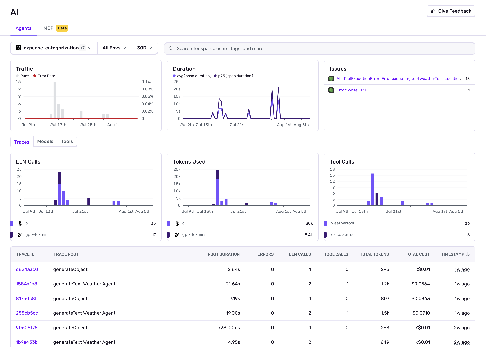

Once you've [configured the Sentry SDK](/product/insights/ai/agents/getting-started/) for your AI agent project, you'll start receiving data in the Sentry [AI Agents Insights](https://sentry.io/orgredirect/organizations/:orgslug/insights/agents/) dashboard.

The main dashboard provides a comprehensive view of all your AI agent activities, performance metrics, and recent executions.

The dashboard displays key widgets like:

- **Traffic**: Shows agent runs over time, error rates, and releases to track overall activity and health
- **Duration**: Displays response times for your agent executions to monitor performance
- **Issues**: Highlights recent errors and problems that need attention, including agent failures and exceptions

Underneath these widgets are three segments that offer focused widgets and a detailed distribution table:

- **Traces**: LLM Calls, Tokens Used, and Tool Calls widgets, as well as recent agent runs with duration, errors, number of LLM and tool calls, and token usage
- **Models**: Model Cost, Tokens Used, and Token Types widgets, as well as all used models with durations and token usage
- **Tools**: Tool Calls and Tool Errors widgets, as well as all used tools with durations and errors

Click on any trace to open the abbreviated trace view in a drawer.

## Abbreviated Trace View

Opens as a drawer when clicking any trace, showing essential details:

- **Agent Invocations**: Each agent execution and nested calls
- **LLM Generations**: Language model interactions with token breakdown
- **Tool Calls**: External API calls with inputs and outputs
- **Handoffs**: Agent-to-agent transitions and human handoffs
- **Critical Timing**: Duration metrics for each step
- **Errors**: Any failures that occurred

Click **"View in full trace"** for comprehensive debugging details.

## Detailed Trace View

Shows complete agent workflow with full context:

This detailed view reveals:

- **Complete Agent Flow**: Every step from initial request to final response
- **Tool Calls**: When and how the agent used external tools or APIs
- **Model Interactions**: All LLM calls with prompts and responses (if PII is enabled)
- **Timing Breakdown**: Duration of each step in the agent workflow
- **Error Context**: Detailed information about any failures or issues

When your AI agents are part of larger applications (like web servers or APIs), the trace view will include context from other Sentry integrations, giving you a complete picture of how your agents fit into your overall application architecture.
