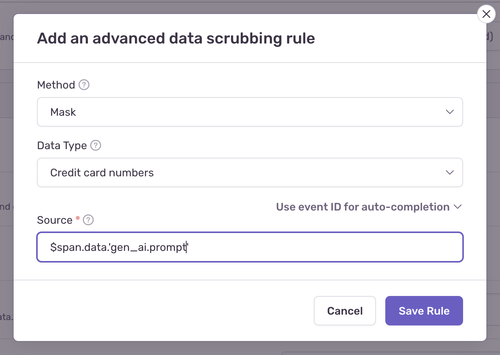

## SDK PII Settings

By default, Sentry AI agent integrations respect your [SDK's PII settings](/platforms/javascript/guides/nextjs/data-management/data-collected/):

- `sendDefaultPii: false` - Only metadata like model names, token counts, tool names, and execution times are collected
- `sendDefaultPii: true` - Full inputs, outputs, prompts, and responses from AI models and tools are captured.

You can override this by configuring it on a function call level. For more details see [Configuration](/platforms/javascript/guides/nextjs/configuration/integrations/vercelai/#configuration).

## Server side PII Scrubbing

<Alert level="info">

Sentry has built-in [Server-Side Data Scrubbing](/security-legal-pii/scrubbing/server-side-scrubbing/) that automatically detects and removes common sensitive data like credit card numbers, social security numbers, and passwords from most event data.

However, the following AI agent span attributes are not protected by default:

- `gen_ai.prompt`
- `gen_ai.request.messages`
- `gen_ai.tool.input`
- `gen_ai.tool.output`
- `gen_ai.response.tool_calls`
- `gen_ai.response.text`
- `gen_ai.response.object`

</Alert>
If you wish to enable Data Scrubbing for any of these fields you can add Organization or Project-level [Advanced Data Scrubbing](/product/data-management-settings/scrubbing/advanced-datascrubbing/) rule in **Security & Privacy** [settings](https://sentry.io/orgredirect/organizations/:orgslug/settings/organization/security-and-privacy) in the following format: `$span.data.''`.

