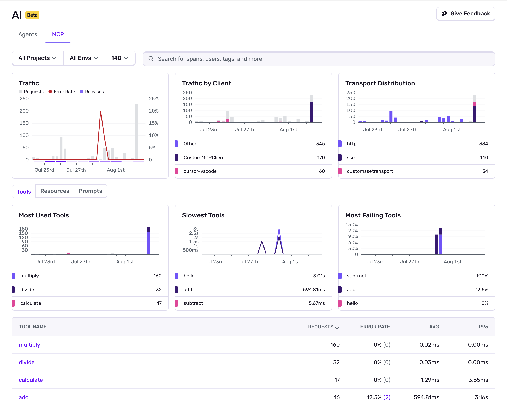

<Include name="feature-limited-on-team-retention.mdx" />

Once you've [configured the Sentry SDK](/product/insights/ai/mcp/getting-started/) for your MCP project, you'll start receiving data in the Sentry [MCP Insights](https://sentry.io/orgredirect/organizations/:orgslug/insights/ai/mcp/) dashboard.

The main dashboard provides a comprehensive view of all your MCP server activities, performance metrics, and recent tool executions.

The dashboard displays key widgets:

| Widget | Description |
| --- | --- |
| **Traffic** | Shows MCP requests over time, error rates, and releases to track overall server activity and health |
| **Traffic by Client** | Displays which MCP clients are connecting to your server (cursor-vscode, CustomMCPClient, etc.) |
| **Transport Distribution** | Shows the distribution of transport protocols used (http, sse, custom transports) |
| **Most Used Tools/Resources/Prompts** | Shows which MCP tools/resources/prompts are called most frequently by clients |
| **Slowest Tools/Resources/Prompts** | Identifies tools/resources/prompts with the highest response times for performance optimization |
| **Most Failing Tools/Resources/Prompts** | Highlights tools/resources/prompts with the highest error rates that need attention |

Underneath these widgets are tables that allow you to view data in more detail:

| Table | Description |
| --- | --- |
| **Tools** | Performance metrics for each MCP tool including request count, error rate, average duration, and P95 latency |
| **Resources** | Access patterns and performance for MCP resources by URI, showing requests, error rate, average duration, and P95 latency |
| **Prompts** | Usage statistics for MCP prompt templates by name, including requests, error rate, average duration, and P95 latency |

