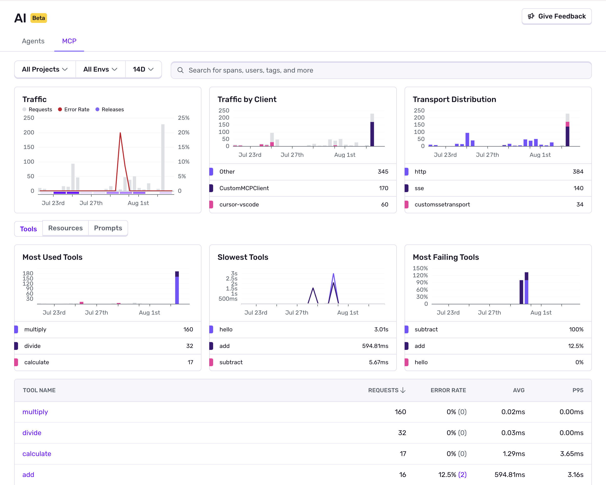

<Include name="feature-stage-beta.mdx" />

Sentry's MCP (Model Context Protocol) monitoring tools help you understand what's happening in your MCP implementations. They automatically collect information about MCP server connections, resource access, tool executions, and errors across your entire MCP pipeline—from client requests to server responses.

## Example MCP Monitoring Use Cases

- Your MCP server is failing to respond to tool calls, and you want to trace the complete request flow to identify where the connection is breaking.
- Clients report that your MCP resources are returning outdated or malformed data, and you need to debug the full context of resource requests and server responses.
- Your MCP implementations are experiencing performance issues, and you want to identify which components (server startup, resource fetching, or tool execution) are causing bottlenecks.

## Get Started

To use MCP Monitoring, you must have an existing Sentry account and project set up. If you don't have one, [create an account here](https://sentry.io/signup/).

