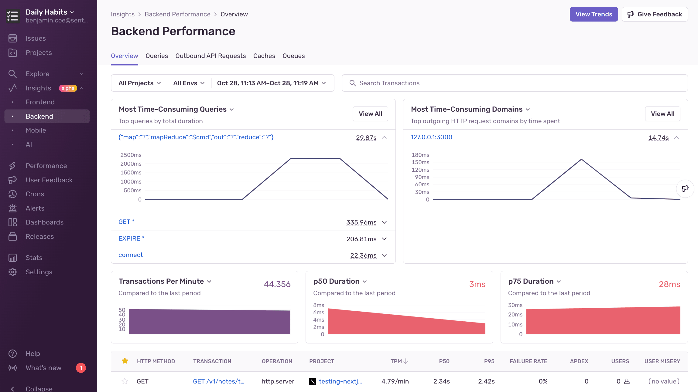

Sentry's [**Backend Performance**](https://sentry.io/orgredirect/organizations/:orgslug/insights/backend/) page gives you an overview of the health of your application. You'll be able to see things like the **Most Time-Consuming Queries**, **Most Time-Consuming Domains**, **p50** and **p75 Duration**, and so on.

You can also dive deeper into Queries, Outbound API Requests, Caches, and Queues to get detailed information about potential issues affecting your application's health. In addition to having a dedicated space to monitor backend performance, you can also look at Sentry's **Insights** tab to monitor frontend, mobile, and AI performance. 

## Learn More

<PageGrid />
