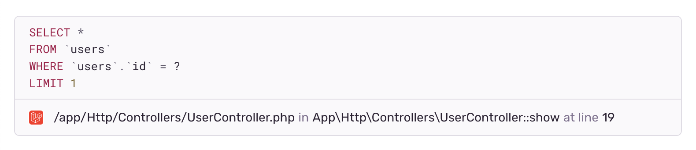

If you have [Insights](/product/insights/) enabled and your application queries a database, you can see how your queries are performing in Sentry.

Sentry's query monitoring helps you investigate the performance of your queries and get more information to improve them.

Starting with the [**Queries** page](#queries-page), you get a high-level overview of how your queries are doing. From there, you can drill into a specific query's [**Query Summary** page](#query-summary-page) and then investigate sample events from the [Sample List](#sample-list) to better understand the context of its performance in a specific endpoint.

The interactive demo below demonstrates how to get insights on your query performance.

<Arcade src="https://demo.arcade.software/YwpxKWDVwi6CtDcOOw6a?embed" />

 

## Prerequisites and Limitations

The queries widget and pages are only available for backend projects with performance monitoring enabled.

### Recommended SDK Versions

Query monitoring works best with up-to-date SDK versions. The following minimum versions are recommended:

- [Python SDK v1.29.2](https://github.com/getsentry/sentry-python/releases/tag/1.29.2)
- [JavaScript SDKs v7.63.0](https://github.com/getsentry/sentry-javascript/releases/tag/7.63.0)
- [Laravel SDK v3.8.0](https://github.com/getsentry/sentry-laravel/releases/tag/3.8.0)
- [Cocoa SDK v8.11.0](https://github.com/getsentry/sentry-cocoa/releases/tag/8.11.0)
- [Java SDK v6.29.0](https://github.com/getsentry/sentry-java/releases/tag/6.29.0)
- [Ruby SDK v5.11.0](https://github.com/getsentry/sentry-ruby/releases/tag/5.11.0)
- [.NET SDK v3.39.0](https://github.com/getsentry/sentry-dotnet/releases/tag/3.39.0)
- [Symfony SDK v4.11.0](https://github.com/getsentry/sentry-symfony/releases/tag/4.11.0)
- [Android SDK v6.30.0](https://github.com/getsentry/sentry-java/releases/tag/6.30.0)

### Span Eligibility

Sentry tries to extract metrics for all SQL-like dialects, as well as MongoDB. Other NoSQL databases like Elasticsearch, graph databases like Neo4j, and other non-SQL database systems are not currently eligible for this feature.

If you are using <PlatformLink to="/tracing/instrumentation/automatic-instrumentation">automatic instrumentation</PlatformLink>, query performance monitoring should work without any configuration. If you've manually instrumented Sentry, you'll need to make sure that your spans conform to our standards for the best experience:

- The span `op` field is set to an [eligible value](https://develop.sentry.dev/sdk/performance/span-operations/#database).
- The span's description contains the full, parameterized query (e.g. `"SELECT * FROM users WHERE id = ?"`). Supported placeholder values for SQL are `%s`, `?`, `:c0` (e.g. `:c0`, `:c1`) and `$1` (e.g. `$1`, `$2`). MongoDB span descriptions should contain valid JSON, and placeholders should be the string `"?"`.
- The `db.system` span data value is set to the [correct identifier](https://github.com/open-telemetry/semantic-conventions/blob/main/docs/database/database-spans.md) (e.g., `"postgresql"` or `"mongodb"`).

## Queries Page

The **Queries** page gives you a quick overview of your application's query performance for the selected project(s). You can use this page as a starting point to investigate potential problem queries and drill down to better understand how various queries are affecting your app's performance.

Open the **Queries** page by clicking "Queries" in the sidebar, under "Insights". Alternatively, the **Performance** page also surfaces the highest impact queries in the "Most Time-Consuming Queries" widget. You can click "View All" to open the **Queries** page from there.

At the top of the page, summary graphs for queries per minute (throughput) and average duration provide high-level insight into your database performance. If you see an anomaly or want to investigate a time range further, you can click and drag to select a range directly in a graph to filter data for that time range.

The query description table below shows a list of queries, their volume (queries per minute), average duration, and the total time your app spent running that query (time spent). The query descriptions are parametrized, so your queries may look slightly different.

By default, this table is sorted by most [time spent](#what-is-time-spent). This means that queries at the top are usually really slow, very frequent, or both. You can change this to sort by queries per minute to see the most frequently run queries, or by average duration to see the slowest queries.

You can also use the dropdowns above to filter all data for specific commands (such as `SELECT` and `UPDATE`) and tables/collections queried.

To view more details, click on a query from the table to open its **Query Summary** page.

### Query Parameterization

Sometimes, Sentry processes queries and simplifies them to improve readability. For example, for SQL queries:

- Table names are removed from column selections if possible (e.g., `SELECT "users"."name", "users"."id", "users.age" FROM users` becomes `SELECT name, id, age FROM users`)
- Long lists of `SELECT` arguments are collapsed (e.g., `SELECT id, name, age, city, country, phone FROM users` becomes `SELECT .. FROM users`)
- Long lists of `VALUES` arguments are collapsed (e.g., `INSERT INTO users (id, email, name, age) VALUES (%s %s %s %s)` becomes `INSERT INTO users (..) VALUES (%s)`)
- `CASE / WHEN` statements are collapsed

For MongoDB queries:

- Leaf values are replaced with the placeholder `"?"`
- A maximum depth is applied to deeply nested query objects

You can see the full query by hovering on a truncated description, or clicking it to see its **Query Summary** page.

## Query Summary Page

To open a query's **Query Summary** page, click on the query from either the table in the "Most Time-Consuming Queries" widget on the **Performance** page or the table in the **Queries** page.

At the top of the page, queries per minute, average duration, and time spent are shown for the selected time range. The full query is shown below these metrics, followed by graphs for queries per minute and average duration. The query's source in the code is also shown if it is available.

At the bottom, you can find a list of endpoints the query is found in, sorted by the most time your application spent in that span.

If you want to investigate a specific endpoint, click on it to open a sidebar showing some sample events.

## Query Sources

<Alert>

Query Sources are currently supported in Sentry's [Laravel](/platforms/php/guides/laravel/configuration/laravel-options/#more-configuration) (enabled by default) and [Python](/platforms/python/configuration/options/#enable-db-query-source) (enabled by default) SDKs. Sentry only attaches query sources to queries that are slower than a configurable threshold ([Python](/platforms/python/configuration/options/#db-query-source-threshold-ms), [Laravel](/platforms/php/guides/laravel/configuration/laravel-options/#more-configuration)) to reduce the performance impact.

</Alert>

A query's source is the location in your application's code that triggered the query. Sentry automatically determines the query source by examining the [stack trace](/product/sentry-basics/integrate-frontend/upload-source-maps/) and attaches the source to the query data.

You can see the query's source underneath the query description on the **Query Summary** page, as shown in the image below. If you have a [source code management integration](/organization/integrations/source-code-mgmt/) enabled, Sentry will also show a link to open the query's source in the relevant repository.

## Sample List

Click on an endpoint to open its samples list. This side panel shows summary metrics (QPM and average duration) for the query in the specific endpoint.

The table shows a sample list of events, their span duration, and the difference in duration compared to the average. This table is sorted by longest span duration.

Sentry automatically finds a variety of samples to help you investigate performance problems. The chosen events will cover the entire selected time range, as well as a range of durations (both faster than, slower than, and near the average duration). You can get a sense of the performance characteristics by comparing different sample events.

These same events are also represented as triangles shown in the average duration graph above.

You can generate a new list of random sample events by clicking the "Try Different Samples" button at the bottom.

From the sample list, you can drill down to specific good, average, or bad examples of a given query within a given endpoint. Click on an event ID to drill into the query's span details within the span waterfall of the [Trace View page](/concepts/key-terms/tracing/trace-view/).

## What is Time Spent?

By default, queries are sorted by **time spent**, which serves as a proxy for the relative impact of a given query.

Every database query takes some time to execute. When an application sends a query, it waits for the database to receive the query, parse it, execute it, and return the result. In Sentry, the total time taken from sending the query to receiving the full result is called the query's **duration**. The query's **time spent** is the sum of all its durations in a given period.

For example, an application might send a query like `SELECT * FROM users LIMIT 10` every time a user calls the `/users` endpoint. The query might take anywhere from 100ms to 200ms to run, and the endpoint is called anywhere from 10 times a minute to 100 times in a minute depending on the time of day. The query's time spent is the sum of all of its durations that occurred in a given period. Put another way, the time spent is the product of the average duration and queries per minute. In a high-throughput application, a query's time spent might be measured in weeks or months.

Time spent is a useful way to measure a query's relative impact, compared to other queries in an application. For example, if one query's time spent is 7 days, and another is just 2 hours, the query with more time spent is probably more impactful to fix. Even a small improvement in duration would result in a meaningful overall improvement. Time spent can also be a strong signal that something is wrong. Queries that suddenly start taking up more time often signal a problem.
