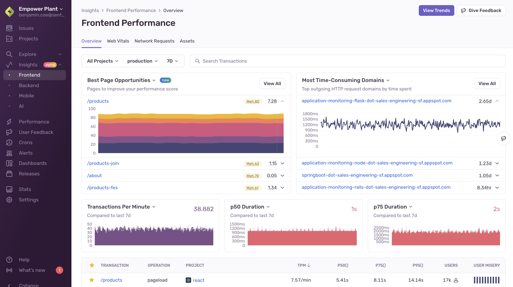

Sentry's [**Frontend Performance**](https://sentry.io/orgredirect/organizations/:orgslug/insights/frontend/) page gives you an overview of the health of your application. You'll be able to see things like **Best Page Opportunities** (the improvements that would most help increase your performance score), your **Most Time-Consuming Assets**, **p50** and **p75 Duration**, and so on. 

You can also dive deeper into Web Vitals, Network Requests, and Assets to get detailed information about potential issues affecting your application's health. In addition to having a dedicated space to monitor frontend performance, you can also look at Sentry's **Insights** tab to monitor backend, mobile, and AI performance. 

## Learn More

<PageGrid />
