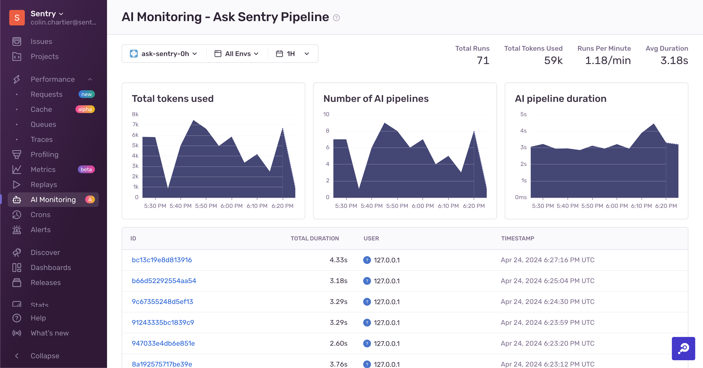

<Include name="feature-stage-alpha.mdx" />

Sentry's LLM Monitoring tools help you understand what's going on with your AI pipelines. They automatically collect information about prompts, tokens, and models from providers like OpenAI and Anthropic.

## Example LLM Monitoring Use Cases

- Users are reporting issues with an LLM workflow, and you want to investigate responses from the relevant large language models.
- You'd like to receive an alert if a specific pipeline costs more than $100 in a single day.
- Users report that LLM workflows are taking longer than usual, and you want to understand what steps in a workflow are slowest.

## Get Started

To use LLM Monitoring, you must have an existing Sentry account and project set up. If you don't have one, [create an account here](https://sentry.io/signup/).

Learn how to [set up Sentry's LLM Monitoring](/product/llm-monitoring/getting-started/).
