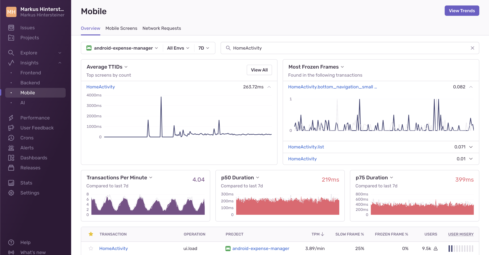

<Include name="feature-limited-on-team-retention.mdx" />

The [**Mobile Performance**](https://sentry.io/orgredirect/organizations/:orgslug/insights/mobile/) page gives an overview of the metrics that let you know how fast your app starts, including the number of slow and frozen frames your users may be experiencing. Each metric provides insights into the overall performance health of your mobile application. Digging into the details helps prioritize critical performance issues and allows you to identify and troubleshoot the root cause faster.

## App Start

App start metrics track how long your mobile application takes to launch. For this, Sentry measures _cold starts_ and _warm starts_.

The definitions of cold start and warm start change slightly depending on the operating system. On iOS, Apple recommends your app take at most 400ms to render the first frame. On Android, the [Google Play console](https://developer.android.com/topic/performance/vitals/launch-time#av) warns you when a cold start takes longer than five seconds or a warm start longer than two seconds. For definitions by operating system, check out the corresponding SDK docs:

- [Android](/platforms/android/tracing/instrumentation/automatic-instrumentation/#app-start-instrumentation)
- [Flutter](/platforms/flutter/tracing/instrumentation/automatic-instrumentation/#app-start-instrumentation)
- [iOS](/platforms/apple/guides/ios/tracing/instrumentation/automatic-instrumentation/#app-start-tracking)
- [React Native](/platforms/react-native/tracing/instrumentation/automatic-instrumentation/#app-start-instrumentation)

In the example below, the detail view of a transaction displays the warm start measurement in the right sidebar.

While the SDKs differentiate between a cold and a warm start, they don't track hot starts or resumes. To get more insight into your cold and warm start metrics, you can use the [App Starts](/product/insights/mobile-vitals/app-starts/) feature.

## Slow and Frozen Frames

To track the responsiveness of the user interface, Sentry measures _slow frames_ and _frozen frames_. Typically, a phone or tablet renders 60 frames per second (fps). At 60 fps, every frame has 16 or 16.67 ms to render.

- **Slow Frames**: Using 60 fps, slow frames are frames that take more than 16 ms (Android) or 16.67 ms (iOS) to render.
- **Frozen Frames**: Frozen frames are frames that take longer than 700 ms to render.

For Apple, the frame rate can be higher, especially as 120 fps displays are becoming more popular. For these apps, Sentry detects the frame rate and adjusts the slow frame calculation accordingly.

In the example below, the detail view of the transaction displays the slow, frozen, and total frames in an iOS application:

You can track slow and frozen frames for:

- [Android](/platforms/android/tracing/instrumentation/automatic-instrumentation/#slow-and-frozen-frames)
- [Flutter](/platforms/flutter/tracing/instrumentation/automatic-instrumentation/#slow-and-frozen-frames)
- [iOS](/platforms/apple/guides/ios/tracing/instrumentation/automatic-instrumentation/#slow-and-frozen-frames)
- [React Native](/platforms/react-native/tracing/instrumentation/automatic-instrumentation/#slow-and-frozen-frames)

## Time to Initial Display and Time to Full Display

To track how long it takes your application to produce its first frame and then how long it takes to produce its first frame with all the content, Sentry measures time to initial display and time to full display, respectively.

- **Time to initial display**: tracks how long it takes for your mobile application to produce its first frame. This includes app start time on the first screen loaded. It doesn’t include any content loaded lazily after the first frame is drawn. Time to initial display is automatic and enabled by default.
- **Time to full display**: tracks how long it takes for your mobile application to produce its first frame with full content. This includes content loaded asynchronously after the first frame, for example, after loading content from the network. Time to full display is opt-in and requires you to manually call the API to report that the screen has loaded all of its content and is fully displayed.

In the example below, the detail view of the transaction displays the time-to-initial-display span in an Android application:

You can track time to initial display for:

- [Android](/platforms/android/tracing/instrumentation/automatic-instrumentation/#time-to-initial-display)
- [Apple](/platforms/apple/tracing/instrumentation/automatic-instrumentation/#time-to-initial-display)
- [Flutter](/platforms/flutter/integrations/routing-instrumentation/#time-to-initial-display)
- [React Native](/platforms/react-native/performance/instrumentation/time-to-display/#automatic-time-to-initial-display-for-react-navigation)

You can track time to full display for:

- [Android](/platforms/android/tracing/instrumentation/automatic-instrumentation/#time-to-full-display)
- [Apple](/platforms/apple/tracing/instrumentation/automatic-instrumentation/#time-to-full-display)
- [Flutter](/platforms/flutter/integrations/routing-instrumentation/#time-to-full-display)
- [React Native](/platforms/react-native/performance/instrumentation/time-to-display/#time-to-full-display)

To get more insight into the performance of your time to initial display and time to full display metrics, use the [Screen Loads](/product/insights/mobile-vitals/screen-loads/) feature.
