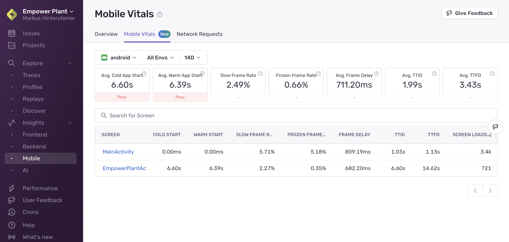
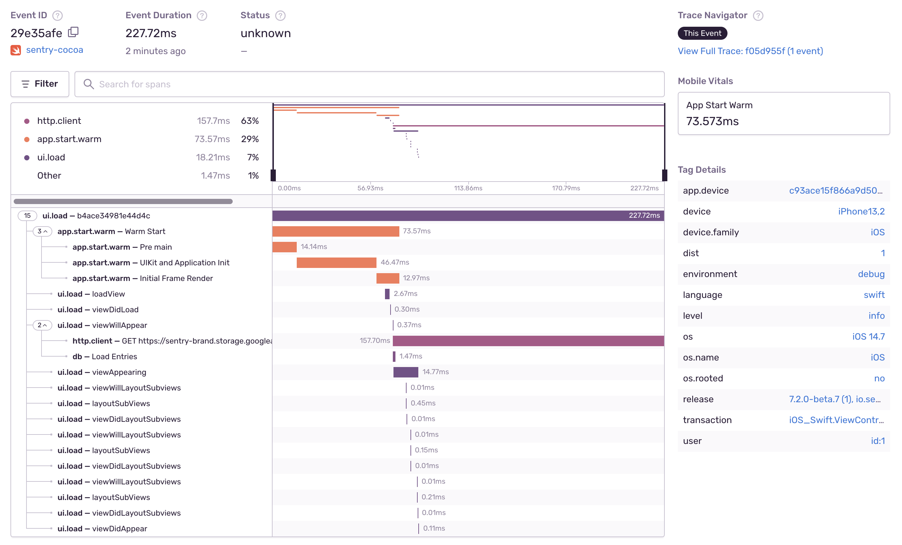
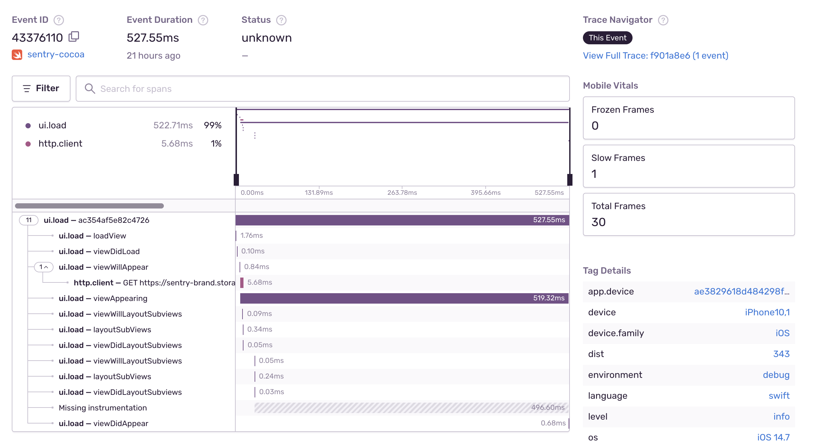

The Mobile Vitals insights module provides a high-level overview of the performance of your screens, and allows you to drill down into the performance metrics of individual screens.

## App Start

App start metrics track how long your mobile application takes to launch. For this, Sentry measures [_cold starts_]( /concepts/search/searchable-properties/events/#measurementsapp_start_cold) and [_warm starts_](/concepts/search/searchable-properties/events/#measurementsapp_start_warm).

The definitions of cold start and warm start change slightly depending on the operating system. On iOS, Apple recommends your app take at most 400ms to render the first frame. On Android, the [Google Play console](https://developer.android.com/topic/performance/vitals/launch-time#av) warns you when a cold start takes longer than five seconds or a warm start longer than two seconds. For definitions by operating system, check out the corresponding SDK docs:

- [Android](/platforms/android/tracing/instrumentation/automatic-instrumentation/#app-start-instrumentation)
- [Apple](/platforms/apple/guides/ios/tracing/instrumentation/automatic-instrumentation/#app-start-tracking)
- [Flutter](/platforms/dart/guides/flutter/tracing/instrumentation/automatic-instrumentation/#app-start-instrumentation)
- [React Native](/platforms/react-native/tracing/instrumentation/automatic-instrumentation/#app-start-instrumentation)

<Alert>

Sentry's App Start instrumentation aims to be as comprehensive and representative of the user experience as possible, and adheres to guidelines by the platform vendors. For this reason, App Starts reported by Sentry might be longer than what you see in other tools. Read more on the [Apple App Start docs](/platforms/apple/guides/ios/tracing/instrumentation/automatic-instrumentation/#app-start-tracing) and [Android App Start docs](/platforms/android/tracing/instrumentation/automatic-instrumentation/#app-start-instrumentation).

</Alert>

In the example below, the detail view of a transaction displays the warm start measurement in the right sidebar.

While the SDKs differentiate between cold and warm starts, they don't track hot starts or resumes. To get more insight into your cold and warm start metrics, you can use the [App Starts](/product/insights/mobile/mobile-vitals/app-starts/) feature.

## Performance Score

Sentry categorizes average app start durations as follows:

| Metric | Good | Meh | Poor |
| --- | --- | --- | --- |
| Average Cold App Start | less than 3s | between 3s and 5s | greater than 5s |
| Average Warm App Start | less than 1s | between 1s and 2s | greater than 2s |

## Slow and Frozen Frames

To track the responsiveness of the user interface, Sentry measures _slow frames_ and _frozen frames_. Both indicate if the rendering of a frame is taking too long, causing the UI to appear laggy or frozen.

Typically, a phone or tablet renders at 60 or 120 frames per second (fps). Based on this a single frame has a time budget of 16.67 / 8.33 ms to render.

- **Slow Frames**: Using 60 fps, slow frames are frames that take more than 16 ms (Android) or 16.67 ms (iOS) to render.
- **Frozen Frames**: Frozen frames are frames that take longer than 700 ms to render.

Sentry also supports higher frame rates, especially as 120 fps displays are becoming more popular. For these apps, Sentry detects the frame rate and adjusts the slow frame calculation accordingly.

On the Mobile Vitals insights page, you can see a slow and frozen frame rate, indicating the percentage of frames that are slow or frozen during the lifetime of the transaction.

In the example below, the detail view of the transaction displays the slow, frozen, and total frames in an iOS application:

You can track slow and frozen frames for:

- [Android](/platforms/android/tracing/instrumentation/automatic-instrumentation/#slow-and-frozen-frames)
- [Apple](/platforms/apple/guides/ios/tracing/instrumentation/automatic-instrumentation/#slow-and-frozen-frames)
- [Flutter](/platforms/dart/guides/flutter/tracing/instrumentation/automatic-instrumentation/#slow-and-frozen-frames)
- [React Native](/platforms/react-native/tracing/instrumentation/automatic-instrumentation/#slow-and-frozen-frames)

## Frames Delay

Frames Delay is the user-perceived total delayed duration of rendered frames. For example, at a refresh rate of 60fps, if a two frame renders takes 20ms each, the frame delay is 8ms (2 * (20ms - 16ms) = 8ms).

You can track frames delay on the following platforms:
- [Android](/platforms/android/tracing/instrumentation/perf-v2/#frames-delay)
- [Apple, as part of slow and frozen frames](/platforms/apple/guides/ios/tracing/instrumentation/automatic-instrumentation/#slow-and-frozen-frames)
- [Flutter](/platforms/dart/guides/flutter/integrations/slow-and-frozen-frames-instrumentation/)

## Time to Initial Display and Time to Full Display

To track how long it takes a screen to render its first frame and then how long it takes to render its first frame with all content, Sentry measures time to initial display and time to full display, respectively.

- **Time to initial display**: tracks how long it takes your app to render its first frame. This includes app start time on the first screen loaded. It doesn't include any content loaded lazily after the first frame is drawn. Time to initial display is measured automatically and enabled by default.

- **Time to full display**: tracks how long it takes for your mobile application to render its first frame with full content. This includes content loaded asynchronously after the first frame, for example, after loading content from the network. Time to full display is opt-in and requires you to manually call the API to report that the screen has loaded all of its content and is fully displayed.

In the example below, the detail view of the transaction displays the time-to-initial-display span in an Android application:

You can track time to initial display for:

- [Android](/platforms/android/tracing/instrumentation/automatic-instrumentation/#time-to-initial-display)
- [Apple](/platforms/apple/tracing/instrumentation/automatic-instrumentation/#time-to-initial-display)
- [Flutter](/platforms/dart/guides/flutter/integrations/routing-instrumentation/#time-to-initial-display)
- [React Native](/platforms/react-native/performance/instrumentation/time-to-display/#automatic-time-to-initial-display-for-react-navigation)

You can track time to full display for:

- [Android](/platforms/android/tracing/instrumentation/automatic-instrumentation/#time-to-full-display)
- [Apple](/platforms/apple/tracing/instrumentation/automatic-instrumentation/#time-to-full-display)
- [Flutter](/platforms/dart/guides/flutter/integrations/routing-instrumentation/#time-to-full-display)
- [React Native](/platforms/react-native/performance/instrumentation/time-to-display/#time-to-full-display)

To get more insight into the performance of your time to initial display and time to full display metrics, use the [Screen Loads](/product/insights/mobile/mobile-vitals/screen-loads/) feature.
