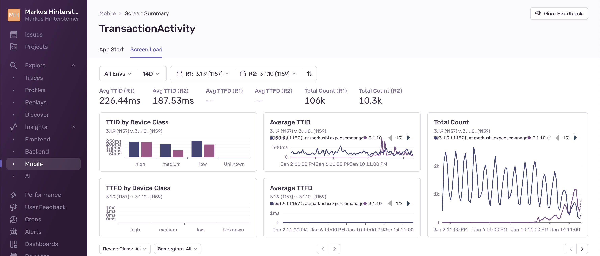

The **Screen Loads** page shows an overview of the amount of time it takes for your application to load its screens. It helps you identify slow or regressed screens and gives additional information so you can better understand the factors contributing to the slowness of both time to initial display (TTID) and time to full display (TTFD).

Sentry tracks TTID automatically, but [TTFD](/product/insights/mobile/mobile-vitals/#time-to-initial-display-and-time-to-full-display) requires that the `reportFullyDisplayed()` API be manually called to report that the screen has loaded all of its content and is fully displayed.

### Minimum SDK Requirements:

**For Android:**

- `>=5.0` for automatic activity transactions
- `>=6.10.0` for [TTID](/platforms/android/tracing/instrumentation/automatic-instrumentation/#time-to-initial-display)
- `>=6.17.0` for [TTFD](/platforms/android/tracing/instrumentation/automatic-instrumentation/#time-to-full-display)

**For iOS:**

- `>=7.12.0` for UIViewController transactions
- `>=8.4.0` for [TTID](/platforms/apple/guides/ios/tracing/instrumentation/automatic-instrumentation/#time-to-initial-display)+[TTFD](/platforms/apple/guides/ios/tracing/instrumentation/automatic-instrumentation/#time-to-full-display)

**For Flutter:**

- `>=7.18.0` [TTID+TTFD for Routing Instrumentation](/platforms/dart/guides/flutter/integrations/routing-instrumentation/#time-to-initial-display)

**For React Native:**

- `>=5.20.0` [TTID+TTFD for React Navigation](/platforms/react-native/performance/instrumentation/time-to-display/)

By default, the **Screen Loads** page displays metrics for the two releases with the highest screen counts for the time range you’ve selected. To choose a different set of releases to compare, use the “release selector” at the top of the page.

The charts section shows a comparison of TTID and TTFD metrics for your two selected releases over time.

**Reasons Why You Might Not Be Seeing Any Data:**

- You don’t have any transactions with op `ui.load`
- Your SDKs don’t meet the minimum SDK requirements

Here, you’ll see a breakdown of TTID and TTFD values by [device class](/concepts/search/searchable-properties/#device-classification) (high, medium, low, or unknown), across your selected releases. This will help you understand how users with different device performance levels are being affected.

To see slow TTID and TTFD events and profiles for each release broken out by specific device class, use the “Device Class” filter below the charts.

At the bottom of the page, you’ll see a table of spans that occurred during screen load, sorted by the most time your screen spent in that span. Here, you’ll be able to:

- Spot span regressions by comparing the average duration of each span across your two releases of choice.

- Find the slowest spans in the release you’re interested in by looking at average span duration.

- See which spans occur most frequently by looking at “Total Count”. (This might help you identify excessive io calls or repeated work that might be occurring during screen load.)

**Eligible span operations:**

- file.read
- file.write
- ui.load
- http.client
- db
- db.sql.query
- db.sql.transaction

### TTID and TTFD affecting spans:

If spans end before TTID or TTFD, there's a chance they could be affecting their respective metrics. They're tagged in Sentry and can be viewed on the **Screen Summary** page. But just because a span has been identified as TTID or TTFD-affecting, it doesn't necessarily mean it's the culprit. This information is an approximation and should be used to find potentially problematic spans on an aggregate level so you can narrow down the scope of spans you need to investigate.

## Span Detail View

Clicking on a span description opens up a side panel that lets you see span details, including the average duration and count for that span, in each of the releases you’ve selected.

In the table below, you’ll see a list of sampled events and profiles (if they exist). By comparing the two, you’ll be able to see how much the duration of the span you’re looking at deviates from average spans in each of the two releases you’ve selected.

Sentry automatically identifies sample events to help you investigate performance problems. (They’re shown as triangles in the “Average Duration” graph.) To give you an accurate picture, a range of faster than average, slower than average, and average span durations are sampled across the whole time period you’ve selected.

You can use the sample list to drill down to and compare fast, average, and slow events of interest within a given screen.

Clicking on a sample event will take you into either the query's span details within the span waterfall of the [Trace View page](/concepts/key-terms/tracing/trace-view/) or the profile icon to see the [flamegraph](/product/explore/profiling/flame-charts-graphs/) for the event. To get different event samples, click the "Try Different Samples" button.
