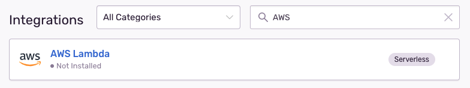
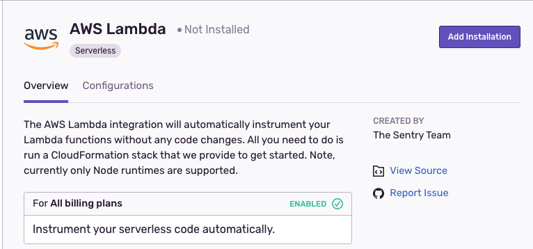
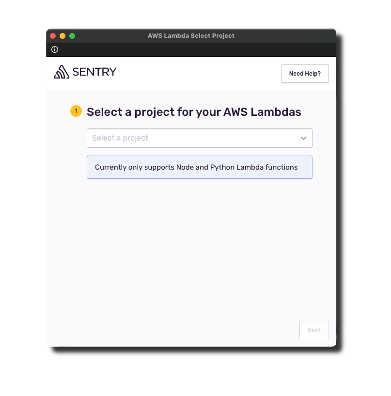
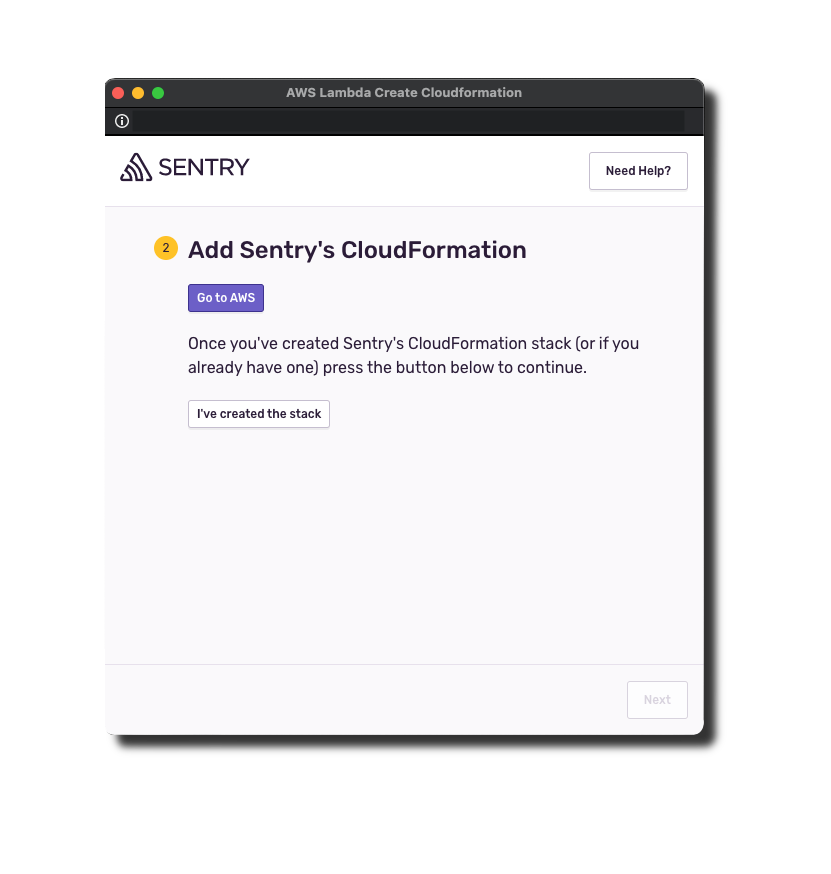
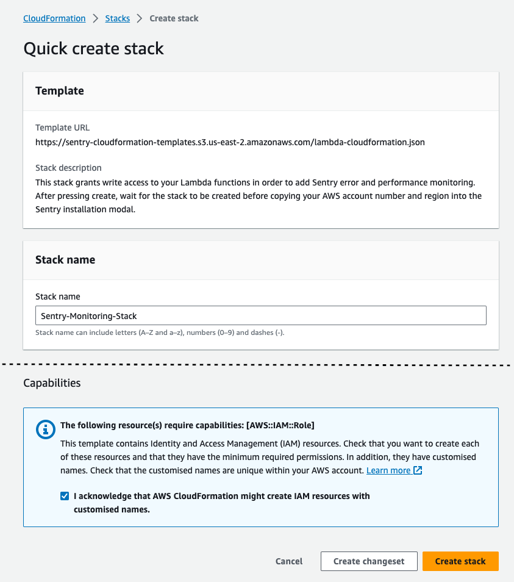
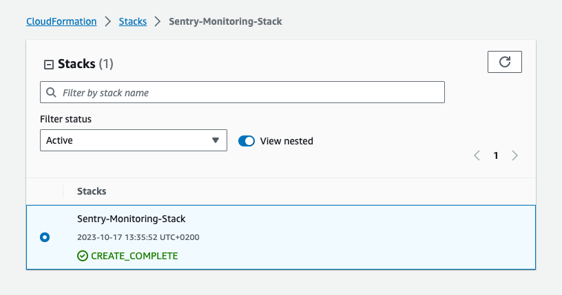
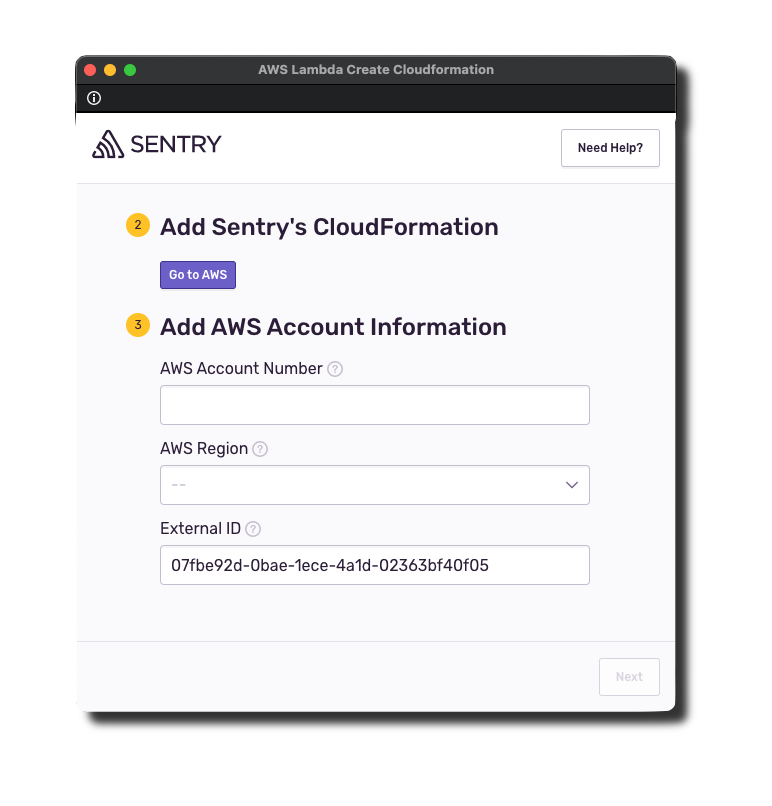
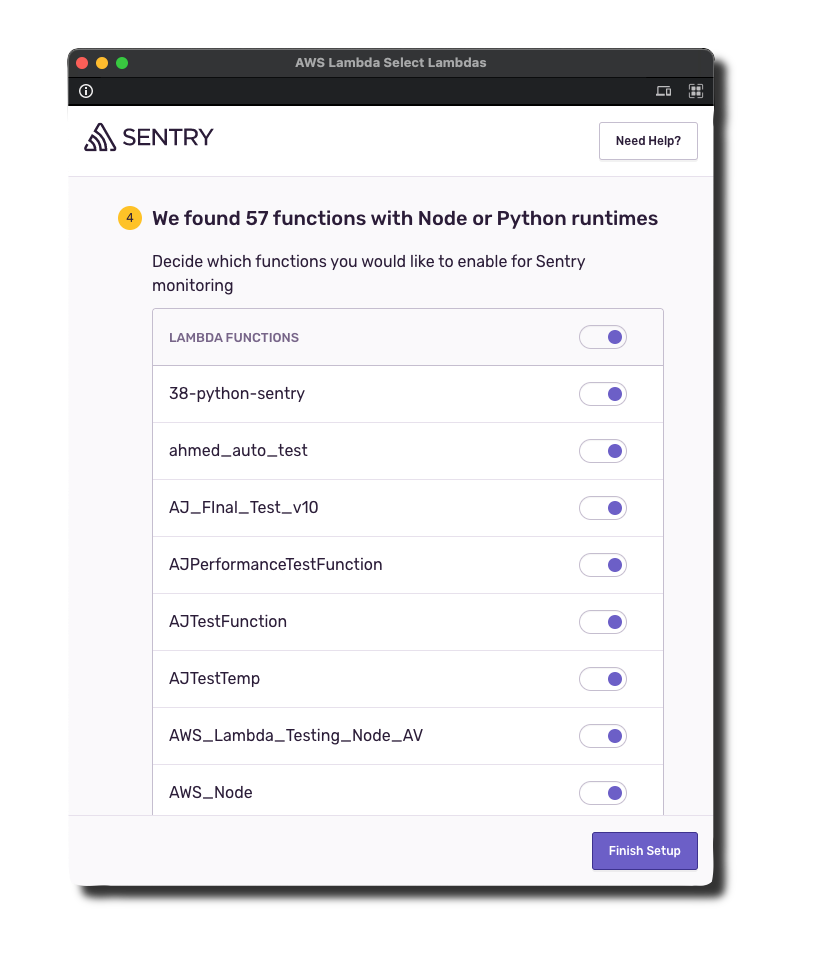
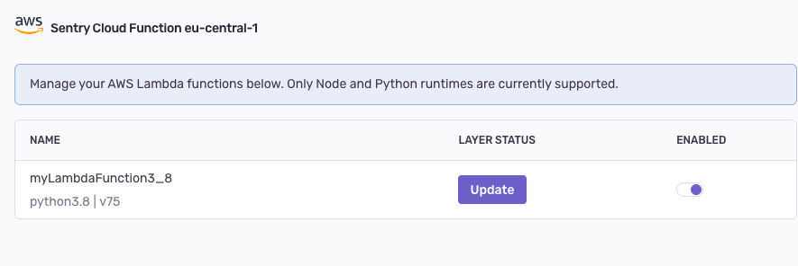

<Note>

Looking for instructions to set up the serverless SDK manually? Check out these docs for [Node](/platforms/javascript/guides/aws-lambda/) or [Python](/platforms/python/integrations/aws-lambda/) instead.

</Note>

Connect Sentry to your AWS account to automatically add Sentry error and performance monitoring to your Node/Python Lambda functions.

## Install

<Note>

Sentry owner, manager, or admin permissions are required to install this integration.

</Note>

1. Navigate to **Settings > Integrations > AWS Lambda**.

   

1. Press **Add Installation** to open the installation modal.

   

1. Select the project for your Lambda integration. **Note:** This project cannot be changed after installation is complete. If you only have a single project, you'll skip this step.

   

1. Click **Go To AWS**.

   

1. Scroll to the bottom of the Create Stack page, check the box, then press **Create Stack** to create a CloudFormation stack in your current region. This stack allows Sentry to automatically instrument your Lambda functions.

   

1. Wait for the stack to be created. Once it's confirmed and the status changes to **Create Complete**, click **I've created the stack** in the Sentry popup.

   

1. Now copy your AWS Account ID, select the region you want to use, and press **Next**.

   

<Note>

You need to create the CloudFormation stack only once per account, even when installing the integration in multiple regions. If you are setting up the integration in a second region, copy the externalId from the existing CloudFormation stack on the "Parameters" tab into the form shown above.

</Note>

8. Select the Lambda functions to automatically add the Sentry layer and necessary environment variables when you **Finish Setup**. **Note:** You can enable or disable Sentry on Lambda functions after installation.

   

Wait a few minutes as the Lambda functions are enabled. If any functions failed to instrument, follow the suggestions in Troubleshooting.

### Troubleshooting

If you need help solving issues with your Sentry AWS Lamba integration, you can read the edge cases documented here. If you need additional help, you can [ask on GitHub](https://github.com/getsentry/sentry-javascript/issues/new/choose). Customers on a paid plan may also contact support.

- #### Error `SentryRole already exists`

  The stack already exists in your account; you can proceed to the next step and add your AWS account information.

- #### Error `Invalid existing layer`

  Your Lambda function has a layer that no longer exists. Please remove the problematic layer, then enable Sentry on the Lambda in the configuration view for the integration.

- #### Error `Please validate the CloudFormation stack was created successfully`

  Sentry is unable to access your AWS account through your CloudFormation stack. This means either the stack has not been created or the external ID used doesn't match the one in your installation. You can go to the Parameters tab of the CloudFormation stack to copy the value of the external ID and paste it into the form field.

- #### Error `Invalid role associated with the lambda function`

  The role associated with your Lambda function no longer exists. Please add a new role to your Lambda function, then enable Sentry on the Lambda in the configuration view for the integration.

## Configure

The integration configuration view in Sentry allows you to do the following with your Lambda functions:

- Enable Sentry
- Disable Sentry
- Update the Sentry Lambda Layer to the latest version

In the table view, you will also see the version of the Lambda layer below the name.



## Verify

Run your AWS Lambda function. Performance data will be sent to Sentry and will show up on the **Performance** page in Sentry. If your function raises an error it will show up on the **Issues** page in Sentry.

## Remove Installation

Note that when the integration is uninstalled, your Lambda functions will still be instrumented with Sentry and you will continue to receive errors. If you want to disable Sentry for all your Lambda functions, you should disable Sentry for each function before uninstalling. Note, you can also uninstall and then reinstall if you would like to change the Sentry project for your Lambdas.

Learn more about [how this integration works](/product/integrations/cloud-monitoring/aws-lambda/how-it-works/).

## Notes on Specific Frameworks

### Serverless Framework

If you're using [Serverless framework](https://www.serverless.com/), note that this integration will configure your existing Lambda functions correctly to use the SDK layer and set the appropriate environment variables. Learn more about it [here](/product/integrations/cloud-monitoring/aws-lambda/how-it-works/).

You can confirm that the output works by inputting `aws lambda get-function-configuration --function-name <yourFunctionName>`. However, when you perform a subsequent `sls deploy` the environment variables aren't maintained even though it looks like the reference to the layer is retained.

You can set the layer definition and environment variables in `serverless.yml` as a workaround, but you'll have to do two things manually: maintain the latest layer version and add the reference to the SDK layer for every function you want "Sentrified".

**Serverless Framework Using Node:**

```yaml {filename:serverless.yml}
# other configuration

provider:
  # more configuration
  region: <AWS_REGION>
  environment:
    SENTRY_TRACES_SAMPLE_RATE: "1.0"
    SENTRY_DSN: "<SENTRY_DSN>"
    NODE_OPTIONS: "-r @sentry/aws-serverless/dist/awslambda-auto"

custom:
  layers:
    - arn:aws:lambda:${self:provider.region}:943013980633:layer:SentryNodeServerlessSDK:26
#    - arn:aws:lambda:${self:provider.region}:943013980633:layer:SentryNodeServerlessSDK:latest

functions:
  <yourFunctionName>:
    handler: <yourLambdaHandlerFunctionPath>
    layers: ${self:custom.layers}
```

**Serverless Framework Using Python:**

```yaml {filename:serverless.yml}
# other configuration

provider:
  # more configuration
  region: <AWS_REGION>
  environment:
    SENTRY_TRACES_SAMPLE_RATE: "1.0"
    SENTRY_DSN: "<SENTRY_DSN>"

custom:
  layers:
    - arn:aws:lambda:${self:provider.region}:943013980633:layer:SentryPythonServerlessSDK:6
#    - arn:aws:lambda:${self:provider.region:943013980633:layer:SentryPythonServerlessSDK:latest

functions:
  <yourFunctionName>:
    handler: sentry_sdk.integrations.init_serverless_sdk.sentry_lambda_handler
    environment:
      SENTRY_INITIAL_HANDLER: "<yourLambdaHandlerFunctionPath>"
    layers: ${self:custom.layers}
```

Currently, there's no way of using the [latest layer plugin](https://www.npmjs.com/package/serverless-latest-layer-version) since the `lambda:ListLayerVersions on resource: arn:aws:lambda:eu-west-1:943013980633:layer:SentryNodeServerlessSDK` hasn't been given the necessary permissions.

### SST

If you use Node functions in [SST](https://serverless-stack.com) and you want to use this integration, you'll need to:

1. Import the [Lambda layer](/platforms/javascript/guides/aws-lambda/layer/) using the [`LayerVersion`](https://docs.aws.amazon.com/cdk/api/latest/docs/@aws-cdk_aws-lambda.LayerVersion.html) construct and set it by calling [`addDefaultFunctionLayers`](https://docs.serverless-stack.com/constructs/Stack#adddefaultfunctionlayers).
2. Then set the `NODE_OPTIONS`, `SENTRY_DSN`, and `SENTRY_TRACES_SAMPLE_RATE` environment variables with the [`addDefaultFunctionEnv`](https://docs.serverless-stack.com/constructs/Stack#adddefaultfunctionenv) method.

Read [how this integration works](/product/integrations/cloud-monitoring/aws-lambda/how-it-works/) and [the SST docs](https://docs.serverless-stack.com/monitoring-your-app-in-prod#sentry) for more information.
