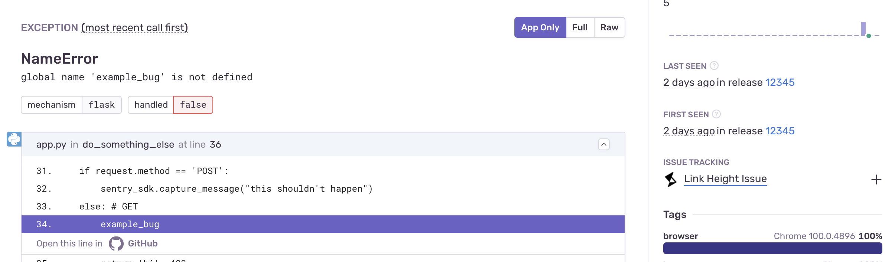

The Height Sentry integration allows your team to record and quickly resolve critical errors by linking new or existing Height tasks to Sentry issues. Linking tasks gives your teammates visibility into updates from Sentry, and they can automatically mark Sentry issues as _Resolved_ as the task status changes in Height. Additionally, set up custom alerts to create new Height tasks when key triggers you care about, like reported errors or session crashes, spike above a certain threshold.

This integration is maintained and supported by the company that created it. For more details, check out our [Integration Platform documentation](/product/integrations/integration-platform/).

## Install and Configure

<Note>

Sentry owner, manager, or admin permissions are required to install this integration.

Height **won't** work with self-hosted Sentry.

</Note>

To add the Height integration, navigate to **Settings > Integrations > Height** and click "Install".

## Issue Management

Issue tracking allows you to create Height tasks from within [sentry.io](https://sentry.io), and link Sentry issues to existing Height tasks. Issue management can be configured in two ways: automatically or manually.

### Automatically

To configure issue management automatically, create an [issue alert](/product/alerts/alert-types/#issue-alerts) or a [metric alert](/product/alerts/alert-types/#metric-alerts). When selecting the [action](/product/alerts/create-alerts/issue-alert-config/#then-conditions-actions), choose "Notify Integration" and then "Height" for issue alerts, or select "Height" from the action dropdown for metric alerts:

A Height task will be created automatically when the alert is triggered.

### Manually

To configure issue management manually, navigate to a specific Sentry issue and find the "Linked Issues" section on the right panel:

Here, you’ll be able to create or link Height tasks:

## Issue Sync

Height will keep your issue statuses in sync. There is a default mapping from the Height task status to the Sentry issue status. If you resolve a Height task, the manually linked Sentry issue will also be resolved.
