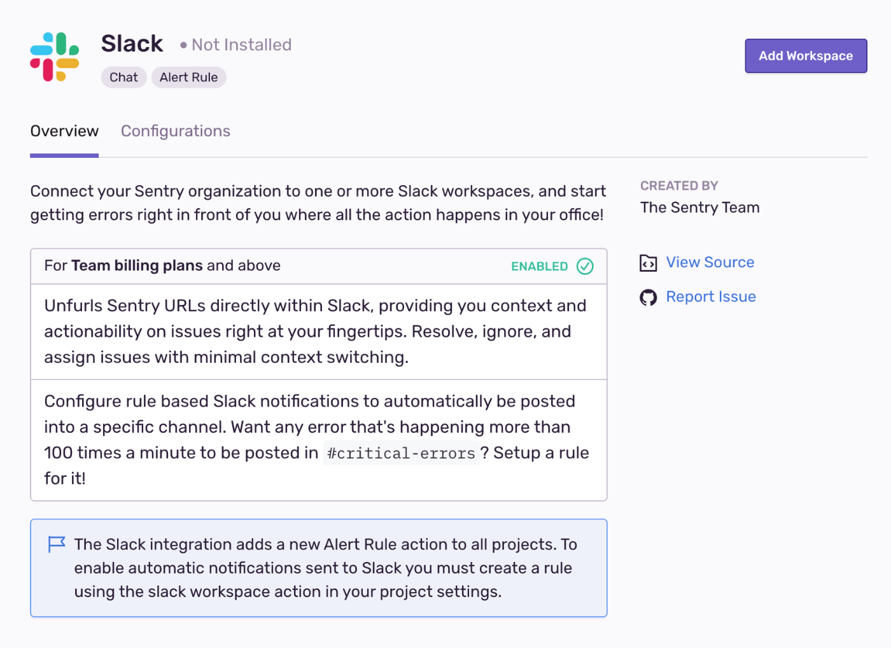
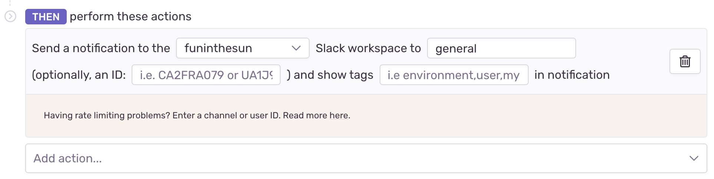
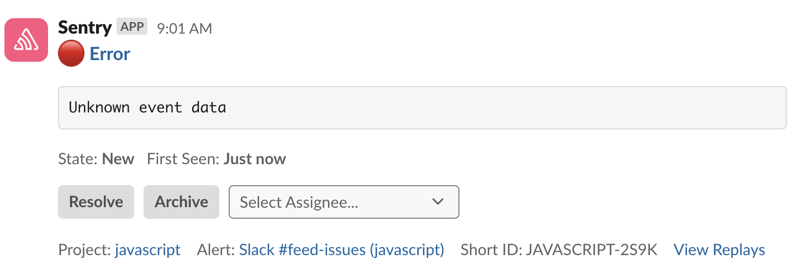
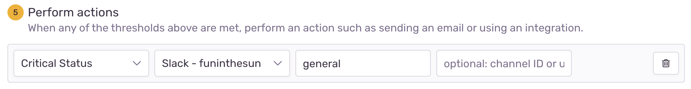
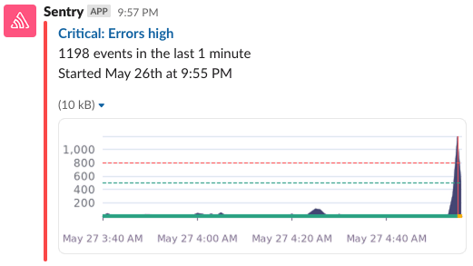
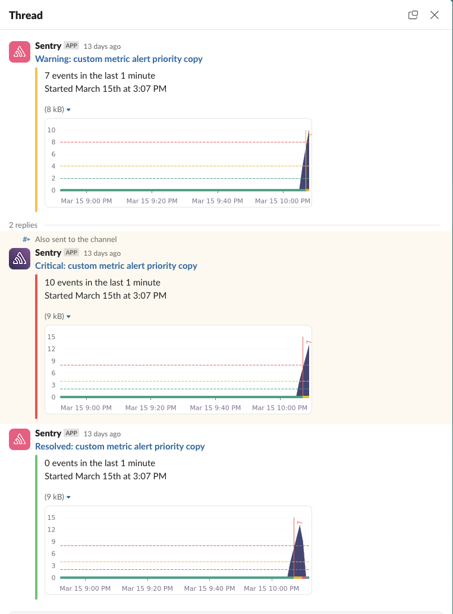

Triage, resolve, and archive Sentry issues directly from Slack.

## Install

<Note>

Sentry owner, manager, or admin permissions are required to install this integration.

</Note>

Slack defaults to let any workspace member authorize apps, but they may have to request access. See this [Slack help article](https://get.slack.help/hc/en-us/articles/202035138-Add-an-app-to-your-workspace) for more details.

1.  In [sentry.io](https://sentry.io), navigate to **Settings > Integrations > Slack**.

2.  Click "Add Workspace".

    

3.  Toggle to the Slack workspace to which you want to connect using the dropdown menu in the upper right corner of the authentication window. Then select "Allow". Repeat this process if you are connecting to multiple workspaces.

    

Your integration details page will refresh and show the Slack workspace you just added.

Your Slack integration is now available to all projects in your Sentry organization. To enable Slack notification for private channels, add the Slack app to the channel. One quick method: use `@sentry` to invite the Sentry bot the Slack channel.

In the next section, we'll walk you through configuring your notification settings.

## Configure

Use Slack for notifications and [alerts](#alert-rules) regarding issues, environments, deployment, etc.

### Personal Notifications

You can receive personal workflow, deploy, and issue alert notifications from our Slack integration. Manage your [personal notification settings](/product/alerts/notifications/notification-settings/) by navigating to **User Settings > Notifications**.

#### Linking Your Slack and Sentry Accounts

In order to receive personal notifications from our Slack integration, your Slack identity must be linked with your Sentry account. This can be done by typing `/sentry link` in Slack.

### Team Notifications

You can receive [team alert notifications](/product/alerts/create-alerts/issue-alert-config/#then-conditions-actions) from our Slack integration. To enable this feature, type `/sentry link team` in the desired Slack channel. To view a team's associated Slack channel in [sentry.io](https://sentry.io), navigate to **Settings > Teams > [Team] > Notifications**.

### Alert Rules

Set up an alert rule by going to **Alerts** and clicking "Create Alert". From here, you can configure alerts to route notifications to your Slack workspace(s).

#### Issue Alerts

In [issue alerts](/product/alerts/alert-types/#issue-alerts), select "Send a Slack notification" in the actions dropdown and then select your workspace and channel. You can optionally select any tags to include in the alert as well as other text in the "notes" section. Mentions are supported in the "notes" section - to @ a user, include their user id like `@<USER_ID>`.

Once you receive a Slack notification for an issue alert, you can use the "Resolve", "Archive", or "Select Assignee..." buttons to update the Issue in Sentry.

#### Metric Alerts

In [metric alerts](/product/alerts/alert-types/#metric-alerts), select the Slack option in the dropdown that corresponds to your workspace and the select your channel:

Metric alert Slack notifications include a chart of the metric's status and a link to investigate the alert further:

Slack notifications in metric alerts are also contained within threads, so all notifications related to a singular issue will be replies to the original notification.

Critical-level notifications will still be sent to the channel, and also contained in a thread.

An example of the experience looks like this:

### Troubleshooting

#### Rate Limiting Error

If you're attempting to save a Slack alert rule and are receiving the following error: "Requests to slack were rate limited. Please try again later.", you may enter in the channel or user ID in addition to the channel name.

To find a channel's ID in Slack click the name of the channel at the top of the application and the channel ID will be shown at the bottom of the pop up. To find a user's ID click on their avatar >> "View full profile" >> ... >> "Copy member ID".

#### Can't Add Alert Rule to Channel

If you receive an error “The slack resource `example-channel` does not exist or has not been granted access in the `example-workspace` Slack workspace” while trying to add an alert rule, we recommend checking whether our app is installed in the channel. In Slack, right click on your channel's name from the left bar and select "Open channel settings". Then click on the "Integrations" tab; the Sentry app should be listed under "Apps".

## Deleting the legacy project-based Slack integration

We recommend disabling the legacy project-based integration after setting up the global integration.

Once you configure the global Slack integration and alert rules, you can disable the old project-based Slack integration. Go to each project that has the old project-based Slack enabled and disable it.
