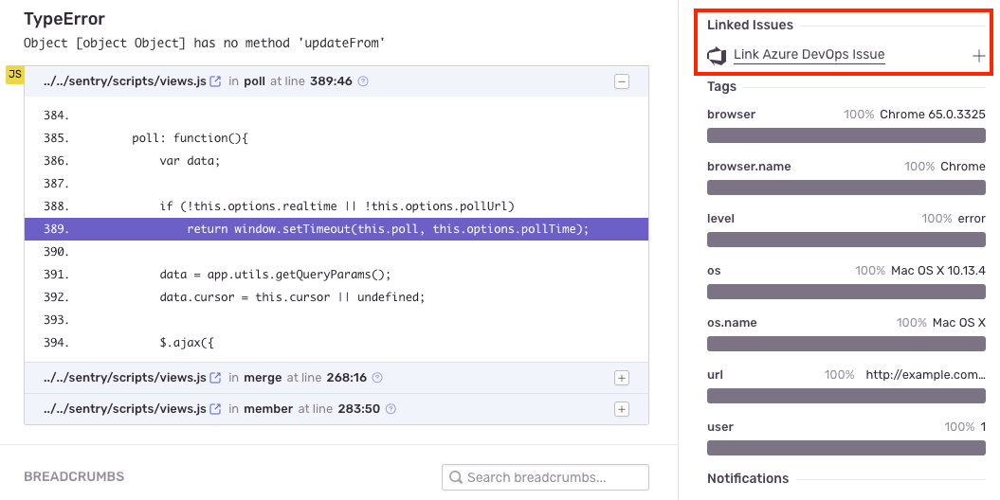
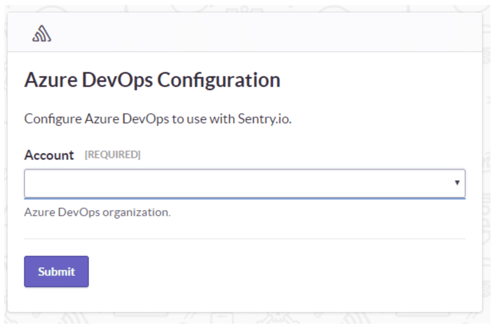

Track and resolve bugs faster by using data from your Azure DevOps commits. (Azure DevOps was formerly known as Visual Studio Team Services, VSTS.)

## Install

1. To install this integration, you need to have Sentry organization owner, manager, or admin permissions, as well as Azure organization owner permissions, or be a user in the Project Collections Administrators group.

2. Go to your Azure Org's settings to make sure third-party access via OAuth is enabled.

3. In [Sentry.io](https://sentry.sentry.io/settings/organization/), navigate to **Settings > Integrations > Azure DevOps** and click "Add Installation".

   

4. An Azure DevOps install window should pop up. Select the Azure DevOps account you'd like to link with Sentry, and press **Submit**.

   

Azure DevOps should now be enabled for all projects under your Sentry organization, but you'll need to configure the features below.

## Configure

Use Azure DevOps to [track commits](#commit-tracking) and [issue management](#issue-management).

### Commit Tracking

Commit tracking allows you to hone in on problematic commits. Uncover which commits likely caused an issue, and allow your team to resolve issues by referencing the issue number in a commit message.

For more details, see the full documentation on [commit tracking and releases](/product/releases/setup/).

You’ll also see that the author of the suspect commit will be listed as a suggested assignee for this issue. To assign the issue to the suggested assignee, click on their icon.

### Issue Management

Issue tracking allows you to create Azure DevOps issues from within Sentry, and link Sentry issues to existing Azure DevOps Issues.

<Alert title="Note" level="info">
  <p>
    Manual issue management is available to organizations on Team, Business, and
    Enterprise plans.
  </p>
  <p>
    Automatic issue management is available to organizations that include
    transactions in their Business and Enterprise plans.
  </p>
</Alert>

Issue management can be configured in two ways - automatically or manually.

#### Automatically

To configure issue management automatically, create an [**Issue Alert**](/product/alerts-notifications/issue-alerts/). When selecting the [**action**](/product/alerts/create-alerts/issue-alert-config/#then-conditions-actions), choose **Create a new Azure DevOps work item**.


An Azure DevOps work item will be created automatically when the alert has been triggered.

#### Manually

Once you’ve navigated to a specific issue, you’ll find the **Linked Issues** section on the right hand panel. Here, you’ll be able to create or link Azure DevOps issues.



### Issue Sync

Sync comments, assignees, and status updates for issues in Sentry to Azure DevOps, to minimize duplication. When you delegate an issue to an assignee or update a status on Azure DevOps, the updates will also populate in Sentry. When you resolve an issue in Sentry, the issue status will automatically update in Azure DevOps.

<Alert title="Note" level="info">
  Issue sync is available for organizations on the Team, Business, and
  Enterprise plans.
</Alert>

To configure Issue sync, navigate to ** Organization Settings > Integrations**, and click "Configure" next to your Azure DevOps instance. On the following page, you’ll see options of what information you’d like synced between Sentry and Azure DevOps.


### Resolve in Commit

Once you send commit data, you can start resolving issues by including `fixes <SENTRY-SHORT-ID>` in your commit messages. For example, a commit message might look like:

```
Prevent empty queries on users

Fixes MYAPP-317
```

When Sentry sees this, we’ll automatically annotate the matching issue with reference to the commit, and later, when that commit is part of a release, we’ll mark the issue as resolved. The commit must be associated with a release. Otherwise, if the commit is squashed, Sentry won’t know when the commit has been released, and the issue may never be marked as a regression.

### Stack Trace Linking

<Note>

This feature is currently only supported for Ruby, Python, Php, Node, JavaScript, Go and Elixir.

</Note>

Stack trace linking takes you from a file in your Sentry stack trace to that same file in your source code. If you have commit tracking set up in Sentry, we can take you to the exact version (using the commit associated with the event) of the source code when the error occurred. Otherwise we'll link you to the current state of the source code (using the default branch).

1. Navigate to **Settings > Integrations > Azure DevOps > Configurations**.

1. Click "Configure" (the gear icon) next to your Azure DevOps Instance.

1. Click the "Code Mappings" tab.

1. Set up a code mapping for each project you want to have stack trace linking. To create a new code mapping, click "Add Mapping".

1. Fill out the form, then click "Save Changes". Each form field is described below:

   - **Project** (required): This is the Sentry project.
   - **Repo** (required): This is the Azure DevOps project associated with the Sentry project above. If you have more than one Azure DevOps project being used per Sentry project, you'll need multiple code mappings.
   - **Branch** (required): This is the default branch of your code we fall back to if you do not have commit tracking set up.
   - **Stack Trace Root** and **Source Code Root** (optional): See below for information on determining these values.

#### Stack Trace Root and Source Code Root

<Note>

The following information is only valid for platforms which use traditional file paths. Platforms with package names require additional steps. For **Java**, read more in the [page on source context](/platforms/java/source-context#setting-up-code-mappings).

</Note>

First, navigate to a stack trace that you wish to map. Find an **In App** frame, which is denoted by a bubble on the right side of the frame. The filename will be shown as the first piece of text at the left hand side of the frame header. In this example, it is `src/main.py`.


For certain native platforms, the stack trace will look different. In cases like these, you can find the absolute path by hovering over the filename.


If you aren’t sure, you can look at the event JSON by clicking on the `{}` button in the event header. Find the text in the frame's `filename` or `abs_path`.

<Include name="common-imgs/code-mappings-event-json" />

Next, locate the file seen in the stack trace with your source code provider (e.g. GitHub). In this example, the path is `flask/src/main.py` (`empower` is ignored since it is the name of the repo).

<Include name="common-imgs/code-mappings-source-file" />

Compare the file path from the stack trace with the path found in your source repository. In this example, the `src/` folder in the stack trace matches the `flask/src` folder in the source code. Using that information, set the **Stack Trace Root** to `src/` and the **Source Code Root** to `flask/src/`. This tells Sentry to replace all file paths beginning in `src/` with `flask/src/` when searching for the source code.

For best results, we recommend always providing a non-empty value for the **Stack Trace Root** when possible.

<Include name="common-imgs/code-mappings-configure-modal" />

## Troubleshooting

### No accounts during installation



If you reach the account selection page during the Azure Devops installation process (step 4 in the instructions above) and see that there are no accounts available to select, please check the following possibilities:

- Ensure you are logged into the account connected to your Azure DevOps organization.
- Double-check that your account is a Microsoft Account (MSA).
- For single sign-on, see [Azure Active Directory SSO](/product/accounts/sso/azure-sso/).
- If you have multiple accounts in Azure DevOps, open [this link to Azure DevOps](https://aex.dev.azure.com) in another tab, select the correct account, then reinstall.

<Note>
  If reinstallation solves the problem, please upvote [that solution in
  GitHub](https://github.com/getsentry/sentry/issues/14357), which is where
  we're tracking this improvement.
</Note>
