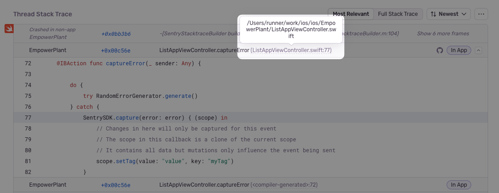

Track and resolve bugs faster by using data from your Bitbucket commits.

## Install

<Note>

Sentry owner, manager, or admin permissions, and Bitbucket admin permissions are required to install this integration.

</Note>

1. Navigate to **Settings > Integrations > Bitbucket**.


2. If you have the legacy Bitbucket integration installed, use the button next to Bitbucket to **Upgrade**. If you don't have the legacy Bitbucket integration installed, use the button to **Install**.

3. In the resulting modal, click "Add Installation".

4. A Bitbucket install window should pop up. Select the Bitbucket account you'd like to grant Sentry access to, and click "Grant Access".
5. On your new Bitbucket instance in Sentry, click "Configure".

   

6. Add any repositories from which you want to collect commit data.

   

Bitbucket should now be enabled for all projects under your Sentry organization.

### Bitbucket Server

#### Generate an RSA public/private key pair

To generate an RSA public/private key pair, run the following commands in your terminal window one by one.

```
openssl genrsa -out bitbucket_privatekey.pem 1024
openssl req -newkey rsa:1024 -x509 -key bitbucket_privatekey.pem -out bitbucket_publickey.cer -days 365
openssl pkcs8 -topk8 -nocrypt -in bitbucket_privatekey.pem -out bitbucket_privatekey.pcks8
openssl x509 -pubkey -noout -in bitbucket_publickey.cer  > bitbucket_publickey.pem
```

#### Create a new application link in Bitbucket

1. In Bitbucket, click the gear icon, then **Applications > Application Links**.
2. Enter the following as the application URL:
   `https://sentry.io/extensions/bitbucket_server/setup/`
3. Click "Create New Link". If you see a warning that “No response was received from the URL you entered,” ignore and click "Continue".
4. In the resulting dialog, fill out the form as follows:

   <table>
     <tr>
       <th>Application Name</th>
       <td>Sentry</td>
     </tr>
     <tr>
       <th>Application Type</th>
       <td>Generic Application</td>
     </tr>
     <tr>
       <th>Service Provider Name</th>
       <td>Sentry</td>
     </tr>
     <tr>
       <th>Consumer Key</th>
       <td>(your choice, but keep this handy for the next step)</td>
     </tr>
     <tr>
       <th>Shared Secret</th>
       <td>sentry</td>
     </tr>
     <tr>
       <th>Request Token URL</th>
       <td>https://sentry.io</td>
     </tr>
     <tr>
       <th>Access Token URL</th>
       <td>https://sentry.io</td>
     </tr>
     <tr>
       <th>Authorize URL</th>
       <td>https://sentry.io</td>
     </tr>
     <tr>
       <th>Create Incoming Link</th>
       <td>No</td>
     </tr>
   </table>

5. Click "Continue". This will return you to the **Configure Application Links** page, where you'll see an application called Sentry.
6. Click the pencil icon next to the Sentry application.
7. On the lefthand side of the resulting modal, click "Incoming Authentication". Fill out the form as follows, and click "Save":

   <table>
     <tr>
       <th>Consumer Key</th>
       <td>(the consumer key from Step II.4)</td>
     </tr>
     <tr>
       <th>Consumer Name</th>
       <td>Sentry</td>
     </tr>
     <tr>
       <th>Public Key</th>
       <td>(the public key you created in Section I)</td>
     </tr>
     <tr>
       <th>Consumer Callback URL</th>
       <td>https://sentry.io/extensions/bitbucket_server/setup/</td>
     </tr>
     <tr>
       <th>Allow 2-Legged OAuth</th>
       <td>no</td>
     </tr>
   </table>

#### Connect your Bitbucket Server application with Sentry

Note: Confirm [Sentry's IP ranges](/product/security/ip-ranges/) are allowed.

1. In Sentry, navigate to **Organization Settings** > **Integrations**.
2. Next to Bitbucket Server, click "Install".
3. In the resulting modal, click "Add Installation".
4. In the resulting window, enter the base URL for your Bitbucket Server instance, your consumer key, and your private key. Click "Submit". Then, complete the OAuth process as prompted.
5. In Sentry, you’ll see a new Bitbucket Server instance appear on the Integrations page.

Bitbucket should now be authorized for all projects under your Sentry organization.

## Configure

Use Bitbucket to [track commits](#commit-tracking), for [issue management](#issue-management), and to [resolve in commit](#resolving-in-commit).

### Commit Tracking

Commit tracking allows you to hone in on problematic commits. Uncover which commits likely caused an issue, and allow your team to resolve issues by referencing the issue number in a commit message.

For more details, see the full documentation on [commit tracking and releases](/product/releases/setup/).

### Issue Management

Issue tracking allows you to create Bitbucket issues from within Sentry, and link Sentry issues to existing Bitbucket Issues.

Once you’ve navigated to a specific issue, you’ll find the **Linked Issues** section on the right hand panel. Here, you’ll be able to create or link Bitbucket issues.


### Resolving in Commit

Once you are sending commit data, you can start resolving issues by including `fixes <SENTRY-SHORT-ID>` in your commit messages. For example, a commit message might look like:

```
Prevent empty queries on users

Fixes MYAPP-317
```

When Sentry sees this, we’ll automatically annotate the matching issue with reference to the commit, and later, when that commit is part of a release, we’ll mark the issue as resolved. The commit must be associated with a release. Otherwise, if the commit is squashed, Sentry won’t know when the commit has been released, and the issue may never be marked as a regression.

### Stack Trace Linking

<Note>

This feature is currently only supported for Ruby, Python, Php, Node, JavaScript, Go and Elixir.

</Note>

Stack trace linking takes you from a file in your Sentry stack trace to that same file in your source code. If you have commit tracking set up in Sentry, we can take you to the exact version (using the commit associated with the event) of the source code when the error occurred. Otherwise we'll link you to the current state of the source code (using the default branch).

1. Navigate to **Settings > Integrations > Bitbucket > Configurations**.

1. Click "Configure" (the gear icon) next to your Bitbucket Instance.

1. Click the "Code Mappings" tab.

1. Set up a code mapping for each project you want to have stack trace linking. To create a new code mapping, click "Add Mapping".

1. Fill out the form, then click "Save Changes". Each form field is described below:

   - **Project** (required): This is the Sentry project.
   - **Repo** (required): This is the Bitbucket project associated with the Sentry project above. If you have more than one Bitbucket project being used per Sentry project, you'll need multiple code mappings.
   - **Branch** (required): This is the default branch of your code we fall back to if you do not have commit tracking set up.
   - **Stack Trace Root** and **Source Code Root** (optional): See below for information on determining these values.

#### Stack Trace Root and Source Code Root

<Note>

The following information is only valid for platforms which use traditional file paths. Platforms with package names require additional steps. For **Java**, read more in the [page on source context](/platforms/java/source-context#setting-up-code-mappings).

</Note>

First, navigate to a stack trace that you wish to map. Find an **In App** frame, which is denoted by a bubble on the right side of the frame. The filename will be shown as the first piece of text at the left hand side of the frame header. In this example, it is `src/main.py`.

<Include name="common-imgs/code-mappings-stacktrace" />

For certain native platforms, the stack trace will look different. In cases like these, you can find the absolute path by hovering over the filename.



If you aren’t sure, you can look at the event JSON by clicking on the `{}` button in the event header. Find the text in the frame's `filename` or `abs_path`.

<Include name="common-imgs/code-mappings-event-json" />

Next, locate the file seen in the stack trace with your source code provider (e.g. GitHub). In this example, the path is `flask/src/main.py` (`empower` is ignored since it is the name of the repo).

<Include name="common-imgs/code-mappings-source-file" />

Compare the file path from the stack trace with the path found in your source repository. In this example, the `src/` folder in the stack trace matches the `flask/src` folder in the source code. Using that information, set the **Stack Trace Root** to `src/` and the **Source Code Root** to `flask/src/`. This tells Sentry to replace all file paths beginning in `src/` with `flask/src/` when searching for the source code.

For best results, we recommend always providing a non-empty value for the **Stack Trace Root** when possible.

<Include name="common-imgs/code-mappings-configure-modal" />

## Troubleshooting

If you're having trouble setting up Sentry with your on-premises integration, verify the following:

- The provided installation URL is a fully qualified domain name (FQDN), which is resolvable on the internet.
- The IP addresses Sentry uses to make outbound requests are [allowed](/product/security/ip-ranges/).
- Sentry's access to your installation URL is not path restricted.
