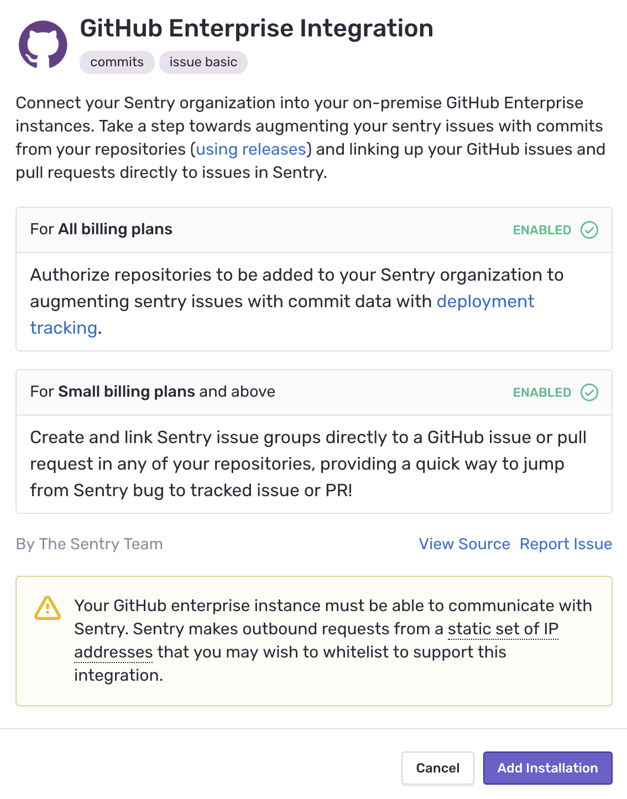
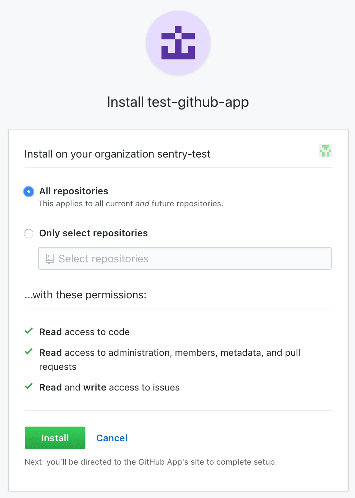
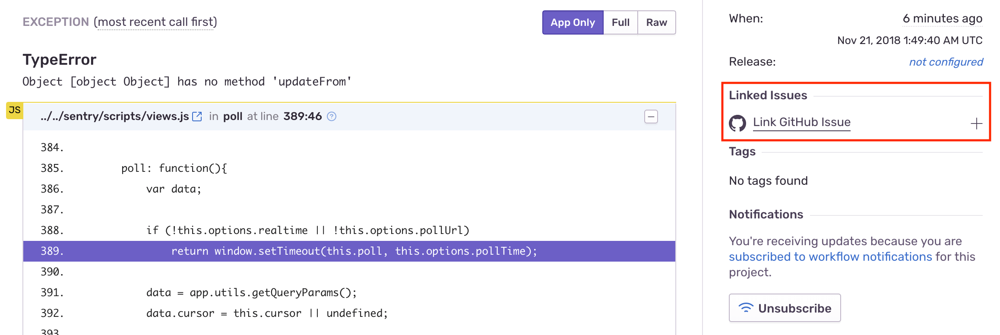

Track and resolve bugs faster by using data from your GitHub commits, and streamline your triaging process by creating a GitHub issue directly from Sentry.

If you're not sure which GitHub integration you need to configure, please take a look at the URL. URLs like `https://github.com/org-name` are usually for GitHub-hosted accounts and should use the regular GitHub (not GitHub Enterprise) integration. See [Install](#install) for more details.

Self-hosted GitHub Enterprise accounts typically have URLs that look more like `https://github.org-name.com` (or some other customization of the domain). In this case, you should configure the [GitHub Enterprise integration](#github-enterprise).

## Install

<Note>

Sentry owner, manager, or admin permissions, and GitHub owner permissions are required to install this integration.

</Note>

1. Navigate to **Settings > Integrations > [GitHub](https://sentry.io/orgredirect/organizations/:orgslug/settings/integrations/github)**.

   

2. If you have the legacy GitHub integration installed, use the button next to GitHub to **Upgrade**. If you don't have the legacy GitHub integration installed, use the button to **Install**.

3. In the resulting modal, click "Add Installation".

4. A GitHub install window should pop up. Click "Install".
5. Select which repositories Sentry should have access to (or select all repositories).
6. You should then be redirected back to the Sentry Integrations page.
7. On your new GitHub instance in Sentry, click "Configure".
8. All of your repositories will be added by default, you just have to refresh your screen. To only add select repositories, choose them from the dropdown list. _Make sure you have given Sentry access to these repositories in GitHub in the previous steps._

   

The GitHub integration is available for all projects under your Sentry organization. You can connect multiple GitHub organizations to one Sentry organization, but you **cannot** connect a single GitHub organization to multiple Sentry organizations.

## GitHub Enterprise

<Note>

If your GitHub Enterprise instance is self-hosted/on-prem, follow the instructions below.
If you're using GitHub Enterprise Cloud, follow the [instructions for GitHub](/product/integrations/source-code-mgmt/github/#install).

</Note>

#### Add new GitHub App

1. Confirm [Sentry's IP ranges](/product/security/ip-ranges/) are allowed for your GitHub Enterprise instance.
2. In your GitHub Enterprise organization, navigate to Settings > Developer Settings > **GitHub Apps** and click to add a new **New GitHub App**.

   

#### Register new GitHub App

1. First, you'll need to generate a webhook secret. For example, in terminal:

   ```
   openssl rand -base64 500 | tr -dc 'a-zA-Z0-9' | fold -w 64 | head -n 1
   ```

2. Then in GitHub, fill out the form as follows and click "Create GitHub App".

   <table>
     <tr>
       <th>GitHub App Name </th>
       <td>sentry-app </td>
     </tr>
     <tr>
       <th>Homepage URL </th>
       <td>https://sentry.io </td>
     </tr>
     <tr>
       <th>User authorization callback URL </th>
       <td>https://sentry.io/extensions/github-enterprise/setup/ </td>
     </tr>
     <tr>
       <th>Setup URL </th>
       <td>https://sentry.io/extensions/github-enterprise/setup/ </td>
     </tr>
     <tr>
       <th>Webhook URL </th>
       <td>https://sentry.io/extensions/github-enterprise/webhook/ </td>
     </tr>
     <tr>
       <th>Webhook secret </th>
       <td>`Input your secret from the previous step` </td>
     </tr>
     <tr>
       <th>Repository Administration </th>
       <td>Read-only </td>
     </tr>
     <tr>
       <th>Commit Statuses </th>
       <td>No Access </td>
     </tr>
     <tr>
       <th>Deployments </th>
       <td>No Access </td>
     </tr>
     <tr>
       <th>Issues </th>
       <td>Read & Write </td>
     </tr>
     <tr>
       <th>Pages </th>
       <td>No Access </td>
     </tr>
     <tr>
       <th>Pull Requests </th>
       <td>Read-only </td>
     </tr>
     <tr>
       <th>Repository Contents </th>
       <td>Read-only </td>
     </tr>
     <tr>
       <th>Single File </th>
       <td>No Access </td>
     </tr>
     <tr>
       <th>Repository Projects </th>
       <td>No Access </td>
     </tr>
     <tr>
       <th>Organization members </th>
       <td>Read-only </td>
     </tr>
     <tr>
       <th>Organization projects </th>
       <td>No Access </td>
     </tr>
   </table>

   **Subscribe to Events**

   <table>
     <tr>
       <th>Pull Request </th>
       <td>Yes </td>
     </tr>
     <tr>
       <th>Push </th>
       <td>Yes </td>
     </tr>
   </table>

#### Install your GitHub App

1. In Sentry, navigate to Organization Settings > **Integrations**.
2. Next to GitHub Enterprise, click "Install".

   

3. Click "Add Installation".

   

4. Fill out the following form with information from your GitHub apps configuration page.

   

   You'll need to generate a private key on your GitHub apps configuration page, and paste the entire contents into the **GitHub App Private Key** field.

   

   For example, in terminal:

   ```
   cat <YOUR_PRIVATE_KEY_FILE> | pbcopy
   ```

5. Click "Configure" and then a GitHub install window will pop up. Select which repositories Sentry should have access to (or select all repositories) and click "Install".

   

6. You will then be redirected back to Sentry. On your new GitHub Enterprise instance, click "Configure".

   

7. Add any repositories that you want to collect commit data from. _Make sure you have given Sentry access to these repositories in GitHub in the previous steps._
   

GitHub Enterprise should now be enabled for all projects under your Sentry organization.

## Configure

Use GitHub to [track commits](#commit-tracking), identify [suspect commits](#suspect-commits-and-suggested-assignees), [resolve via commit or PR](#resolve-via-commit-or-pull-request) and [manage issues](#issue-management).

### Commit Tracking

Commit tracking allows you to hone in on problematic commits. Learn more about [commit tracking](/product/releases/setup/release-automation/).

### Suspect Commits and Suggested Assignees

Once you set up commit tracking, you’ll be able to see the most recent changes to files found in the issue’s stack trace with suspect commits.

For issues where the files in the stack trace match files included in commits sent to Sentry, you’ll see the suspect commit, with a link to the commit itself.


You’ll also see that the author of the suspect commit will be listed as a suggested assignee for this issue. To assign the issue to the suggested assignee, click on their icon.

### Issue Management

Issue tracking allows you to create GitHub issues from within Sentry, and link
Sentry issues to existing GitHub Issues.

<Alert title="Note" level="info">
  <p>
    Manual issue management is available to organizations on Team, Business, and
    Enterprise plans.
  </p>
  <p>
    Automatic issue management is available to organizations that include
    transactions in their Business and Enterprise plans.
  </p>
</Alert>

Issue management can be configured in two ways - automatically or manually.

#### Automatically

To configure issue management automatically, create an [**Issue Alert**](/product/alerts-notifications/issue-alerts/). When selecting the [**action**](/product/alerts/create-alerts/issue-alert-config/#then-conditions-actions), choose **Create a new GitHub issue**.


A GitHub issue will be created automatically when the alert has been triggered.

#### Manually

To configure issue management manually, once you've navigated to a specific Sentry issue, you'll find the **Linked Issues** section on the right hand panel.



Here, you’ll be able to create or link GitHub issues.


### Resolve via Commit or Pull Request

Once you are sending commit data, you can start resolving issues by including `fixes <SENTRY-SHORT-ID>` in your commit messages. For example, a commit message might look like:

```
Prevent empty queries on users

Fixes MYAPP-317
```

You can also resolve issues with pull requests by including `fixes <SENTRY-SHORT-ID>` in the title or description.

When Sentry sees this, we’ll automatically annotate the matching issue with a reference to the commit or pull request, and, later, when that commit or pull request is part of a release, we’ll mark the issue as resolved. The commit must be associated with a release. Otherwise, if the commit is squashed, Sentry won’t know when the commit has been released, and the issue may never be marked as a regression. With GitHub, we recommend using `fixes <SENTRY-SHORT-ID>` in the body of your pull request that is going to be merged to your main branch.

### Get Sentry Comments on Pull Requests

Sentry can comment on merged and open pull requests. These features are automatically enabled once your GitHub integration has been set up. To disable it, go to **Settings > Integrations > GitHub** and toggle it off.


#### Merged Pull Request Comments

If a recently merged pull request is suspected of causing an issue, Sentry will comment on it to surface the issue, as shown in the example below.


Sentry will only comment on pull requests less than two weeks old that are associated with suspect commits. The comment will continuously be updated with up to five issues the pull request is suspected to have caused.

#### Open Pull Request Comments

When a pull request is opened, Sentry will parse the filenames and function names modified in the pull request from the PR diff to find recent unhandled, unresolved issues associated with your pull request.


Sentry will comment on the pull request with up to five issues per file that were first seen within the past 90 days and were last seen within the past 14 days.

This feature requires [code mappings](/product/issues/suspect-commits/#2-set-up-code-mappings) and is currently only supported for Python, Javascript/Typescript, and PHP files. For Javascript/Typescript, please ensure that you've unminified your code by [setting up source maps](/platforms/javascript/sourcemaps/).

### Missing Member Detection

If there are users committing to Github repositories linked to Sentry and they're not members of your organization, Sentry detects them as missing members. Once a month, Sentry sends organization owners and managers an email reminding them to invite those users to join their org. Sentry also shows a banner to invite missing members in the **Settings > Members** page.


The banner shows the 5 most active contributors that are not yet in the organization. To see all missing members (up to 50), click "View All" in the banner. To snooze the banner, click the ellipsis, then select "Hide Missing Members".

Clicking "View All" on the invite banner will display the invite modal. From here, you can select multiple users and assign roles and teams before inviting them.


By default, this feature is automatically enabled once your GitHub integration has been set up. To disable it, go to **Settings > Integrations > GitHub** and toggle it off.


### Stack Trace Linking

<Note>

Sentry will automatically try to set up code mappings on Python, JavaScript, Node.js, Ruby, and PHP projects for organizations with the GitHub integration installed. If your project uses a different SDK, you can add code mappings manually. Support for other languages and other source code integrations is being worked on.

</Note>

Stack trace linking takes you from a file in your Sentry stack trace to that same file in your source code. If you have commit tracking set up in Sentry, we can take you to the exact version (using the commit associated with the event) of the source code when the error occurred. Otherwise we'll link you to the current state of the source code (using the default **branch**).

1. Navigate to **Settings > Integrations > GitHub > Configurations**.

1. Click the "Configure" button next to your GitHub Instance.

1. Click the **Code Mappings** tab.

1. Set up a code mapping for each project for which you want to enable stack trace linking. To create a new code mapping, click **Add Mapping**.

1. Fill out the form, then click **Save Changes**. Each form field is described below:

   - **Project** (required): This is the Sentry project.
   - **Repo** (required): This is the GitHub repository associated with the Sentry project above. If you have more than one GitHub repository being used per Sentry project, you'll need multiple code mappings.
   - **Branch** (required): This is the default branch of your code we fall back to if you do not have commit tracking set up.
   - **Stack Trace Root** and **Source Code Root** (optional): See below for information on determining these values.

#### Stack Trace Root and Source Code Root

<Note>

The following information is only valid for platforms which use traditional file paths. Platforms with package names require additional steps. For **Java**, read more in the [page on source context](/platforms/java/source-context#setting-up-code-mappings).

</Note>

First, navigate to a stack trace that you wish to map. Find an **In App** frame, which is denoted by a bubble on the right side of the frame. The filename will be shown as the first piece of text at the left hand side of the frame header. In this example, it is `src/main.py`.


For certain native platforms, the stack trace will look different. In cases like these, you can find the absolute path by hovering over the filename.


If you aren’t sure, you can look at the event JSON by clicking on the `{}` button in the event header. Find the text in the frame's `filename` or `abs_path`.


Next, locate the file seen in the stack trace with your source code provider (e.g. GitHub). In this example, the path is `flask/src/main.py` (`empower` is ignored since it is the name of the repo).


Compare the file path from the stack trace with the path found in your source repository. In this example, the `src/` folder in the stack trace matches the `flask/src` folder in the source code. Using that information, set the **Stack Trace Root** to `src/` and the **Source Code Root** to `flask/src/`. This tells Sentry to replace all file paths beginning in `src/` with `flask/src/` when searching for the source code.

For best results, we recommend always providing a non-empty value for the **Stack Trace Root** when possible.


### Code Owners

<Include name="feature-available-for-plan-business.mdx" />

Import your existing GitHub CODEOWNERS files to automatically assign Sentry issues and route alerts to the responsible individuals and teams.

For more details, see the full documentation for [Code Owners](/product/issues/ownership-rules/#code-owners).

### GitHub Single Sign-On

Single sign-on (or SSO) allows you to manage your organization’s entire membership via a third-party provider.

For more details, see the full documentation for [Single Sign-on](/product/accounts/sso/).

## Troubleshooting

If you’re having issues adding a GitHub repository:

- Make sure you are the Owner of your GitHub organization.
- [Disconnect](https://sentry.io/account/settings/identities/), and then [reconnect](https://sentry.io/account/settings/social/associate/github/) your GitHub Identity.

If you're having trouble setting up Sentry with your on-premises integration, verify the following:

- The provided installation URL is a fully qualified domain name (FQDN), which is resolvable on the internet.
- The IP addresses Sentry uses to make outbound requests are [allowed](/product/security/ip-ranges/).
- Sentry's access to your installation URL is not path restricted.
