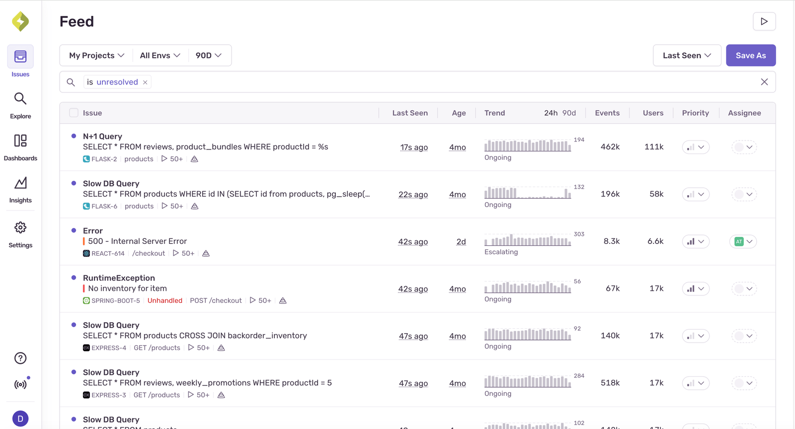
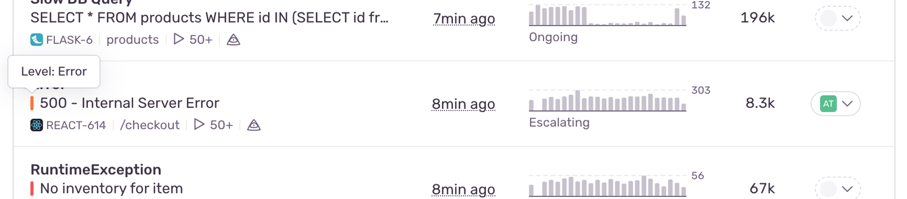
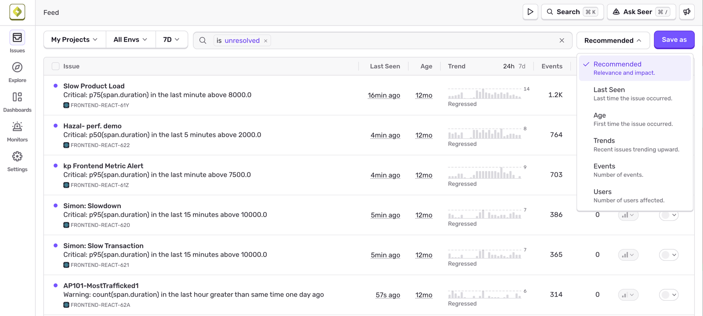

The [**Issues**](https://sentry.io/orgredirect/organizations/:orgslug/issues/) page in Sentry displays information about problems in your application. This page allows you to filter by properties such as browser, device, impacted users, or whether an error is unhandled. You can then inspect issue details to better understand the problem and [triage](/product/issues/states-triage/) effectively.

A typical application sends a large number of events to Sentry. You can think of an <SandboxLink scenario="oneIssue" projectSlug="react">issue</SandboxLink> as a single bug or problem with your app. To make them manageable, we [group similar events into issues](/concepts/data-management/event-grouping/) based on a fingerprint. This grouping of events into issues allows you to see how frequently a problem is happening and how many users it's affecting.

<Alert>

**Issues and Event Quotas**

Your quota is consumed by _events_, not _issues_. Issues are generated from your accepted error or transaction events. Generating issues does not cause Sentry to accept more events for you and **does not** directly impact your quota. Sentry does provide tools, however, to control the type and amount of error and transaction events that are accepted. Learn more in [Quota Management](/pricing/quotas/).

</Alert>

For each issue, the page displays:

- Issue type and description
- Associated project
- Issue timing, such as last and first time seen

For error issues, to see the stack trace of the latest event, you can hover over the issue title. You can also hover over the colored square to the left of the issue information to see the error level (error, info, fatal, warning, debug, or sample) of the latest event:

{/* TODO(msun): Update this when issue views are GA'd */}
You can save your issue queries and access them later by clicking the "Saved Searches" button in the header. Learn more in [Saved Searches](/concepts/search/saved-searches/). You can also add issues data to your [custom dashboards](/product/dashboards/custom-dashboards/) as widgets using the [dataset selector](/product/dashboards/widget-builder/#choose-your-dataset).

When you click on an issue on the main **Issues** page, the **Issue Details** page for that issue is displayed. Learn more in [Issue Details](/product/issues/issue-details/).

## Issue Categories

Sentry creates issues for more than just errors. The **Issues** page sidebar groups them by the kind of problem they represent:

- **Errors & Outages** — Things that break functionality: [runtime errors and exceptions](/product/issues/issue-details/error-issues/), [failed cron jobs](/product/monitors-and-alerts/monitors/crons/), and [uptime outages](/product/issues/issue-details/uptime-issues/).
- **Breached Metrics** — Degraded behavior over time, such as [endpoint latency regressions](/product/issues/issue-details/performance-issues/endpoint-regressions/) or a metric crossing a threshold you've set.
- **Warnings** — Code that works but inefficiently, like [N+1 queries, render-blocking assets, or file I/O on the main thread](/product/issues/issue-details/performance-issues/). These degrade performance and user experience.
- **Configuration** (beta) — SDK or tooling setup problems that make your data harder to debug, such as [low-value spans](/product/issues/issue-details/low-value-span-issues/).
- **User Feedback** — Reports your users submit directly through [User Feedback](/product/user-feedback/).

## Issue Triage

From the **Issues** page, you can begin to triage. The page is organized into tabs, each corresponding to a filtered list of issues, and these different lists help you with triaging:

- All Unresolved (`is:unresolved`): All unresolved issues, including issues that need review.
- For Review (`is:unresolved is:for_review`). Also called **Review List**,  for-review issues are a subset of all unresolved issues and can include new issues or regressions that haven't been reviewed yet.
- Regressed (`is:regressed`): All regressed issues; resolved issues that have come up again.
- Archived (`is:archived`): All archived issues.
- Escalating (`is:escalating`): All escalating issues; previously archived issues that have exceeded their forecasted event volume.

Learn more about triaging issues and their different states in [Issue States and Triage](/product/issues/states-triage/).

## How to Sort Issues

Change how issues are sorted in the issues stream by selecting from the sort dropdown:

- **Recommended**: The issues most relevant to you are shown first. Sentry combines a variety of signals to determine which issues are most likely to need your attention.
- **Last Seen**: The most recent events are shown first.
- **First Seen**: The newest issues are shown first.
- **Trends**: New issues and escalating issues (with event volumes trending upward) are shown first. Older issues and issues with fewer recent events are sorted lower. The ranking currently relies on three primary factors:
  - Relative volume: Escalating issues that have a higher recent volume (relative to their baseline) are ranked higher.
  - Absolute volume: Issues with more event volume are weighted more highly. Recent events are weighted more than old events.
  - Issue age: New issues are prioritized — an exponential decay factor halves the weight every 12 hours.
- **Events**: Issues are sorted by total event volume.
- **Users**: Issues are sorted by number of users affected.

## Learn More

<PageGrid />
