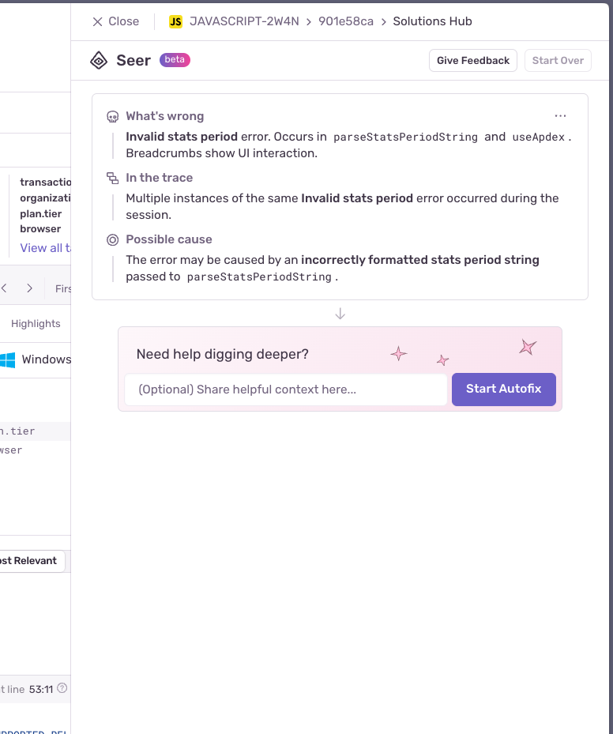
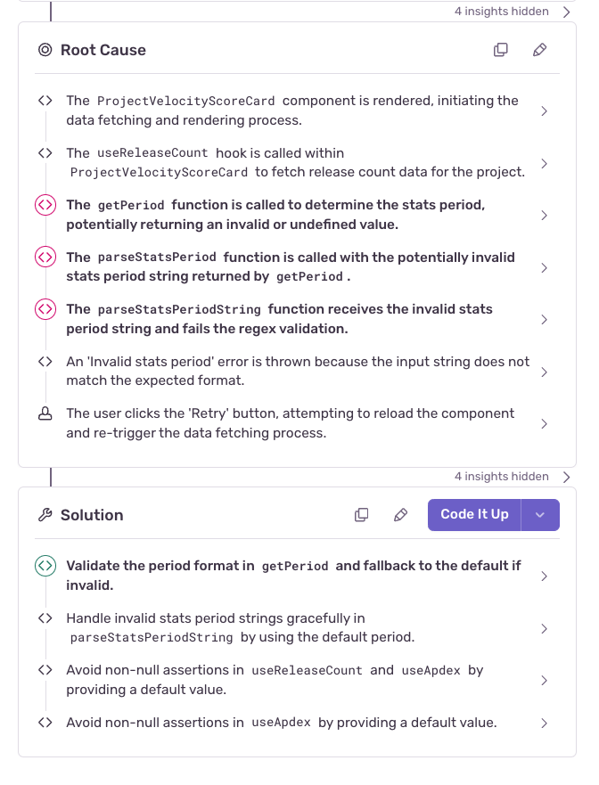
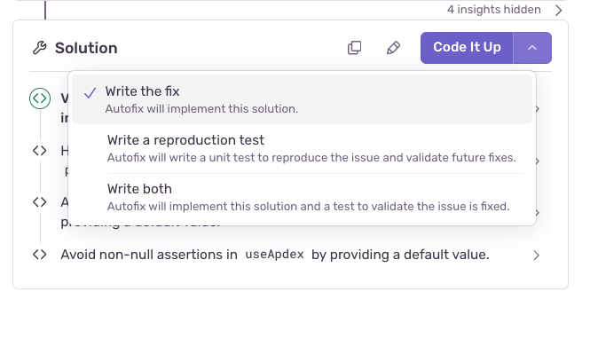
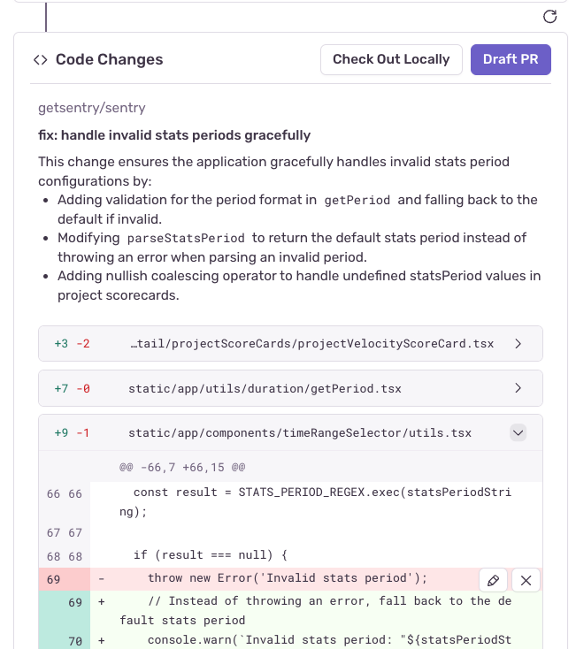

**Autofix** uses Sentry's context (issue details, tracing data, and profiles), your codebase (integrated through GitHub), and its interactions with you to identify and reason through problems in your code. Autofix can identify the root cause and suggest a code change for fixing the issue and/or add unit tests for it. You can find it in the **Solutions Hub** section of the issue details page after clicking on any error from the [**Issues**](https://sentry.io/orgredirect/organizations/:orgslug/issues/) page.

Autofix is powered by [Seer](/product/issues/issue-details/seer-ai-features/), which is Sentry's AI agent.

<Alert>

Autofix is currently in Beta, free of charge, for paid Sentry customers. Feedback is highly welcomed and can be submitted in-product or via email to autofix@sentry.io.

</Alert>

<Alert>

Autofix replaces Suggested Fix (an earlier feature that has been sunsetted).

</Alert>

## Enabling Autofix and Other AI Features

Before you can use Autofix, you need to enable the features that leverage generative AI for your Sentry organization. From the [**Organization Settings** page](https://sentry.io/orgredirect/organizations/:orgslug/settings/organization/), make sure that _Hide AI Features_ is **off**:

<Alert>

Issue Summary and other generative AI features in Sentry are not available for customers hosted in the European Union at this time.

</Alert>

## Using Autofix

When you start an Autofix run, you'll see the following screen, with an option to share any additional context:

Autofix will then analyze the issue and relevant code to help identify the root cause and a solution. You'll see a live stream of Autofix's thought process in real time as it works through the problem. Autofix will share key insights as they come up and you'll have the option to expand each. You'll see the event data and code that support Autofix conclusions, building a clear chain of reasoning back to the root cause.

While Autofix is reasoning through your problem, you can step in at any time to add context or feedback; collaboration tends to lead to the best results. If Autofix encounters gaps in its understanding, it will ask for your input.

The output will be a clearly defined root cause of the Sentry issue, and a detailed solution for how to resolve it:

You are free to edit or adjust this solution based on your own requirements and preferences. Once you are ready to proceed, you can select "Code It Up" to generate code resolving the bug. You have three options:

- Write a fix
- Write a unit test reproducing the issue
- Write both

Once the coding step is complete, you can either create a Pull Request (PR) in GitHub directly from Autofix, or create a branch and checkout the code locally if you would like to iterate further.

