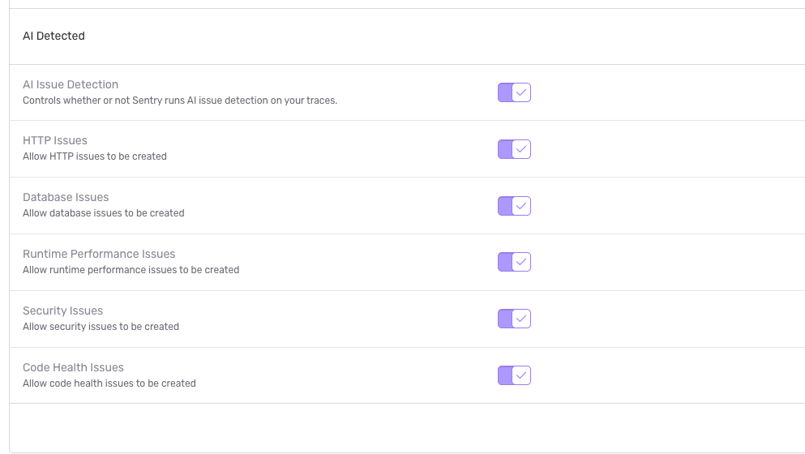

<Include name="feature-available-for-user-group-early-adopter" />

You can join the early adopter discussion on [GitHub](https://github.com/getsentry/sentry/discussions/109234).

Sentry analyzes your traces and logs using AI to detect issues that traditional pattern-matching detectors can't catch. Instead of relying on hardcoded rules, AI Issue Detection identifies problems across broader trace context, using a trained model to create issues that closely match [designated categories](/product/issues/issue-details/ai-detected-issues/#issue-categories).

## Issue Categories

AI Issue Detection classifies detected issues into the following categories:

| Issue Category | Description | Possible Issue Title |
| --- | --- | --- |
| HTTP | Issues related to HTTP requests and responses | Inefficient HTTP Requests, Degraded HTTP Operation, Failed HTTP Operation |
| Database | Issues related to database queries and operations | Inefficient Database Queries, Degraded Database Operation |
| Runtime Performance | General runtime performance problems | Blocking Operation, Degraded UI Performance |
| Security | Potential security concerns detected at runtime | Potential Security Leak, Potential Security Risk |
| Code Health | Misconfigurations or usage of deprecated features | Configuration Warning, Deprecation Warning |

## Configuration

### Enabling AI Issue Detection

AI Issue Detection is available to organizations with the Early Access feature enabled on a paid account. Organizations on a Business plan will have more of their traces analyzed for AI-detected issues.

You must also have the "Show Generative AI Features" toggle enabled in **Organization Settings > General**.

### Project-Level Toggles

Under **Project Settings > Performance**, the **AI Issue Detection** toggle controls whether Sentry runs AI issue detection at all. If toggled on, you can enable or disable each category individually. 

All toggles are enabled by default.

## Issue Details Page: Span Evidence

When viewing an AI-detected issue, the span evidence section shows:

- **Transaction** — The transaction where the issue was detected (links to the transaction summary).
- **Explanation** — A description of what the problem is.
- **Impact** — The potential impact of the issue.
- **Evidence** — Supporting detail from the trace.
- **Trace** — A preview of the trace, and a link to the full trace view.

{/* screenshot placeholder */}
