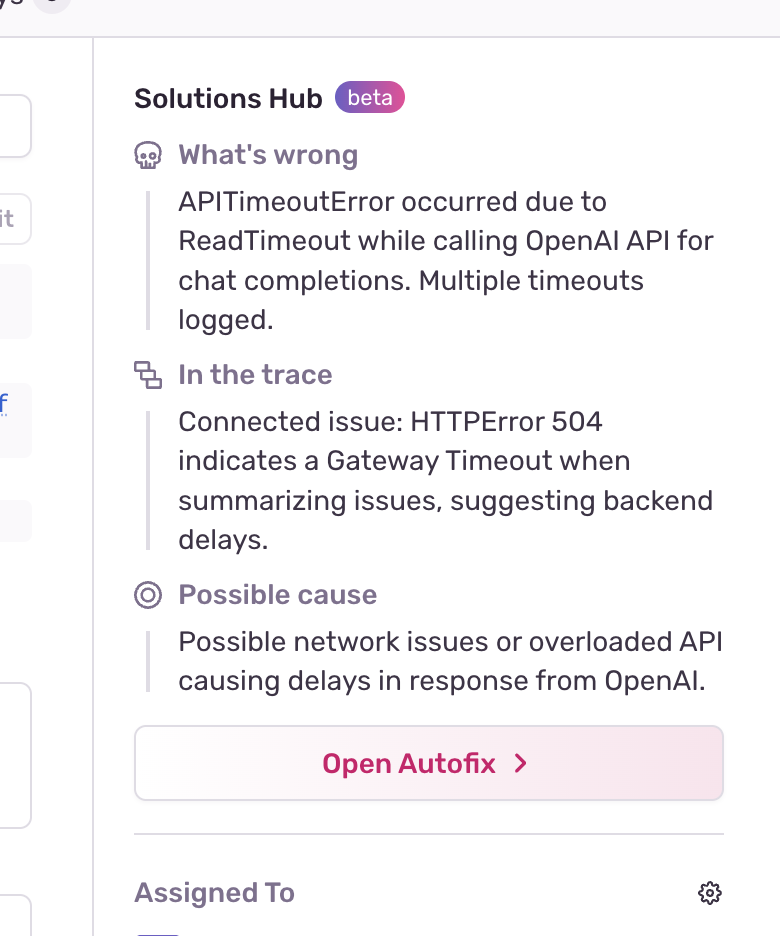

Issue Summary provides a quick overview of an issue by highlighting key insights taken from event and issue-level metadata.  
Issue Summary is powered by [Seer](/product/issues/issue-details/seer-ai-features/), which is Sentry's AI agent.

You can find the AI-generated summary of a problem in the **Solutions Hub** section of the issue details page, after clicking on any error from the [**Issues**](https://sentry.io/orgredirect/organizations/:orgslug/issues/) page.  
You'll see a quick overview of what's going wrong, a potential cause, and if relevant, insights from trace-connected issues, all in the **Solutions Hub** in the sidebar:

<Alert>

Issue Summary is currently in Beta, free of charge, for paid Sentry customers. Feedback is highly welcomed and can be submitted in-product or via email to autofix@sentry.io.

</Alert>

## Enabling Autofix and other AI features

Before you can use Autofix, you need to enable features that leverage generative AI for your Sentry organization. From the [**Organization Settings** page](https://sentry.io/orgredirect/organizations/:orgslug/settings/organization/), make sure that _Hide AI Features_ is **off**:

<Alert>

Issue Summary and other generative AI features in Sentry are not available for customers hosted in the European Union at this time.

</Alert>
