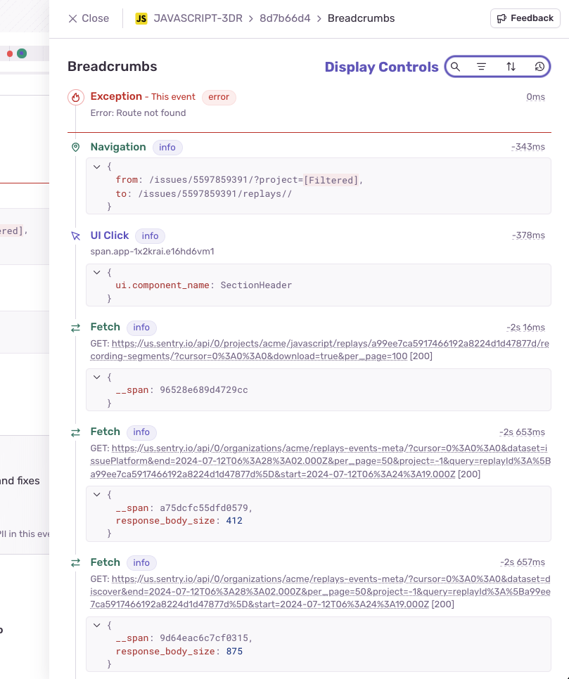

Sentry uses _breadcrumbs_ to create a trail of events that happened prior to an issue. These events are very similar to traditional logs, but can record more rich structured data.

SDKs automatically start recording breadcrumbs by enabling integrations. To learn how to do this for your platform, select the platform from the dropdown at the top of the page, then review the breadcrumbs documentation for that platform.

If an error event provides a trail, [sentry.io](https://sentry.io) displays the breadcrumbs on the **Issue Details** page.

## Breadcrumbs Display

On the main issue details page, you'll only see a portion of the breadcrumbs that may be available for the event. To access the rest of them, click the 'View All' button at the bottom of the section. This will open a slide out drawer where you can search, filter, sort and change the time display for all the breadcrumbs. To close this drawer, click 'Close' or press the escape key.

In the drawer the following controls are accessible:
- **Search**: Shows only breadcrumbs that match the query. Matches can occur on `type`, `category`, `message` and `data`.
- **Filter**: The list of breadcrumbs can be filtered by the associated `type`.
- **Sort**: Determines how breadcrumbs will be ordered, either Newest first or Oldest first. Your sort preference is saved to the browser.
- **Time Display** Determines how breadcrumb timestamps will be displayed, either as absolute timestamps (respecting user preferences for 24-hour clocks/timezone), or relative to the first breadcrumb in the list. Relative timestamps that appear negative indicate they took place before the event first breadcrumb. Your time display preference is saved to the browser.

## Breadcrumbs Attributes

Each breadcrumb is composed of the following details:

- **Type**: A semi-internal attribute `type` can control the type of the breadcrumb. By default, all breadcrumbs are recorded as `default`, but Sentry provides other [types](https://develop.sentry.dev/sdk/event-payloads/breadcrumbs/#breadcrumb-types) that influence the color/icon associated with the breadcrumb in the UI.

- **Category**: The category of the event. This data is similar to a logger name, and helps you understand the area in which an event took place, such as `auth`. In the UI, period characters are replaced with space (e.g. `ui.click` becomes `UI Click`)

- **Message**: A string describing the event, rendered as text with all whitespace preserved. It's often used as a drop-in for a traditional log message.

- **Data**: A key-value mapping of breadcrumb's arbitrary data. Useful for attaching structured information related to the breadcrumb, like IDs or variable values.

- **Level**: The severity of an event. The level is set to one of five values, which are — in order of severity — fatal, error, warning, info, and debug.

- **Time**: A timestamp representing when the breadcrumb occurred. The format is either a string, as defined in [RFC 3339](https://tools.ietf.org/html/rfc3339), or a numeric value representing the number of seconds that have elapsed since the Unix epoch.

Learn more detailed information about breadcrumb data in the [Breadcrumbs Interface developer documentation](https://develop.sentry.dev/sdk/event-payloads/breadcrumbs/).
