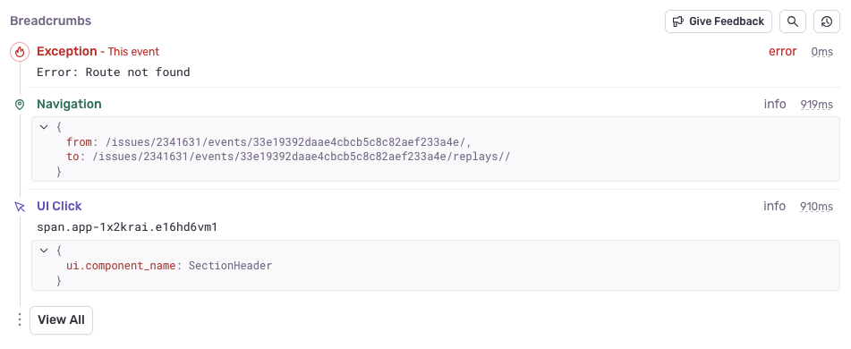
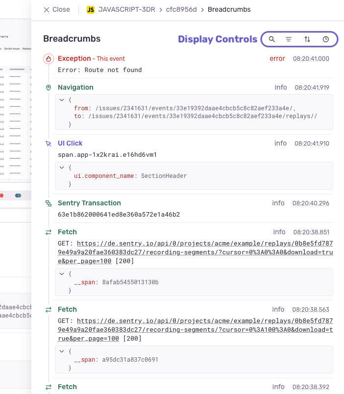

Sentry uses _breadcrumbs_ to create a trail of events that happened prior to an issue. These events are very similar to traditional logs, but can record more rich structured data.

SDKs automatically start recording breadcrumbs by enabling integrations. To learn how to do this for your platform, select it from the dropdown at the top of the left hand nav. You'll be taken to the breadcrumb documentation specific to the platform you use.

If an error event provides a trail, you'll see the breadcrumbs on the **Issue Details** page in [Sentry.io](https://sentry.io/orgredirect/organizations/:orgslug/issues/) displays .

## Breadcrumbs Display

You'll see a few of the breadcrumbs that may be available for the event in the issue "Details" tab. To access the rest of them, click the "View All" button at the bottom of the section. This will open a slide out drawer where you can search, filter, sort, and change the time display for all available breadcrumbs.

Here are all the ways you can narrow down what you see:
- **Search**: Shows only breadcrumbs that match the query. Matches can occur on `type`, `category`, `message` and `data`.
- **Filter**:  Filters by the associated `type` and `level`.
- **Sort**: Determines whether breadcrumbs are shown by Newest or Oldest first. (Your sort preference will be saved to the browser.)
- **Time Display:** Determines how breadcrumb timestamps are displayed, either as absolute timestamps (respecting user preferences for a 24-hour clocks/timezone), or relative to the first breadcrumb in the list. If a relative timestamp appear negative, it means that it took place before the top-most breadcrumb in the list. (Your time display preference will be saved to the browser.)

## Breadcrumb Attributes

Each breadcrumb is composed of the following:

- **Type**: `type` is a semi-internal attribute that controls how breadcrumbs are categorized. If left unchanged, all breadcrumbs are recorded as `default`, but Sentry provides other [types](https://develop.sentry.dev/sdk/data-model/event-payloads/breadcrumbs/#breadcrumb-types) that each have their own color/icon in the UI.

- **Category**: The event category. This data is similar to a logger name and helps you understand where an event took place, such as `auth`.

- **Message**: A string describing the event, rendered as text with all whitespace preserved. It's often used as a drop-in for a traditional log message.

- **Data**: A key-value mapping of a breadcrumb's arbitrary data. This is useful for attaching structured information related to the breadcrumb, like IDs or variable values.

- **Level**: The severity of an event. The level is set to one of five values: fatal, error, warning, info, and debug, in order of severity.

- **Time**: A timestamp showing when the breadcrumb occurred. The format is either a string, as defined in [RFC 3339](https://tools.ietf.org/html/rfc3339), or a numeric value representing the number of seconds that have elapsed since the Unix epoch.

Learn more detailed information about breadcrumb data in the [Breadcrumbs Interface developer documentation](https://develop.sentry.dev/sdk/data-model/event-payloads/breadcrumbs/).
