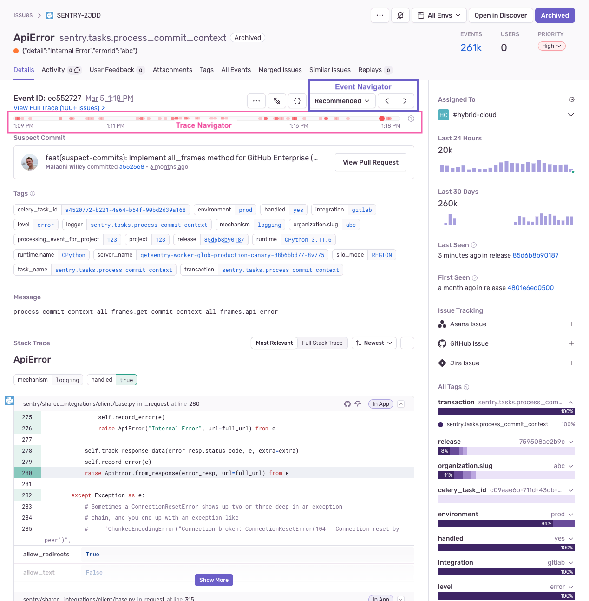
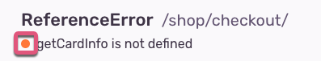
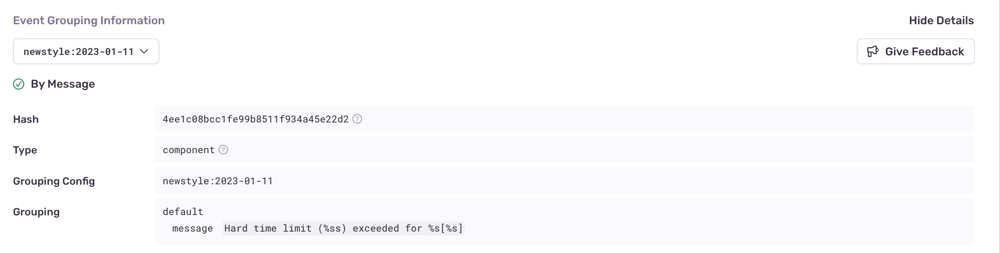

An _error issue_ is a grouping of error events. What counts as an error varies by platform, but in general, if there's something that looks like an exception, it can be captured as an error in Sentry. Sentry automatically captures errors, uncaught exceptions, and unhandled rejections, as well as other types of errors, depending on platform. We group similar error events into issues based on a fingerprint. For error issues, a fingerprint is primarily defined by the event stack trace.

To subscribe to an error issue and receive alerts about it, click the bell icon, then fine tune [workflow notifications](/product/alerts/notifications/#workflow-notifications) related to the issue in **User Settings > Notifications**. The event description is displayed just below the issue title along with an icon representing the error level of the event:

The level can be:

- Error - orange
- Info - blue
- Warning - yellow
- Fatal - red
- Debug - gray
- Sample - purple

In the right hand sidebar, [sentry.io](https://sentry.io) reflects a summary that includes information such as how often the error <SandboxLink scenario="oneIssue" projectSlug="react">issue</SandboxLink> has occurred in the last 24 hours and the last 30 days, as well as the last time and the first time the issue was seen. If the issue is linked to any GitHub or Jira issues, that's displayed here as well. You can also use this section to link to existing GitHub or Jira issues. Learn more about linking issues in [Integrations](/organization/integrations/). Lastly, there is a facet map, which shows the distribution of values for the ƒ for all events included in the error issue. All of these values are based on the environment that you've selected in the environment dropdown.

In addition, this page provides several other key pieces of information explained below.

## Event Grouping Information

The "Event Grouping Information" section provides details of how Sentry fingerprinted the event into the group. You can see which parts of the stack trace contributed to the fingerprint as well as all values that were available. You can also use the "Grouping Config" dropdown to experiment with other grouping algorithms.
