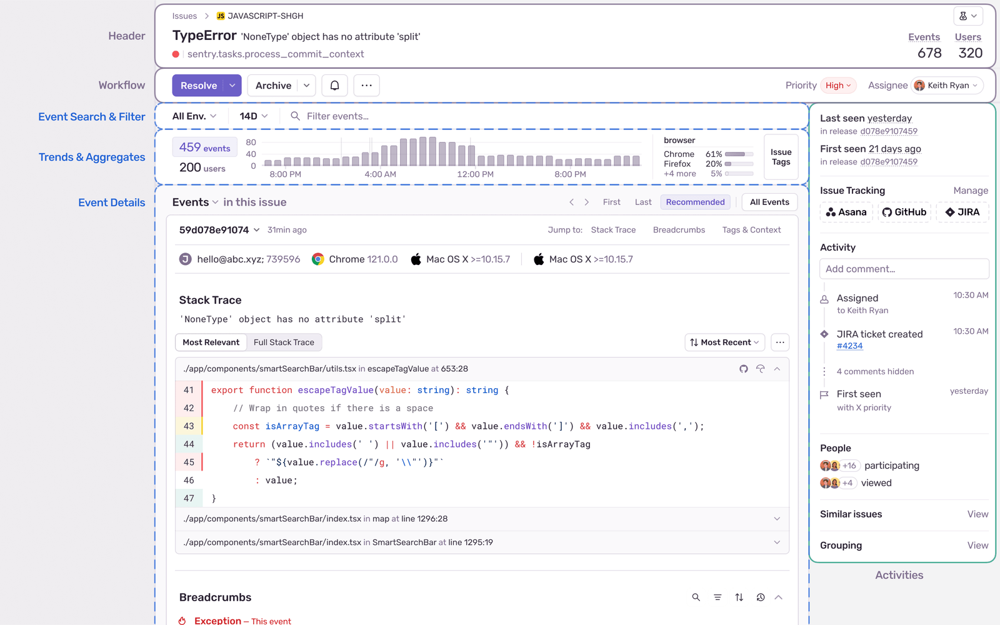
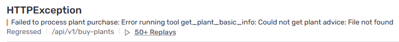
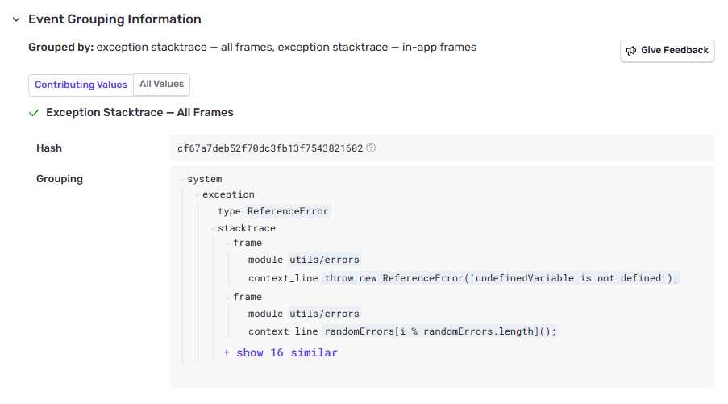

An _error issue_ is a grouping of error events. What counts as an error varies by platform, but in general, if there's something that looks like an exception, it can be captured as an error in Sentry. Sentry automatically captures errors, uncaught exceptions, and unhandled rejections, as well as other types of errors, depending on the platform. We group similar error events into issues based on a fingerprint. For error issues, a fingerprint is primarily defined by the event stack trace.

## Error Levels
The event description is displayed just below the issue title along with a colored icon representing the error level of the event:

The level can be:

- Error
- Info
- Warning
- Fatal
- Debug
- Sample

## Event Grouping Information

The "Event Grouping Information" section provides details of how Sentry fingerprinted the event into the group. You can see which parts of the stack trace contributed to the fingerprint as well as all values that were available.

## Learn More

Read more about the individual parts of the [Issue Details](/product/issues/issue-details/) page to help you triage an issue.
