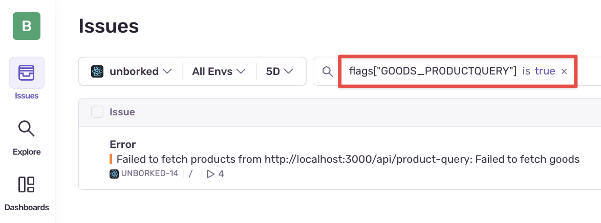
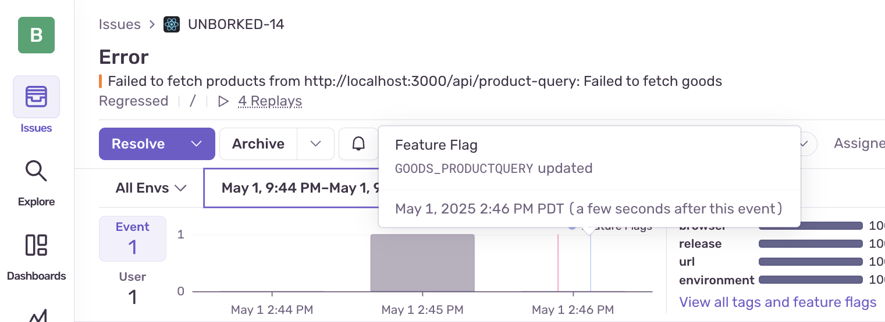

<Alert title="Currently in Beta">

Feature flag change tracking and feature flag evaluation tracking is currently in open beta.

</Alert>

Enabling a feature flag integration provides deep insights into the state of your application prior to an error. A list of flags and their evaluation results are displayed on each error event in the order of evaluation.

Integrating Sentry with your feature flag provider enables Sentry to correlate feature flag changes with new error events and mark certain changes as suspicious.

## Evaluation Tracking

Flag evaluations will appear in the "Feature Flag" section of Issue Details page as a table, with "suspect" flag predictions highlighted in yellow.

For each event, we track the 100 most recently evaluated flags leading up to the error. Learn more about how to interact with feature flag insights within the Sentry UI by reading the [Issue Details page documentation](/product/issues/issue-details/#feature-flags).

Setting up evaluation tracking also allows you to use Issues Search in conjunction with feature flags. On Issues Search, using the `flags` keyword will allow you to filter for issues containing errors where the feature flag evaluated value is true or false.

This allows you to quickly find all errors where a specific flag evaluation and its value of interest are present. See [searchable properties](/concepts/search/searchable-properties/issues/#flags) for more details about the search syntax.

### Set Up Evaluation Tracking

To set up evaluation tracking, visit the SDK integration documentation for your platform:
* [JavaScript](/platforms/javascript/feature-flags/)
* [Python](/platforms/python/feature-flags/)

### Flag Distribution View

The flag distribution view allows you to see the percentage of your users who are receiving a specific feature flag value. You can access this view by selecting `View all tags and feature flags` from the issue details view, and selecting `All Feature Flags` on the top right.

This view is useful for diagnosing the impacted audience of feature flag changes. For example, if a new issue occurs and the flag distribution view shows that 100% of impacted users are receiving a recently changed feature flag value, this could suggest that the feature flag change is responsible for the new error.

## Change Tracking

Change tracking enables Sentry to listen for additions, removals, and modifications to your feature flags. On change, we'll record the change event in the audit log.

Within an issue, the audit log is represented in the "event" chart and presents itself as a "release" line. The lines will only appear for flags that were evaluated before the error event occurred. This feature requires evaluation tracking to be enabled. 

If the change is responsible for a new error event, we'll notify you by marking the feature flag as "suspect" on the Issue Details page.

Learn more about how to interact with feature flag insights within the Sentry UI by reading the [Issue Details documentation](/product/issues/issue-details/#feature-flags).

### Set Up Change Tracking

<PlatformContent includePath="feature-flags/change-tracking-index" platform="_default"/>
