The **Issue Details** page helps you gain further insight into the source of the issue and the impact it has on your application's users.

The header shows essential information about an issue and provides access to common actions.

Below is the event graph, showing a distribution of events and errors. You can use the search bar to filter which events are shown. Tags are also shown here and can be opened from here.

The sidebar shows more about the issue, including when it was last seen and first seen, whether it's linked to any GitHub or Jira issues, issue activity and comments, participants and viewers, and Sentry AI features.

The main area of the page displays information about a specific event that's part of an issue, including the stack trace, breadcrumbs, tags, and more. You can also see information about replays, attachments, and feedback related to the issue here.

Let's take a closer look at the individual section that make up the **Issue Details** page.

## Event Header

The header displays high-level information about the issue, such as the error message, how often it has been seen, and how many users it has affected.

## Workflow

From here, you can manage an issue: assign it to yourself or a teammate, set its priority, resolve or archive it, subscribe to alerts, or share it with others.

### Subscribe to Alerts

To subscribe to an error issue and receive alerts about it, click the bell icon, then fine tune [workflow notifications](/product/notifications/#workflow-notifications) related to the issue in **User Settings > Notifications**.

### Share an Issue

To share an issue, click the "Share Issue" button in the header.

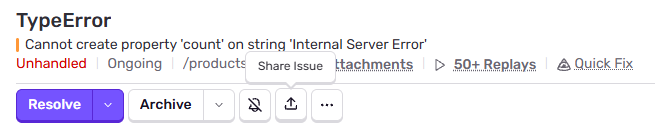

From there, you can choose what kind of link you want to share, such as including the event ID or copying the link as Markdown. You can also create a public link so that anyone can view the issue, even if they're outside your organization.

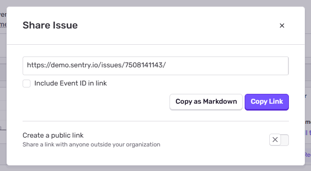

## Event Search & Filter

Use the environment selector, time period selector, and search bar to filter events. You can search using any of the [event properties](/concepts/search/searchable-properties/events).

Filtering here updates the counts, graph, and tags shown in the trends and aggregates section below, as well as event navigation.

## Trends & Aggregates

The event and user counts reflect your current search, selected environments, and time period. This differs from the counts in the header, which show total counts across the issue's lifetime.

The graph reflects your current search, environment, and time period selection, and you can toggle between event and user counts using the selector on the left. You can hide releases and feature flag data by clicking the respective label in the upper-right corner.

A preview of the issue's tags is shown next to the graph. Click into any tag for more detail, or click the link to view all. The tags displayed here are a summary of all tag values across the events included in the issue.

## Event Navigation

By default, the **Issue Details** page displays the "Recommended" event with the most context to help you solve the issue. Sentry uses the following criteria in determining the recommended event:

- **Recency**: The recommended event is never more than 7 days older than the latest event.
- **Relevance**: The recommended event takes into account what terms you've searched for on your way to the issue.
- **Content**: The recommended event prioritizes events that contain debugging tools such as replays, profiles, and traces.

To view other events, you can skip to the latest or first event, or click **View More Events** to see the full list. You can change the default event in your [User Settings](https://sentry.io/settings/account/details/#defaultIssueEvent).

<Alert title="Note">

**View More Events** is only available on [Team plan and above](https://sentry.io/pricing/). On the Free plan, this button will not appear.

</Alert>

You can also move between events chronologically. All event navigations will respect any search filter on the page, including search queries, environments, or date filters.

## Activities Sidebar

You can view the first and last time the issue has been seen here. These values depend on your environment selection and update if you change the environment. If you have releases set up, it shows the first and last release where the issue was seen.

The **Seer** section contains features from [Sentry Seer](/product/ai-in-sentry/seer/) that help you understand and fix issues.

If you have [issue tracking](/integrations/issue-tracking/) set up, integrations or linked issues will appear.

The activity section shows a chronological lifetime of the issue. You can find information on assignments, regressions, escalations, and more here. Any comments users leave on an issue will also appear here.

Participants and viewers of an issue are shown, along with the time users viewed it; you can see this by hovering over a user or viewing all viewers.

Similar and merged issues allow you to learn more about and control [grouped issues](/product/issues/grouping-and-fingerprints/). Similar issues help you find other issues in your project that match the one you are viewing. Merged issues show any issues that have been merged into the issue you are viewing.

## Event Details

Relevant actions for specific events can be found here including copying the event ID or viewing the JSON of the event.
Depending on the issue category and available event data, the **Issue Details** page displays some combination of the following sections:

### Event Highlights

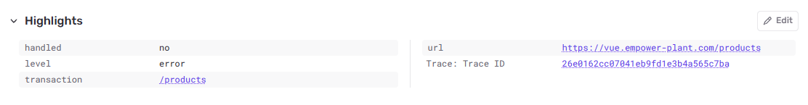

Event Highlights are specific [tags](#tags) and [context](#contexts) items that have been promoted to the top of the page for quicker debugging.

By default, Sentry will surface a few common tags and context values based on your project's platform. However, these highlights are intended to be customized to best fit your needs. Project Admins can click on the "Edit" button to add or remove any highlights they see fit and apply those changes across the project.

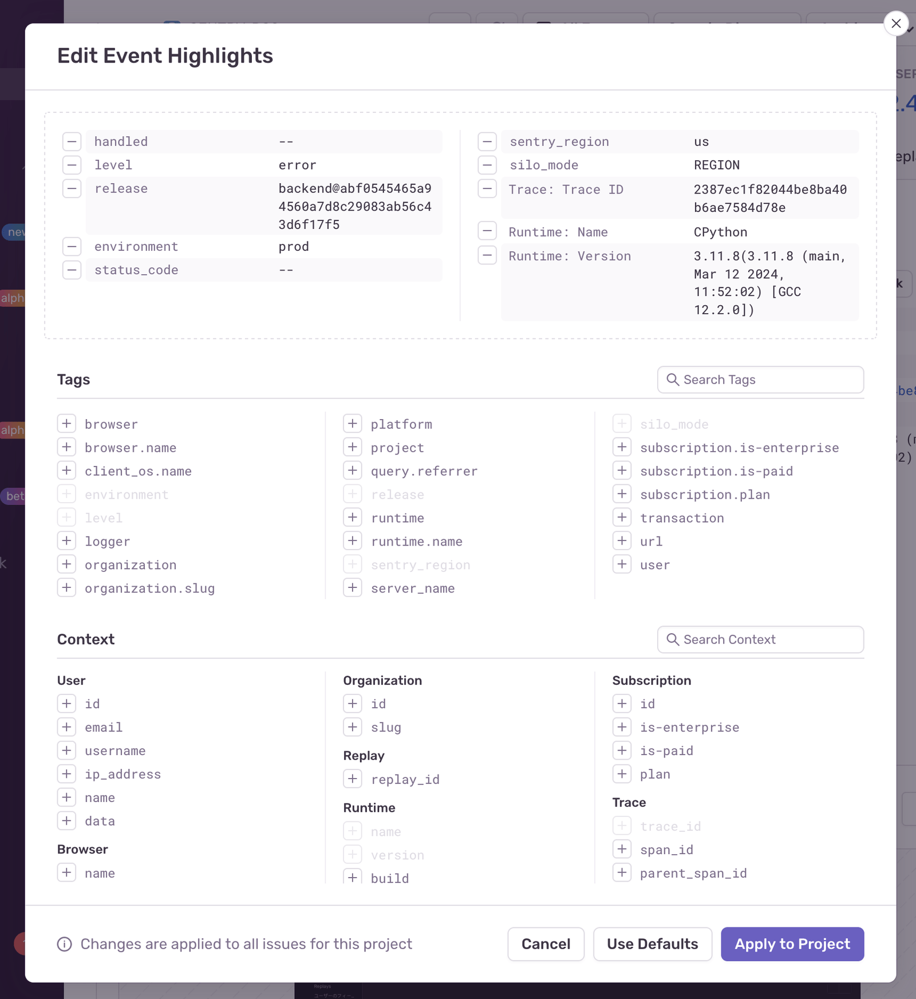

### Stack Trace

The Stack Trace section of the page shows you the line of code that the event errored on.

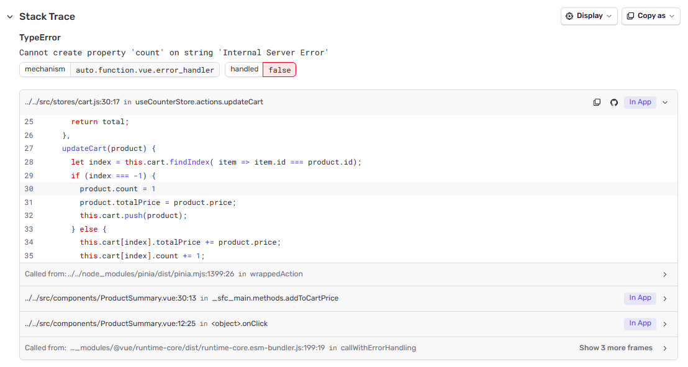

It's the most important piece of information that the Sentry grouping algorithm uses to group events into one issue. You can also customize how events are grouped. Learn more about customized grouping in [Issue Grouping](/concepts/data-management/event-grouping/).

### Suspect Commits

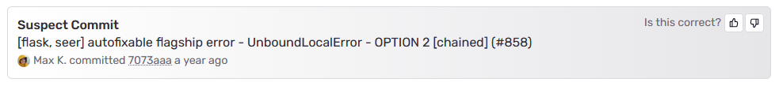

A Suspect Commit is a commit that's been identified as potentially having caused the error event. If you've configured [suspect commits](/product/issues/suspect-commits/), these are displayed. This allows you to immediately investigate commits that are likely to have generated the issue. The author of the suspect commit is also suggested as an assignee for the issue.

### Breadcrumbs

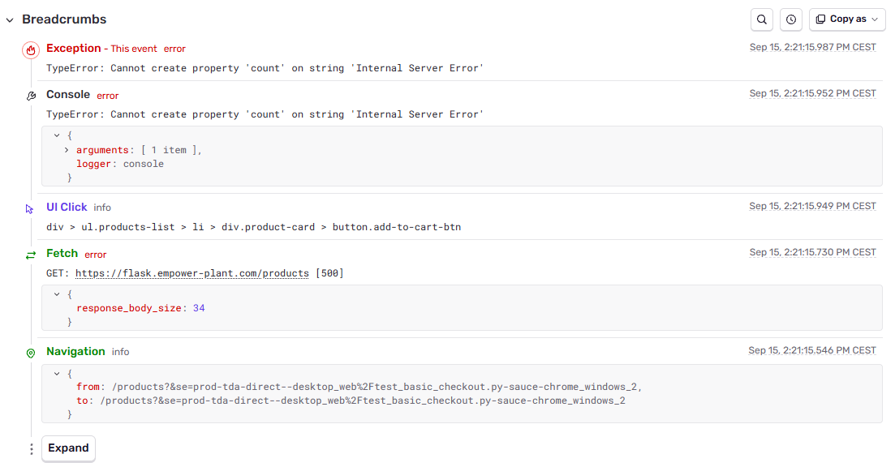

[Breadcrumbs](/product/issues/issue-details/breadcrumbs/) provide a history and timeline leading up to the error event. These can include things like HTTP requests, log statements from the console or server, and DOM (document object model) events in JavaScript.

You can set your own <PlatformLink to="/enriching-events/breadcrumbs/">breadcrumbs</PlatformLink> to make them more useful for debugging.

### Logs

[Logs](/product/logs) give you the application log entries that were emitted leading up to and surrounding the error event. Click a log entry to view its default properties and any additional custom properties you've added.

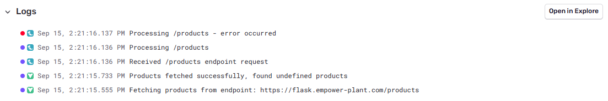

### Application Metrics

The [Application Metrics](/product/metrics) section lists the tracked counters, gauges, and distributions, along with their values at the time of the event.

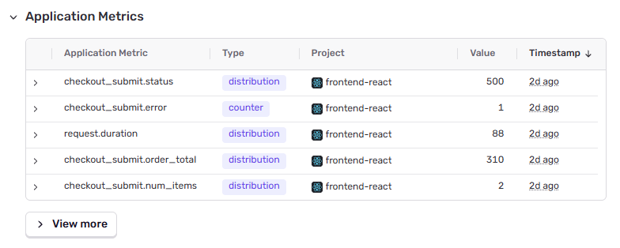

### Trace Preview

An abbreviated view of the related [trace](/concepts/key-terms/tracing/distributed-tracing) for the current transaction.

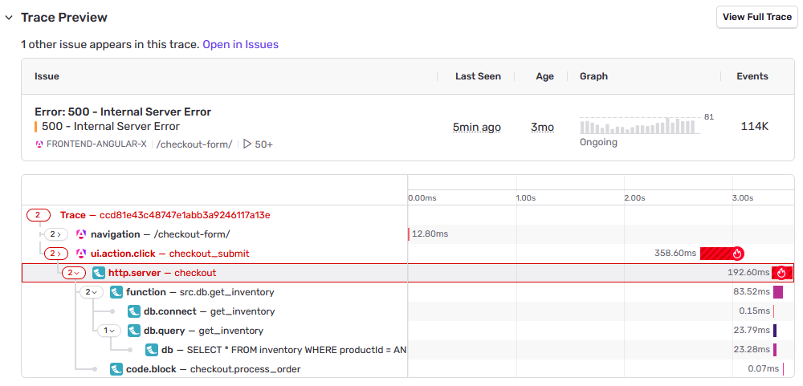

Sometimes the trace will be supplemented by a Trace-related Issue. A Trace-related Issue is a different issue that occurred during the same trace as the event in view. This is useful for understanding the context of the current issue and may help you identify its root cause. A Trace-related Issue allows the developer to quickly navigate between the two related events.

### Session Replay

If you've enabled [Session Replay](/product/session-replay/), you'll have access to a replay preview on the page (if there's one associated with the event). Replays can be associated with both frontend and [backend errors](/product/session-replay#replays-for-backend-errors), as long as distributed tracing is set up. From here you can navigate to the rest of the replays recorded for this issue, or inspect this replay on the [Replay Details](/product/session-replay/replay-details/) page.

### HTTP Request

Information from the HTTP request including the query string, cookies, and headers.

### Packages

Packages used in your application and their versions.

### Additional Data

Any additional data sent from the SDK.

### Attachments

Any additional files stored, such as config, log, or screenshot files that are related to the error event.

### User Feedback

Any feedback collected from users through the <PlatformLink to="/user-feedback/">SDK's user feedback</PlatformLink>.

### Span Evidence

Information about the [performance problem](/product/issues/issue-details/performance-issues) in the context of the current event.

### Tags

[Tags](/concepts/search/) are key/value string pairs that are both indexed and searchable. For example, a tag provides you with information such as the browser, device, or user associated with the event. Tags are the diagnostic information sent by the SDK for the individual event.

<Include name="common-imgs/tags" />

You can use the tag tabs to filter these event tags by category ("All", "Custom", "Application", "Client", "Other"). If you hover over a tag and then click "...", you can choose to view more events or issues with that tag value (and sometimes other information associated with that tag, such as the release itself). Sentry will display tags containing '`.`' characters as a tree structure to make things a bit more readable, but searching should always use the full tag name (for example, `organization.slug` instead of `slug`).

The tags displayed in the main section of the page are specific to the event that you're viewing. The tags displayed in the trends and aggregates section are a summary of all tag values for all events included in the issue. You can set your own tags to make them more useful for debugging as described in <PlatformLink to="/enriching-events/tags/">Customize Tags</PlatformLink>.

### Screenshot

Sentry provides the ability to take a screenshot and include it as an attachment when a user experiences an error, an exception, or a crash. Screenshot attachments sent as part of an event are displayed in this section. This feature only applies to SDKs with a user interface. It's supported for the following SDKs:

- [.NET Xamarin](/platforms/dotnet/guides/xamarin/#attachscreenshots)
- [.NET MAUI](/platforms/dotnet/guides/maui/configuration/options/#attach-screenshot)
- [Android](/platforms/android/enriching-events/screenshots/)
- [Flutter](/platforms/dart/guides/flutter/enriching-events/screenshots/)
- [Godot](/platforms/godot/)
- [iOS](/platforms/apple/guides/ios/enriching-events/screenshots/)
- [JavaScript Electron](/platforms/javascript/guides/electron/enriching-events/screenshots/)
- [Native](/platforms/native/enriching-events/screenshots/)
- [React Native](/platforms/react-native/enriching-events/screenshots/)
- [Unity](/platforms/unity/enriching-events/screenshots/)
- [Unreal Engine](/platforms/unreal/enriching-events/screenshots/)

### Contexts

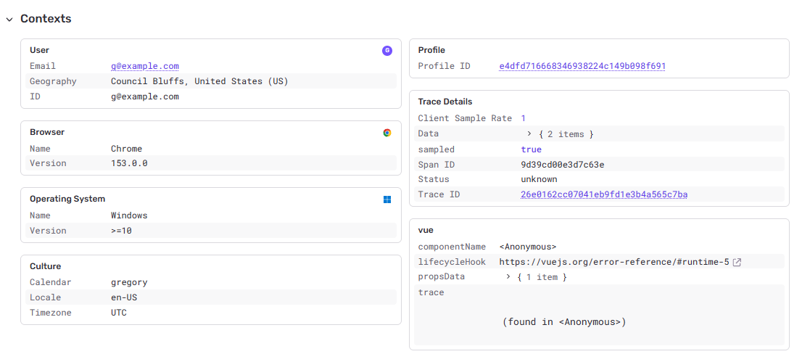

The Contexts section contains related key/value items (not just strings) that you've set manually in your application, or have been automatically added by Sentry. Contexts are meant to provide you with related sets of data to help with your debugging.

The **Issue Details** page only displays context for the individual event, and context cannot be searched. If you require searching for your data, use [Tags](#tags) instead.

You can set up your own context items to collect useful debugging information in your next event, as described in <PlatformLink to="/enriching-events/context/">Structured Context</PlatformLink>.

### Feature Flags

<Alert title="Currently in Beta">

Feature flag change tracking and feature flag evaluation tracking is currently in open beta.

</Alert>

Enabling one or more of our [evaluation tracking integrations](/product/issues/issue-details/feature-flags/#evaluation-tracking) will reveal the feature flag evaluation table. Here you can see an ordered list (in order of evaluation) of all the flags evaluated and their evaluation results prior to the error event.

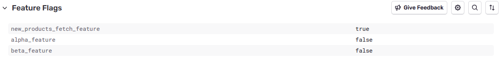

Setting up evaluation tracking also allows you to use Issues Search in conjunction with feature flags. On Issues Search, using the `flags` keyword will allow you to filter for issues containing errors where the feature flag evaluated value is true or false. This allows you to quickly find all errors where a specific flag evaluation and its value of interest are present. See [searchable properties](/concepts/search/searchable-properties/issues/#flags) for more details about the search syntax.

Enabling both [change tracking](/product/issues/issue-details/feature-flags/#change-tracking) and evaluation tracking integrations adds feature flag change annotations to the event volume chart and unlocks suspect feature flag detection. Feature flag change annotations help you identify regressions caused by updates to a feature flag's definition. An annotation will only appear for flags that were evaluated before the error event occurred.

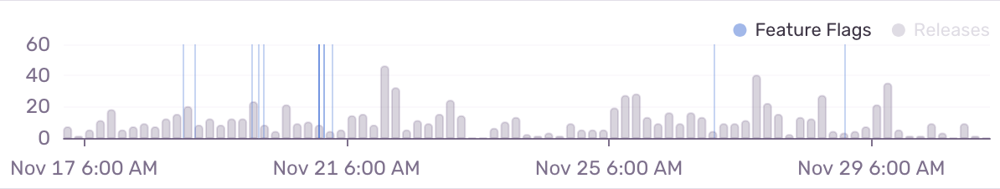

With suspect feature flag detection, Sentry automatically highlights feature flags that may have contributed to an error event, making it easier to review and pinpoint potential causes.

### Event Grouping Information

Provides details of how Sentry fingerprinted the event into the group.
