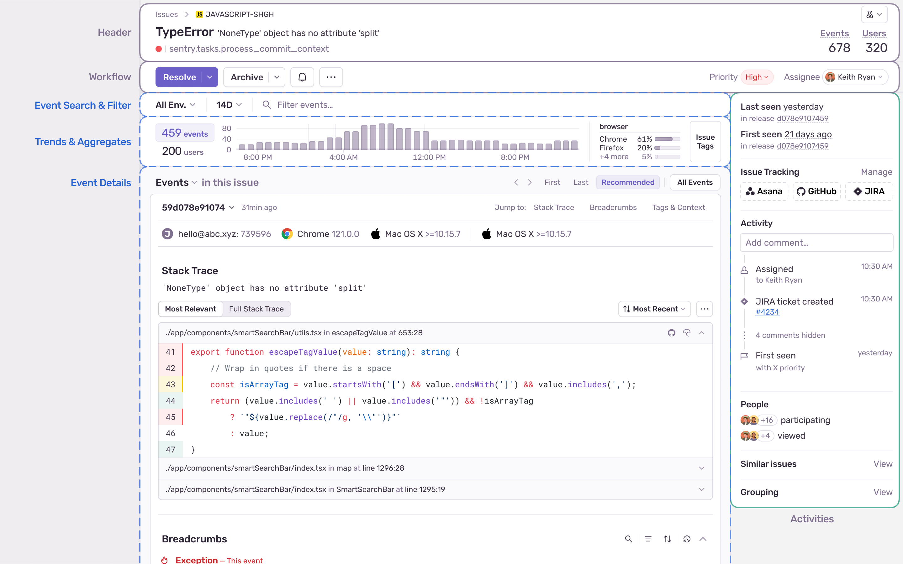

The **Issue Details** page helps you gain further insight into the source of the issue and the impact it has on your application's users.

The header contains high-level information about the issue such as the error message, total counts of how often it has been seen, and how many users it has affected. Actions such as assigning, resolving, and archiving are also here.

Beneath the header is the event graph, showing a distribution of events and errors. You can use the search bar to filter which events are shown. Tags are shown and can be opened from here too.

The sidebar shows more about the issue and includes information such as the last time and the first time the issue was seen, if the issue is linked to any GitHub or Jira issues, issue activity and comments, participants and viewers, and Sentry AI features.

The main area of the page displays information about a specific event that's part of an issue, including the stack trace, breadcrumbs, tags, and more. You can also see information about replays, attachments, and feedback related to the issue here.

## Event Search

The embedded search bar allows you to search for events using any of the [event properties](/concepts/search/searchable-properties/events). Environment and time period can also be changed. Once the search is updated, the counts and graph below will be updated. Event navigations such as recommended, first, and last, and All Events will also be updated to only show matching events.

## Trends & Aggregates

The event and user counts represent the counts given the search, environments, or time period selected above. This is different from the counts in the header which are the total counts across the lifetime of the issue.

The graph is similarly affected by any search and can be toggled between user and event counts by the selection on the left. Releases and feature flag data can be hidden by clicking on the field in the upper right corner.

A few tags are shown as a preview on the page, but to see more, you can either click into any preview tag to see more details or click "All Tags" to see all tags for an issue. Tags are not affected by the search filters above.

## Sidebar

The first and last time the issue has been seen will be displayed here. These values will depend on your environment selection and will be updated if you change the environments. If you have releases set up, the first and last release where the issue was seen will be shown

The solutions hub contains features from [Sentry AI](/product/issues/issue-details/sentry-ai) that help you understand and fix issues.

If you have [issue tracking](/organization/integrations/issue-tracking) set up, integrations or linked issues will appear.

The activity section shows a chronological lifetime of the issue. Information including assignments, regressions, escalations, and more can be found here. Any comments users leave on an issue will also appear here.

Participants and viewers of an issue will be shown along with the time that users viewed the issue, which can be found if you hover over a user or see all viewers.

Similar and merged issues allow you to learn more about and control [grouped issues](/product/issues/grouping-and-fingerprints). Similar Issues can be used to find any other issues in your project that are similar to the one you are viewing. Merged issues shows any issues that have been merged into the issue you are viewing.

## Issue Content

In addition to events, information about replays, attachments, and feedback can be found from the page.

- **Replays** – A list of [replays](/product/explore/session-replay/) tied to error events included in the issue.
- **User Feedback** - Any feedback collected from users through the <PlatformLink to="/user-feedback/">SDK's user feedback</PlatformLink>.
- **<PlatformLink to="/enriching-events/attachments/">Attachments</PlatformLink>** - Any additional files stored, such as config, log, or screenshot files that are related to the error event.

While attachments are affected by the search filters on the page, replays and user feedback are not.

## Event Navigation

By default, the **Issue Details** page displays the "Recommended" event with the most context to help you solve the issue. Sentry uses the following criteria in determining the recommended event:

- **Recency**: The recommended event is never more than 7 days older than the latest event.
- **Relevance**: The recommended event takes into account what terms you've searched for on your way to the issue.
- **Content**: The recommended event prioritizes events that contain debugging tools such as replays, profiles, and traces.

To view other events, you can use the dropdown to skip to the latest or oldest event, or view the full list of events. You can change the default event in your [User Settings](https://sentry.io/settings/account/details/#defaultIssueEvent).

In addition, you can scroll between events chronologically or view all events. All event navigations will respect any search filter on the page, including search queries, environments, or date filters.

## Event Actions

Relevant actions for specific events can be found here including copying the link to the event or event ID. You can also view the JSON of the event here.

## Event Details

Depending on the issue category and available event data, the Issue Details page displays some combination of the following sections:

### Event Highlights

_Event Highlights_ are specific [tags](#tags) and [context](#contexts) items that have been promoted to the top of the page for quicker debugging. If you miss tags being at the top of the page, click "View All" to go to their new location under the stack trace.

By default, Sentry will surface a few common tags and context values based on your project's platform. However, these highlights are intended to be customized to best fit your needs. Project Admins can click on the "Edit" button to add or remove any highlights they see fit and apply those changes across the project.

### Stack Trace

The Stack Trace section of the page shows you the line of code that the event errored on.

It's the most important piece of information that the Sentry grouping algorithm uses to group events into one issue. You can also customize how events are grouped. Learn more about customized grouping in [Issue Grouping](/concepts/data-management/event-grouping/).

### Suspect Commits

A _suspect commit_ is a commit that's been identified as potentially having caused the error event. If you've configured [suspect commits](/product/issues/suspect-commits/), these are displayed. This allows you to immediately investigate commits that are likely to have generated the issue. The author of the suspect commit is also suggested as an assignee for the issue.

### Breadcrumbs

[Breadcrumbs](/product/issues/issue-details/breadcrumbs/) provide a history and timeline leading up to the error event. These can include things like HTTP requests, log statements from the console or server, and DOM (document object model) events in JavaScript.

You can set your own <PlatformLink to="/enriching-events/breadcrumbs/">breadcrumbs</PlatformLink> to make them more useful for debugging

### Trace Preview

An abbreviated view of the related [trace](/product/sentry-basics/tracing/distributed-tracing) for the current transaction.

Sometimes the trace will be supplemented by a Trace-related Issue. A Trace-related Issue is a different issue that occurred during the same trace as the event in view. This is useful for understanding the context of the current issue and may help you identify its root cause. A Trace-related Issue allows the developer to quickly navigate between the two related events.

### Session Replay

If you’ve enabled [Session Replay](/product/explore/session-replay/), you’ll have access to a replay preview on the page (if there’s one associated with the event). Replays can be associated with both frontend and [backend errors](/product/explore/session-replay/getting-started#replays-for-backend-errors), as long as distributed tracing is set up. From here you can navigate to the rest of the replays recorded for this issue, or inspect this replay on the [Replay Details](/product/explore/session-replay/web/replay-details/) page.

### HTTP Request

Information from the HTTP request including the query string, cookies, and headers.

### Packages

Packages used in your application and their versions.

### Additional data

Any additional data sent from the SDK.

### Span Evidence

Information about the performance problem in the context of the current event.

### Tags

<Include name="common-imgs/tags" />

[Tags](/concepts/search/) are key/value string pairs that are both indexed and searchable. For example, a tag provides you with information such as the browser, device, or user associated with the event. Tags are the diagnostic information sent by the SDK for the individual event.

You can use the tag tabs to filter these event tags by category ("All", "Custom", "Application", "Other"). If you hover over a tag and then click "...", you can choose to view more events or issues with that tag value (and sometimes other information associated with that tag, such as the release itself). Sentry will display tags containing '`.`' characters as a tree structure to make things a bit more readable, but searching should always use the full tag name (for example, `organization.slug` instead of `slug`).

The tags displayed in the main section of the page are specific to the event that you're viewing. The tags displayed in the right-hand sidebar are a summary of all tag values for all events included in the issue. You can set your own tags to make them more useful for debugging as described in <PlatformLink to="/enriching-events/tags/">Customize Tags</PlatformLink>.

### Screenshot

Sentry provides the ability to take a screenshot and include it as an attachment when a user experiences an error, an exception, or a crash. Screenshot attachments sent as part of an event are displayed in this section. This feature only applies to SDKs with a user interface. It's supported for the following SDKs:

- [.NET Xamarin](/platforms/dotnet/guides/xamarin/)
- [Android](/platforms/android/enriching-events/screenshots/)
- [Flutter](/platforms/flutter/enriching-events/screenshots/)
- [iOS](/platforms/apple/guides/ios/enriching-events/screenshots/)
- [JavaScript Electron](/platforms/javascript/guides/electron/enriching-events/screenshots/)
- [React Native](/platforms/react-native/enriching-events/screenshots/)
- [Unity](/platforms/unity/enriching-events/screenshots/)
- [Unreal Engine](/platforms/unreal/enriching-events/screenshots/)

### Contexts

The Contexts section contains related key/value items (not just strings) that you've set manually in your application, or have been automatically added by Sentry. Contexts are meant to provide you with related sets of data to help with your debugging.

The issue details page only displays context for the individual event, and context cannot be searched. If you require searching for your data, use [Tags](#tags) instead.

You can set up your own context items to collect useful debugging information in your next event, as described in <PlatformLink to="/enriching-events/context/">Structured Context</PlatformLink>.

### Feature Flags

<Alert title="Currently in Beta">

Feature flag change tracking and feature flag evaluation tracking is currently in open beta.

</Alert>

Enabling one or more of our [evaluation tracking integrations](/product/explore/feature-flags/#evaluation-tracking) will reveal the feature flag evaluation table. Here you can see an ordered list (in order of evaluation) of all the flags evaluated and their evaluation results prior to the error event.

Enabling a [change tracking integration](/product/explore/feature-flags/#change-tracking) will enable annotations on the event volume chart. These lines mark feature flag changes and can help identify regressions caused by a feature flag definition change.

Enabling both a change tracking integration and a evaluation tracking integration will enable suspect feature flag detection. Sentry will attempt to identify feature flags which might have caused an error event and highlight them for review.

### Event Grouping Information

Provides details of how Sentry fingerprinted the event into the group.
