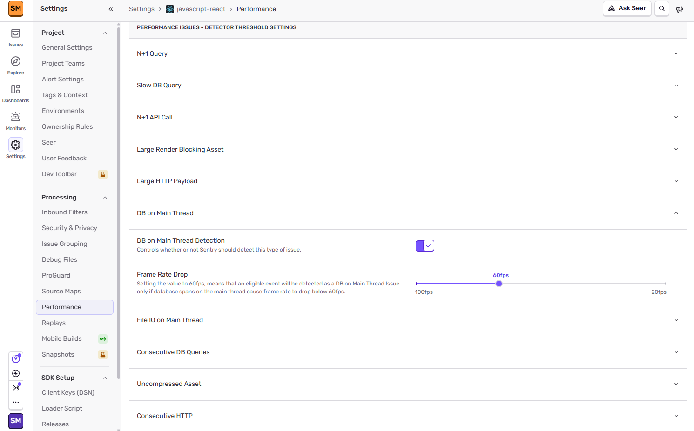

The main UI thread in a mobile application handles user interface events such as button presses and page scrolls. To prevent App Hangs and Application Not Responding errors, the main UI thread shouldn't be used for performing long-running operations like database queries. These kinds of operations block the whole UI until they finish running and get in the way of the user interacting with the app.

Filter mobile performance issues with `issue.category:mobile` in **Issues** and **Dashboards**.

## Detection Criteria

The Database on Main Thread detector looks at the total non-overlapping duration for database spans on the main thread. If it exceeds 16ms, a Database on Main Thread issue is created.

You can configure detector thresholds for Database on Main Thread issues in **Project Settings > Performance**:

## Span Evidence

Span evidence identifies the root cause of the Database on Main Thread problem by showing you three main aspects:

- **Transaction name**
- **Parent Span:** Where the database spans occurred
- **Offending Span:** The actual spans that are performing database queries in the main thread

View it by going to the **Issues** page in Sentry, selecting your project, clicking on the database error you want to examine, then scrolling down to the "Span Evidence" section.
