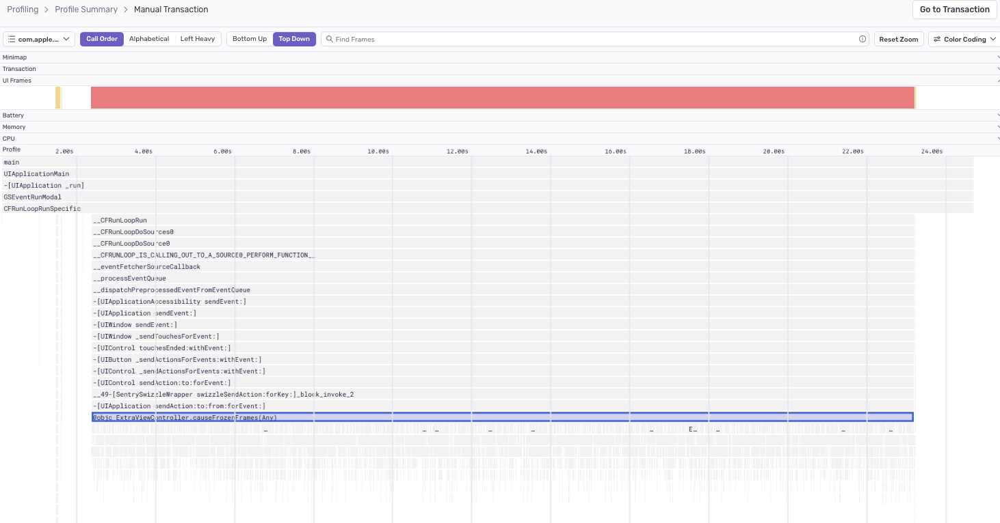
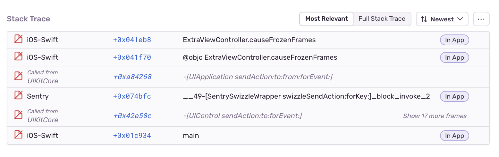

The main (or UI) thread in a mobile app is responsible for handling all user interaction and needs to be able to respond to gestures and taps in real time. If a long-running operation blocks the main thread, the app becomes unresponsive, impacting the quality of the user experience.

We can detect some specific causes for a main thread stall, like decoding [images](/product/issues/issue-details/performance-issues/image-decoding-main-thread/) or [JSON](/product/issues/issue-details/performance-issues/json-decoding-main-thread/), or [searching strings with regexes](/product/issues/issue-details/performance-issues/regex-main-thread/), but there are many other things that could cause a stall. If a main thread stall causes your app to drop UI frames, but doesn't match one of our specific detectors, Sentry reports it under the generic Frame Drop issue type.

## Detection Criteria

[Profiling](/product/explore/profiling/) must be enabled for Sentry to detect Frame Drop issues. Once set up, Sentry will look for profiles that record a frozen UI frame and then search for the most time-consuming application function call delaying the display link's next vsync. In a run of functions calling through without any self-time, the deepest call will be chosen.

<Note>

The minimum supported version for Cocoa is `8.12.0`.

</Note>

## Function Evidence

To find additional information about your Frame Drop problem, go to its **Issue Details** page and scroll down to the "Function Evidence" section, which shows the following:

- **Transaction Name:** The name of the transaction where the issue was detected.
- **Suspect Function:** The function that triggered the issue detection.
- **Duration:** How long the function took to execute and the number of consecutive samples collected by the profiler that contained the function.


To view the entire profile associated with the issue, click the “View Profile” button.

The profile will indicate where the suspect function was called from, along with other functions being called _by_ the suspect function:



## Stack Trace

The “Stack Trace” section shows a full stack trace view, highlighting the long-running function frame:



## Examples

### iOS

The following code executes a long-running `while` loop on the main thread:

```objc
// given an array of number strings...

NSMutableOrderedSet<NSString *> *sortedEvenNumbers = [NSMutableOrderedSet<NSString *> orderedSet];
[numbers enumerateObjectsUsingBlock:^(NSString * _Nonnull obj, NSUInteger __unused idx, BOOL * _Nonnull __unused stop) {
    if (obj.integerValue % 2 == 0) {
        [sortedEvenNumbers addObject:obj];
    }
}];
```

Performance could be improved by moving the long computation off of the main thread. The simplest approach is dispatching it to a lower Quality of Service (QoS) queue (or `NSOperationQueue`):

```objc {tabTitle:Dispatch to Background Queue}
// given an array of number strings...

NSMutableOrderedSet<NSString *> *sortedEvenNumbers = [NSMutableOrderedSet<NSString *> orderedSet];
dispatch_async(dispatch_get_global_queue(QOS_CLASS_UTILITY, 0), ^{
    [numbers enumerateObjectsUsingBlock:^(NSString * _Nonnull obj, NSUInteger __unused idx, BOOL * _Nonnull __unused stop) {
        if (obj.integerValue % 2 == 0) {
            [sortedEvenNumbers addObject:obj];
        }
    }];
});
```

Another avenue to consider for loops is to parallelize iterations. There are several options for doing this:

1. If you're iterating through a Foundation collection, you may already be using `enumerateObjects` or `enumerateKeysAndObjects`. Change this to `-[NSArray|NSSet|NSOrderedSet enumerateObjectsWithOptions:usingBlock:]` or `-[NSDictionary enumerateKeysAndObjectsWithOptions:usingBlock:]`, with option `NSEnumerationConcurrent`. Note that modifying the collection from inside the block will result in an exception being thrown. This is roughly equivalent to dispatching each iteration of the loop body to a concurrent GCD queue.

1. Use `dispatch_apply` to perform iterations of a general loop on a concurrent queue.

```objc {tabTitle:Foundation Collection Concurrent Enumeration}
// given an array of number strings...

NSMutableOrderedSet<NSString *> *sortedEvenNumbers = [NSMutableOrderedSet<NSString *> orderedSet];
[numbers enumerateObjectsWithOptions:NSEnumerationConcurrent usingBlock:^(NSString * _Nonnull obj, NSUInteger __unused idx, BOOL * _Nonnull __unused stop) {
    if (obj.integerValue % 2 == 0) {
        [sortedEvenNumbers addObject:obj];
    }
}];
```

```objc {tabTitle:dispatch_apply}
// given an array of number strings...

NSMutableOrderedSet<NSString *> *sortedEvenNumbers = [NSMutableOrderedSet<NSString *> orderedSet];
dispatch_apply(numberOfNumbers, dispatch_get_global_queue(QOS_CLASS_UTILITY, 0), ^(size_t iteration) {
    NSString *number = numbers[iteration];
    if (number.integerValue % 2 == 0) {
        [sortedEvenNumbers addObject:number];
    }
});
```

There are several things to keep in mind when introducing concurrency:

- You may need to `@synchronize` critical sections, use semaphores, or dispatch back to a serial queue (or the main queue for UI work).
- You may be unable to parallelize loops whose iterations are dependent or where order is significant.
- Parallelization may be less efficient for small collections because [thread spawning has its own costs](https://developer.apple.com/library/archive/documentation/Cocoa/Conceptual/Multithreading/AboutThreads/AboutThreads.html#//apple_ref/doc/uid/10000057i-CH6-SW20). So always measure first!
- Both `enumerateObjects...` and `dispatch_apply` are synchronous and won't return until all iterations have completed. Dispatch their invocation asynchronously off the main queue to avoid waiting.

### Android

The following function executes a long-running `for` loop to sort a list:

```kotlin
// sort a list of numbers, with even numbers before the odd ones
fun sortEvenOdd(numbers: List<Int>): List<Int> {
    val newList = ArrayList<Int>()
    for (n in numbers) {
        if (n % 2 == 0) {
            val i = newList.indexOfFirst { it % 2 == 1 }
            newList.add(i.takeIf { it != -1 } ?: 0, n)
        } else {
            val i = newList.indexOfLast { it % 2 == 1 }
            newList.add(i.takeIf { it != -1 } ?: newList.size, n)
        }
    }
    return newList
}
```

Performance could be improved by moving the long computation off of the main thread to a coroutine:

```kotlin
// sort a list of numbers, with even numbers before the odd ones, then call onSorted with the sorted list as parameter.
fun sortEvenOdd(numbers: List<Int>, onSorted: (sorted: List<Int>) -> Unit): List<Int> {
    lifecycleScope.launch(Dispatchers.Default) {
    val newList = ArrayList<Int>()
        for (n in numbers) {
            if (n % 2 == 0) {
            if (n % 2 == 0) {
                val i = newList.indexOfFirst { it % 2 == 1 }
                newList.add(i.takeIf { it != -1 } ?: 0, n)
            } else {
                val i = newList.indexOfLast { it % 2 == 1 }
                newList.add(i.takeIf { it != -1 } ?: newList.size, n)
            }
        }
        withContext(Dispatchers.Main) {
            // Continue computation on the main thread
            onSorted(newList)
        }
    }
}
```

There is no generally-applicable way to fix the performance of custom algorithms since each is different.

In our example above, for every item on the list we analyze each number, perform a search to find the right index for placing the element, and finally insert it into the list.

By using two separate lists for even and odd numbers we can avoid the search step since the right index will always be the end of the list.
Also, due to the nature of the ArrayList, inserting an element in the middle of the list is slower than inserting it at the end.

Given those considerations this function can be made faster:

```kotlin
// sort a list of numbers, with even numbers before the odd ones, then call onSorted with the sorted list as parameter.
fun sortEvenOddFaster(numbers: List<Int>, onSorted: (sorted: List<Int>) -> Unit): List<Int> {
    lifecycleScope.launch(Dispatchers.Default) {
        val evenList = ArrayList<Int>(numbers.size)
        val oddList = ArrayList<Int>(numbers.size)
        for (n in numbers) {
            if (n % 2 == 0) {
                evenList.add(n)
            } else {
                oddList.add(n)
            }
        }
        evenList.addAll(oddList)
        withContext(Dispatchers.Main) {
            // Continue computation on the main thread
            onSorted(evenList)
        }
    }
}
```

There are several considerations to keep in mind to improve the performance of an algorithm:

- You may be able to parallelize work by using threads (or Kotlin coroutines).
- Explore and find the best data structures you can for your specific scope.
- Some structures can be cached and reused throughout your function, reducing memory usage.
- Evaluate different approaches to solve a problem.
