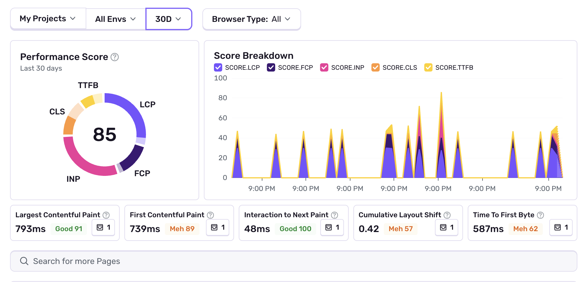

Web Vitals issues are created for the highest opportunity pages in a project when
their vitals scores fall into the [`Meh`](/product/insights/frontend/web-vitals/#performance-score) or [`Poor`](/product/insights/frontend/web-vitals/#performance-score) threshold for an extended period of time.

## Detection Criteria

<Alert>

This issue is currently only available for browser SDKs.

</Alert>

The detector for this performance issue runs on a schedule and checks the 7 day average Web Vitals scores for the top 5 [highest opportunity](/product/insights/frontend/web-vitals/#opportunity) pages on your website (_the pages that are both high traffic, and have issues worth fixing_).

The following additional criteria must hold true:

- You must have [Seer](/product/ai-in-sentry/seer/) enabled on your Sentry account.
- There must be at least `10` sample spans for the given vital (_this value is [configurable](/product/issues/issue-details/performance-issues/#configuration)_).
- There must be no issues currently open for the same Web Vitals metrics.

## Span Evidence

You can view the [Web Vitals Insights](/product/insights/frontend/web-vitals/) dashboard
to get an understanding of what pages will trigger the Web Vitals performance issue:

* A _loading / render performance issue_ will be opened, if [Time to First Byte](https://web.dev/articles/ttfb#what_is_ttfb) (TTFB), [Largest Contentful Paint](https://web.dev/articles/lcp#what-is-lcp) (LCP), or [First Contentful Paint](https://web.dev/articles/fcp#what-is-fcp) (FCP) falls below the `Meh` threshold.
* A _page stability issue_ will be opened, if [Cumulative Layout Shift](https://web.dev/articles/cls#what-is-cls) (CLS) falls below the `Meh` threshold.
* An _interaction performance issue_ will be opened, if [Interaction to Next Paint](https://web.dev/articles/inp#what-is-inp) (INP) falls below the `Meh` threshold.

## How to Fix Web Vitals Issues

We highly recommend using [Seer's Issue Fix](/product/ai-in-sentry/seer/#issue-fix) functionality to diagnose and fix the Web Vitals Issues we've opened. Alternatively, there is lots of great documentation online about how to improve specific web vitals metrics, see:

* [Optimize Largest Contentful Paint](https://web.dev/articles/optimize-lcp).
* [Optimize Cumulative Layout Shift](https://web.dev/articles/optimize-cls).
* [Optimize Interaction to Next Paint](https://web.dev/articles/optimize-inp).
