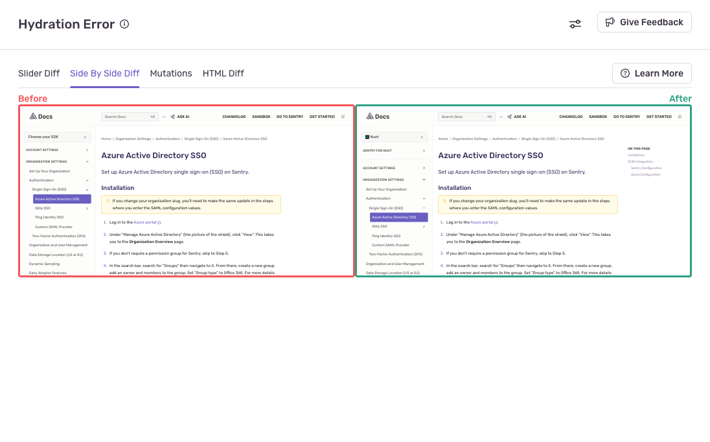
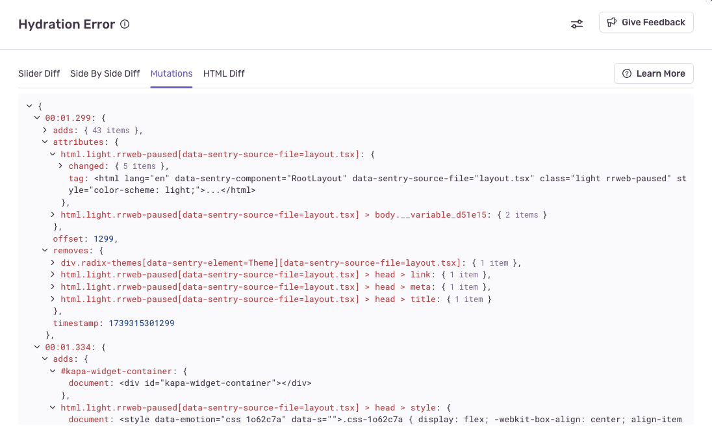

Hydration errors are a React-specific problem that happen when the initial client UI does not match what was rendered on the server. They can result in extra work for the browser, and a slower pageload experience for users.

## Prerequisites for Seeing Hydration Error Diff Tools

Hydration Errors can come into your issue stream either as regular error events, or they could be detected inside a replay and converted into an issue by the server. Read more about
[configuring hydration errors](/platforms/javascript/session-replay/issue-types/) to learn about the differences.

If the hydration error event instance has an associated replay, then you will see diff tools on the **Issue Details** page to make debugging the hydration error easier.

## Debugging Hydration Errors

Hydration errors represent a mismatch between the server-rendered HTML, and the client-rendered HTML. So it's beneficial to compare the before and after state of a webpage to understand what's changed, and decide how to make those two states consistent. To do this, we provide a few diff tools to see the differences -- both visually and by looking at the rendered HTML itself.

Generally, the visual tools are a good place to start to identify the issue, but keep in mind that sometimes differences can appear below the fold, or there can be differences in hidden DOM nodes or attributes, so inspecting the HTML is important too.

#### Example Error

In the example below we'll look at a hydration error and see how each tool helps to debug the problem.

The problem is that code highlighting is not applied on the server. When the server renders the PHP code block in the bottom-center of the page, all the code has a white font color. After hydration syntax highlighting is applied, the code snippet is colorful.

### Image Slider

The image slider tool allows for comparing the two page states by overlaying the images on top of each other. Click and drag the purple line to reveal one image or the other.

### Side-by-Side Image

View images side-by-side to see large chunks of the page that may differ.

### Tree Compare

Use the tree compare tool to list specifically which DOM nodes were added, removed, or had attributes changed.

You can see each change to the page, and when it happened within the context of the hydration error. In this case one mutation happened at the timestamp `1732089574790` which was at time offset `1790`, or 1.7 seconds since the start of the captured replay. Within this mutation 39 nodes were added, 2 nodes had some attributes changed, and 4 nodes were removed.

We show a CSS selector for each node in the tree to make it easier to identify the component that was changed. Note that some changed nodes might exist outside your React render tree and won't cause hydration errors.

### HTML Diff

The HTML diff tool is a basic HTML comparison. It is useful if the hydration error is caused by hidden DOM nodes, different attributes on a DOM node, or there's mismatched content below the fold.

## Privacy

The diff tools all rely on replay data, so any PII data within the webpage will be masked or blocked before being sent to the server by default. Read more about [Protecting user privacy in Session Replay](/security-legal-pii/scrubbing/protecting-user-privacy/) and [how to configure Session Replay to maintain user privacy](/platforms/javascript/session-replay/privacy/).
