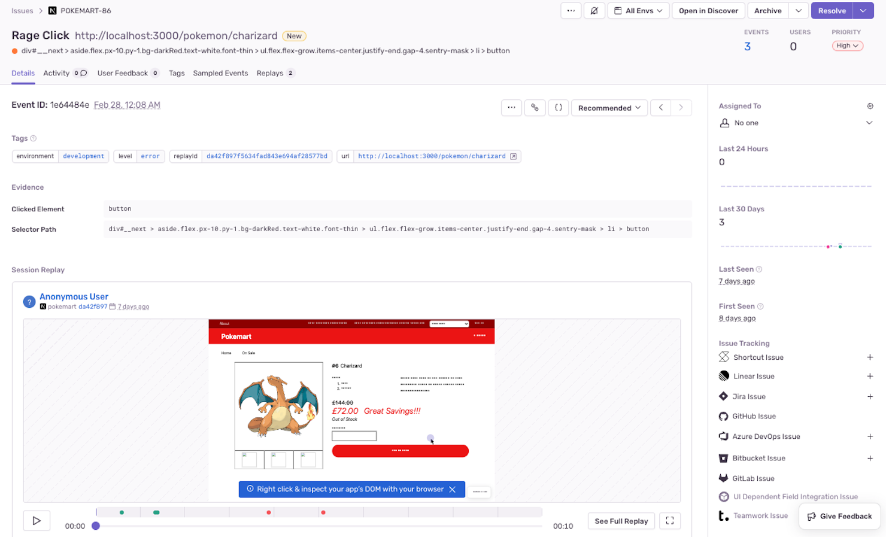
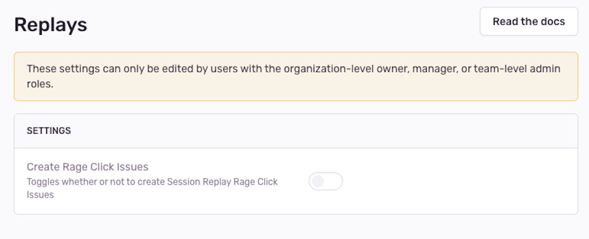

If you've enabled [Session Replay](/product/session-replay/), you'll be able to see rage click issues on the [**Issues**](https://sentry.io/orgredirect/organizations/:orgslug/issues/) page in Sentry. Rage clicks are a series of consecutive clicks on the same unresponsive element. They are a sure sign of user frustration and most likely deserve your attention.



## Prerequisites for Seeing Rage Clicks

In order to see rage clicks in your issue stream on the **Issues** page, your organization needs to:

- Be sending [session replay events](/product/session-replay/getting-started/)
- Enable the JavaScript SDK (or framework-specific bundle), version 7.60.1 or higher

<Note>
While you can enable **session replay** with JavaScript SDK version 7.27.0, or higher, you'll need to have version 7.60.1 or higher in order to be able to see **rage click issues**.
</Note>

## Detection Criteria

"Slow clicks" (also called "dead clicks") are only detected on `<button>`, `<input>`, and `<a>` elements that don't lead to updates to the DOM or a page scroll within 7 seconds). When the user clicks on one of these elements 3 or more times within that 7 second time frame, it indicates frustration, and the SDK registers a "rage click". 

### Why am I seeing too many or too few rage clicks?
There might be fewer rage clicks than you expect if the user stopped waiting for the site to respond before the 7 second threshold and instead chose to to something else. This is why the rage click issues that you *do* see are so valuable, because the user that clicked at least 3 times and continued waiting at least 7 seconds for the site to respond is likely very frustrated.

You might also see more rage clicks than you expected from buttons that don't trigger a DOM mutation or page scroll, i.e. Print and Download buttons. There is no reliable way for the SDK to detect that a download or print has initiated, so a slow click might be generated even if the button is not actually "dead". For these cases, you can configure the SDK via `slowClickIgnoreSelectors` - see <PlatformLink to='/session-replay/configuration'>Configuration</PlatformLink> for more details.

For example, you could ignore detection of dead and rage clicks for download links in your application like this:

```javascript
Sentry.replayIntegration({
  slowClickIgnoreSelectors: [
    ".download",
    // Any link with a label including "download" (case-insensitive)
    'a[label*="download" i]',
  ],
});
```

## Get Rage Click Alerts

To set up alerts and get notified when a rage click occurs, follow these steps:

1. Create a new [Alert Rule](https://sentry.sentry.io/alerts/new/issue/) in Sentry.
2. In the "Set conditions" section, set the "IF" filter to "The issue's category is equal to", then choose "Replay" from the dropdown.
3. Add an optional filter if you like.
5. Choose the action to be performed in the "THEN" dropdown.
6. Decide how often you'd like Sentry to look for rage click issues.
7. Lastly, name your alert and add an owner.

## Turn Off Rage Click Issues

If you don't want to see rage click issues, you can disable them by going to the **Settings** page in Sentry, clicking "Projects", and selecting the project for which you want to disable rage clicks. From here, select "Replays" under the "PROCESSING" heading and toggle off "Create Rage Click Issues".


