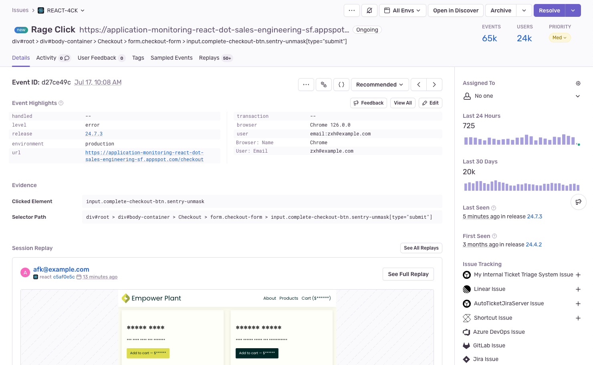

If you've enabled [Session Replay](/product/explore/session-replay/), you'll be able to see rage click issues on the [**Issues**](https://sentry.io/orgredirect/organizations/:orgslug/issues/) page in Sentry. Rage clicks are a series of consecutive clicks on the same unresponsive page element. They are a strong signal of user frustration and most likely deserve your attention.

## Prerequisites for Seeing Rage Clicks

In order to see rage clicks in your issue stream on the **Issues** page, your organization needs to:

- Be sending [Session Replay events](/product/explore/session-replay/getting-started/)
- Enable the JavaScript SDK (or framework-specific bundle), version 7.60.1 or higher

<Alert>
While you can enable **Session Replay** with JavaScript SDK version 7.27.0, or higher, you'll need to have version 7.60.1 or higher in order to be able to see **rage click issues**.
</Alert>

## Detection Criteria

"Dead clicks" (also called "slow clicks") are only detected on `<button>`, `<input>`, and `<a>` elements that don't lead to updates to the DOM or a page scroll within 7 seconds. When the user clicks on one of these elements 3 or more times within that 7-second timeframe, it indicates frustration, and the SDK registers a "rage click".

You can configure Replay to ignore specific selectors if you are seeing [too many rage clicks](/platforms/javascript/session-replay/troubleshooting/#why-am-i-seeing-too-many-or-too-few-rage-clicks) reported. For example, you might want to ignore clicks on "Print" or "Download" buttons.

## Get Rage Click Alerts

To set up alerts and get notified when a rage click occurs, follow these steps:

1. Create a new [Alert Rule](https://sentry.io/orgredirect/organizations/:orgslug/alerts/new/issue/) in Sentry.
2. In the "Set conditions" section, set the "IF" filter to "The issue's category is equal to", then choose "Replay" from the dropdown.
3. Add an optional filter if you like.
5. Choose the action to be performed in the "THEN" dropdown.
6. Decide how often you'd like Sentry to look for rage click issues.
7. Lastly, name your alert and add an owner.

## Turn Off Rage Click Issues

If you don't want to see rage click issues, you can disable them, follow these steps:
1. Go to the [Settings > Projects](https://sentry.io/orgredirect/organizations/:orgslug/settings/projects/) page in Sentry.
2. Select a project from the list.
3. Go to the "Replays" sub-page for this project under the "Processing" heading.
4. Toggle off "Create Rage Click Issues".

