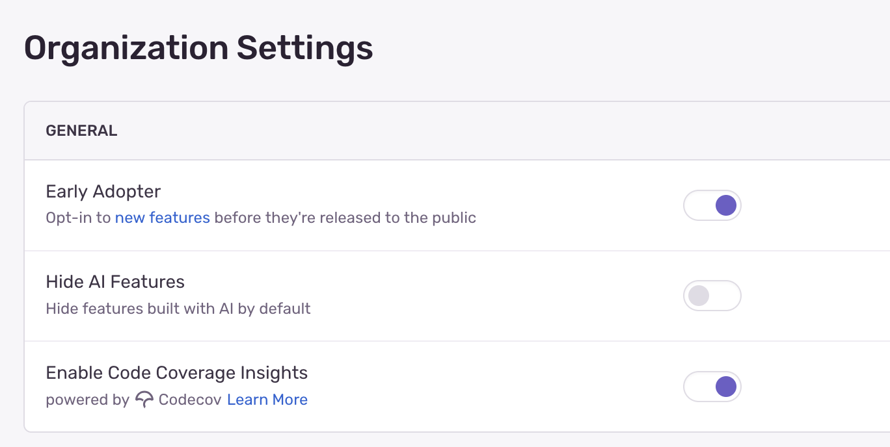

Seer is Sentry's AI agent that powers a set of features built on AI and ML.

Once you've set up Seer, you'll be able to use the following features that leverage generative AI models:

- [**Autofix**](/product/issues/issue-details/ai-autofix/)
- [**Issue Summary**](/product/issues/issue-details/ai-issue-summary/)

Additionally, Seer includes a Sentry-made Machine Learning (ML) model that enables [**AI-powered Issue Grouping**](/concepts/data-management/event-grouping/).

<Alert>

Seer features built on generative AI, including Autofix and Issue Summary, are not available for hosted Sentry customers in the European Union at this time.

</Alert>

## Data Processing for Generative AI

When using generative AI capabilities in Seer, we use the data listed below for analysis and to provide solutions for your review. **Your data will not be used to train any models or to generate output shown to others.** These features are powered by generative AI models hosted by the feature-specific subprocessors identified on our [subprocessor list](https://sentry.io/legal/subprocessors/). Our subprocessors will only use the data as directed by us.

The data used for these features includes:

- Error messages
- Stack traces
- Sentry spans
- DOM interactions
- Profiles
- Relevant code from linked repositories

You can learn more about our data privacy practices [in our AI/ML policy](/security-legal-pii/security/ai-ml-policy/#use-of-identifying-data-for-generative-ai-features).

## Disabling Generative AI Features

If you don't find the feature useful and want to disable it for all users, you can do so in your organization's settings with the "Hide AI Features" toggle:

Also note that the features won't be available until the proper consent is given for your organization.
