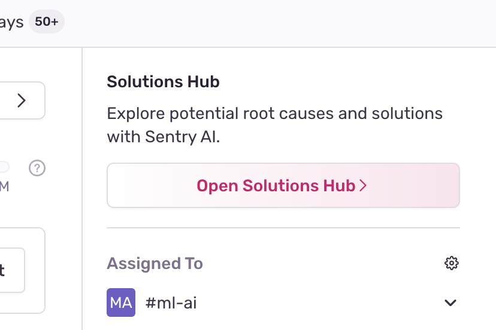
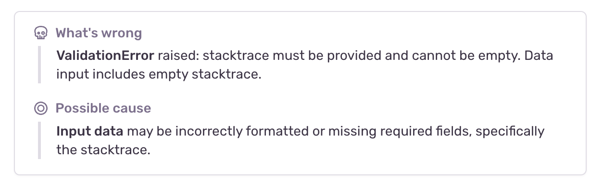

Sentry AI is a set of tools that help you quickly understand an issue, find a root cause, and create a fix. 
You can find it in the Solutions Hub in the sidebar of the issue details page for any error:

Once you've set up Sentry AI, you'll be able to use the following features:

- [**Issue Summary**](#issue-summary): A quick summary of all the data in the issue to help you understand what's going on at a glance.
- [**Autofix**](#autofix): A collaborative workflow to find the root cause of an error and create a PR that fixes it.

## Issue Summary

Issue Summary quickly orients you with the issue by summarizing key insights across event and issue level metadata.

When you open an issue, you'll see a quick overview of what's going wrong in the issue in the Solutions Hub in the sidebar:

Opening the Solutions Hub will show you a more detailed overview of the issue. It will summarize what's going wrong, a possible cause, and if relevant, insights from trace-connected issues:

## Autofix

When you want to understand the root cause more deeply, you can use Autofix. It uses the issue details, your codebase (integrated through GitHub), and its interactions with you to gain context and reason through the problem.

When you start an Autofix run, you'll see the following screen, with an option to share initial helpful context on the issue:

Autofix then starts analyzing the issue and the relevant code. You can see its status at the bottom of the screen. As it goes through the process, Autofix will share its key insights along the way. You can expand each one to see the exact event data and code that it used to justify it. These insights build up a chain of reasoning to the root cause of the error.

Autofix obviously doesn't know everything, so it collaborates with you. At any point, you can jump in with helpful context or feedback. You can also directly edit its line of reasoning. Just click the "Edit" button above any of them, provide any thoughts or instructions you have, and Autofix will walk back its thought process and rethink from that point. Autofix can also recognize when it doesn't know something, and ask you for the context it needs to continue.

Once you reach a root cause you're happy with, or have enough context to propose your own, Autofix will use the same process to find a fix. When complete, you'll see the diff of its proposed code changes. You can directly reject, edit, rethink, and give feedback on the changes. You can also ask Autofix to add tests to ensure the issue doesn't happen again.

Once you're happy with the changes, Autofix can create a draft PR for you to review and merge in GitHub.

## Data Processing

Under normal circumstances we do not send data to a third party
undisclosed in our [subprocessor list](https://sentry.io/legal/subprocessors/).
Because of this you need to provide consent to do so. If your organization has
signed a DPA with us, an owner of the organization will also need to sign a
"OpenAI Subprocessor Acknowledgement" in the organization [Legal & Compliance
page](https://sentry.io/orgredirect/organizations/:orgslug/settings/legal/). Otherwise an individual
user will receive a prompt to confirm that data will be sent to a third party.

The data shared via this feature will not be used to train any AI models. The data used for these features includes:

- Error messages
- Stack traces
- Sentry spans
- DOM interactions
- Relevant code from linked repositories

## Disabling AI Features

If you don't find the feature useful and want to disable it for all users, you
can do so in your organization's settings with the "Hide AI Features" toggle. Also remember that the features won't be available until the proper consent is given for your organization.

