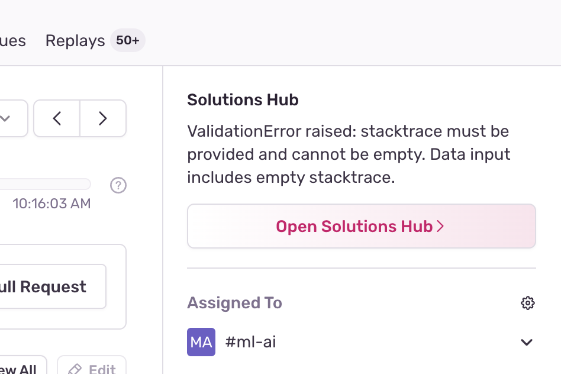
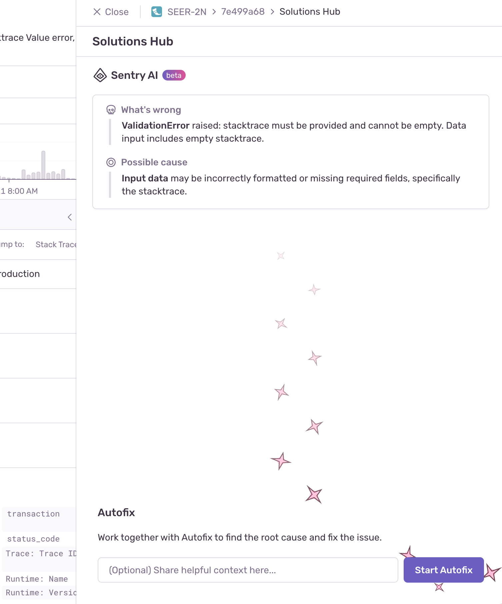
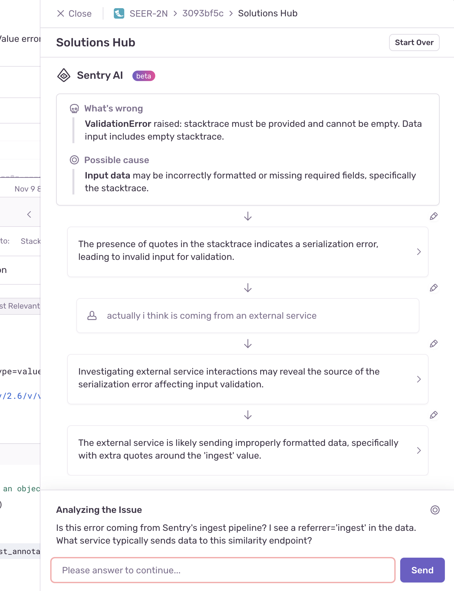
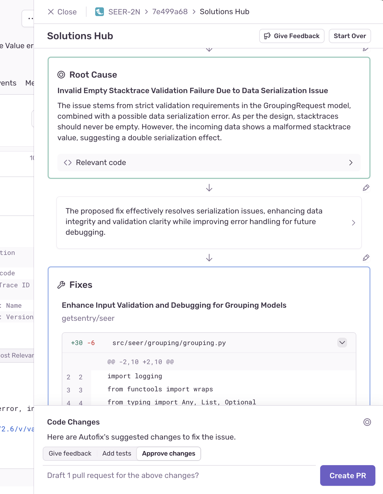

Sentry AI is a set of tools that help you quickly understand an issue, find a root cause, and create a fix. You can find it in the **Solutions Hub** section of the issue details page after clicking on any error from the [**Issues**](https://sentry.io/orgredirect/organizations/:orgslug/issues/) page.

Once you've set up Sentry AI, you'll be able to use the following features:

- [**Issue Summary**](#issue-summary): A quick summary of all the data in the issue to help you understand what's going on at-a-glance.
- [**Autofix**](#autofix): A collaborative workflow to find the root cause of an error and create a PR that fixes it.

## Issue Summary

The Issue Summary provides a quick overview of an issue by highlighting key insights taken from event and issue-level metadata. You'll see a quick overview of what's going wrong, a potential cause, and if relevant, insights from trace-connected issues, all in the Solutions Hub in the sidebar:

## Autofix

<Alert>

 Autofix replaces Suggested Fix (an earlier feature that has been sunset).

 </Alert>

**Autofix** uses the issue details, your codebase (integrated through GitHub), and its interactions with you to gain context, reason through the problem, and get a deeper understanding of the root cause.

When you start an Autofix run, you'll see the following screen, with an option to share any additional context:

Autofix will then analyze the issue and relevant code to help identify the root cause. You'll see the progress displayed at the bottom of the screen. Autofix will share key insights as they come up and you'll have the option to expand each. You'll see the event data and code that support Autofix conclusions, building a clear chain of reasoning back to the root cause.

Since Autofix doesn’t have all the context, collaboration leads to the best results. You can step in at any time to add context or feedback. To edit its reasoning, click the "Edit" button above any line to provide instructions or corrections, and Autofix will adjust its approach accordingly. If Autofix encounters gaps in its understanding, it will ask for your input.

When you’ve identified the root cause, or gathered enough information to propose your own solution, Autofix will use the same process to suggest a fix. It will present a diff of the proposed code changes. You can then:

- Accept, reject, or edit the changes.
- Provide feedback or ask Autofix to rethink its approach.
- Request tests to ensure the issue doesn’t recur.

Once you're happy with the changes, Autofix can create a draft PR for you to review and merge in GitHub.

## Data Processing

We use the data listed below for analysis and to provide solutions for your review. Your data will not be used to train any models or to generate output shown to others. These features are powered by generative AI models hosted by the feature-specific subprocessors identified on our [subprocessor list](https://sentry.io/legal/subprocessors/). Our subprocessors will only use the data as directed by us.

The data used for these features includes:

- Error messages
- Stack traces
- Sentry spans
- DOM interactions
- Relevant code from linked repositories

You can learn more about our data privacy practices [here](https://docs.sentry.io/security-legal-pii/security/ai-ml-policy/#use-of-identifying-data-for-generative-ai-features).
## Disabling AI Features

If you don't find the feature useful and want to disable it for all users, you
can do so in your organization's settings with the "Hide AI Features" toggle. Also remember that the features won't be available until the proper consent is given for your organization.
