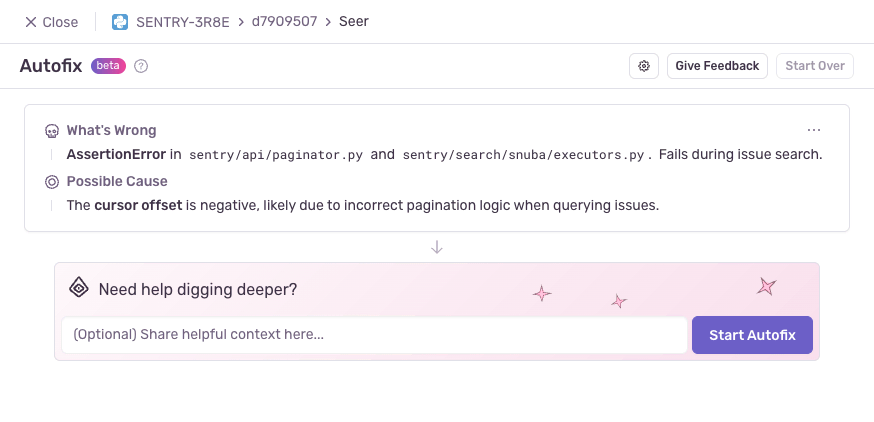
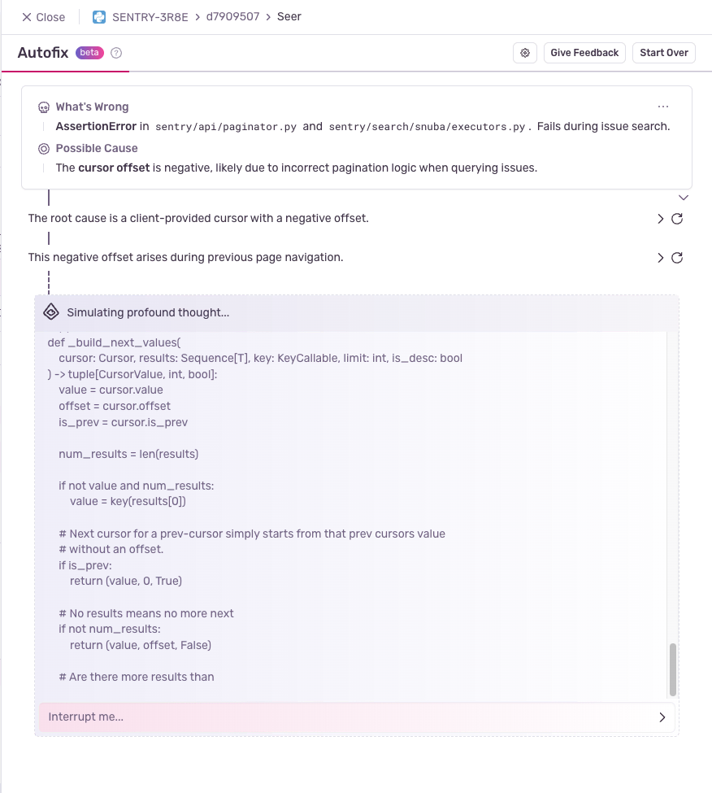
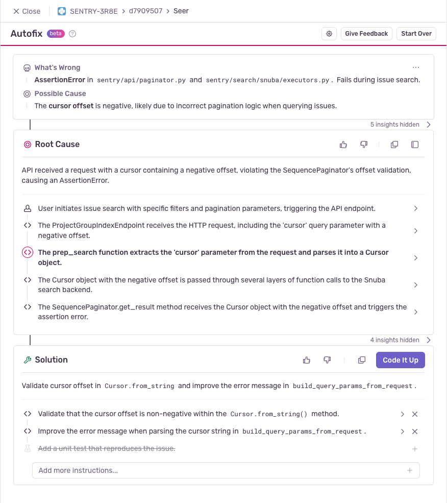

Seer is Sentry's AI agent that powers a set of features built on generative AI and ML. Once you've set up Seer, you'll be able to use the following features:

- [**Autofix**](#autofix): A collaborative workflow to find the root cause and solution of issues
- [**Issue Summary**](#issue-summary): A quick summary of issue context to help you see what's going on

<Alert>

Autofix and Issue Summary are currently in Beta, free of charge, for paid Sentry customers. Feedback is highly welcomed and can be submitted in-product or via email to [autofix@sentry.io](mailto:autofix@sentry.io).

</Alert>

### Issue Fix

Seer uses Sentry's context (issue details, tracing data, logs and profiles), your codebases (integrated through GitHub), and its interactions with you to identify and reason through problems in your code. Seer can identify the root cause and suggest a code change for fixing the issue and/or add unit tests for it.

When you start an Issue Fix run, you'll see the following screen, with an option to share any additional context:

Seer will then analyze the issue and relevant code to help identify the root cause and a solution. You'll see a live stream of Seer's thought process in real time as it works through the problem. Seer will share key insights as they come up and you'll have the option to expand each. You'll see the event data and code that support Seer's conclusions, building a clear chain of reasoning back to the root cause.

While Seer is reasoning through your problem, you can step in at any time to add context or feedback; collaboration tends to lead to the best results. If Seer encounters gaps in its understanding, it will ask for your input.

The output will be a clearly defined root cause of the Sentry issue, and a detailed solution for how to resolve it:

You are free to edit or adjust this solution based on your own requirements and preferences. Once you are ready to proceed, you can select "Code It Up" to generate code resolving the bug. You have three options:

- Write a fix
- Write a unit test reproducing the issue
- Write both

Once the coding step is complete, you can either create a Pull Request (PR) in GitHub directly from Seer, or create a branch and checkout the code locally if you would like to iterate further.

### Issue Summary

Issue Summary provides a quick overview of an issue by highlighting key insights taken from event and issue-level metadata. You'll see a quick overview of what's going wrong, a potential cause, and if relevant, insights from trace-connected issues.

## Data Processing for Generative AI

We use the data listed below to provide insights, analysis, and solutions for your review. Your data will not be used to train any generative AI models without your express consent and AI-generated output from your data is shown only to you, not other customers. Our generative AI features are powered by generative AI models hosted by subprocessors identified on our [subprocessor list](https://sentry.io/legal/subprocessors/). Our subprocessors are only permitted to use the data as directed by us.

The data used for these features includes:
- Error messages
- Stack traces
- Sentry spans
- DOM interactions
- Profiles
- Relevant code from linked repositories

You can learn more about our data privacy practices [here](/security-legal-pii/security/ai-ml-policy/#use-of-identifying-data-for-generative-ai-features).

## Disabling Generative AI Features

If you don't find Seer useful and want to disable it for all users, you can do so in your organization's settings with the ["Show Generative AI Features" toggle](https://sentry.io/orgredirect/organizations/:orgslug/settings/#hideAiFeatures).
