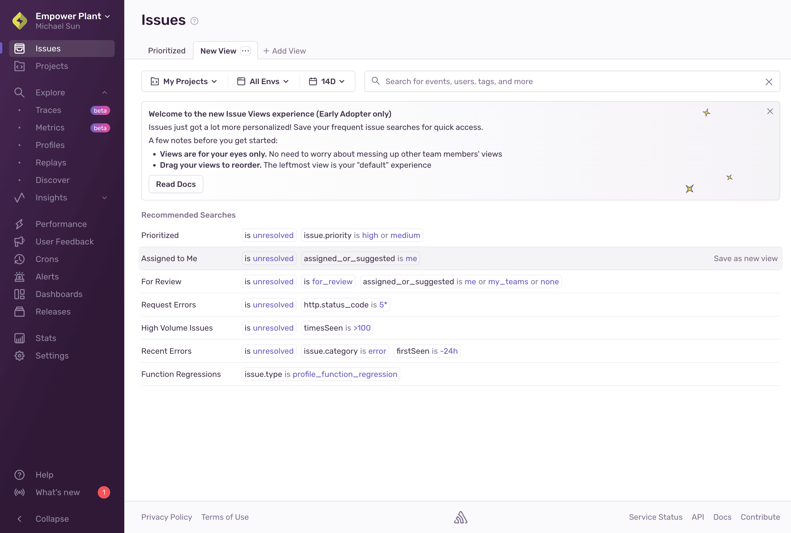
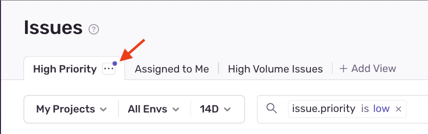

Issue views let you customize what shows up in your issue stream so you can quickly see what's most important to you. You have full control over which search query your issue stream renders by default, and which other queries are within a click's reach.

<Alert>
  This feature is only available if your organization has enabled [early adopter features](/organization/early-adopter-features/). Early adopter features are still in-progress and may have bugs. We recognize the irony. If you’re interested in participating, enable early adopter features in [organization settings](https://sentry.io/orgredirect/organizations/:orgslug/settings/organization).
</Alert>

## Creating Your First View

To create your first custom issue view, navigate to the [**Issues**](https://sentry.io/orgredirect/organizations/:orgslug/issues/) page and click the **Add View** button. You'll see the following page:

Here, you'll be able to select a view from one of the recommended options or create your own by following the instructions below:

1. **Name your view**: Give your view a name that describes the types of issues it will show.
2. **Set your view's search query**: Choose the search query that will be applied by default when you select this view. Don't forget to hit enter to apply the query!
3. **Set your view's sort**: Select how you want the issues to be sorted in this view (for example, by date, events, and so on).
4. **Save your view**: Click on the ellipsis menu within the tab and select **Save Changes**.

<Alert>
If you had a default custom saved search, it'll be converted to an issue view and will appear as your default view automatically, just like before. Any other saved searches you created will be available in the **Add View** menu until the end of the year. Please save them as views if you'd like to keep them.
</Alert>

## Customizing Your Views

### Updating View Queries and Sorting

Views are defined by their search query and sort order, but you can safely change the query or sort within your view without changing the persistent query or sort. If you want to input a different query from the one your view was saved with, you'll see an **unsaved changes indicator** (shown below). To update your view with this new query or sort, click the ellipsis menu and select **Save Changes**. To discard them, click **Discard Changes** within the ellipsis menu, or close your Sentry tab without saving.

### Reordering Views and Setting a Default View

Your can reorder your view tabs by dragging them to where you want them to be. The first tab will always be your default view and will be what you see when you first open the **Issues** page.

### Renaming Views

To rename a view, select it from the tab list. Then, either double click on the view's name or click the ellipsis menu and select **Rename**, type in a new name, and hit enter.

## Sharing Views

We built Issue Views in a way that makes them easy to share with people in your organization. To share, just copy the link to your issue view and send it to a fellow org member. The link will take them to a **temporary tab** that contains the same query and sort as your view. They'll then be able to save the view as their own by clicking **Save View**, or discard it by clicking **Discard**. Note, that temporary tabs will not be persisted across page navigations or reloads.
