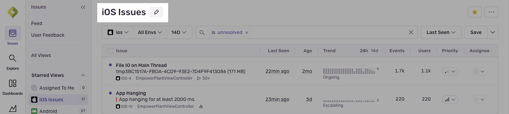

Issue views let you customize and share your issue stream, so you and your teammates can quickly see the issues that are most relevant to you.

<Alert>
  This feature is only available if your organization has enabled [early adopter features](/organization/early-adopter-features/). Early adopter features are still in-progress and may have bugs. We recognize the irony. If you’re interested in participating, enable early adopter features in [organization settings](https://sentry.io/orgredirect/organizations/:orgslug/settings/organization).
</Alert>

## Creating Your First View

To create your first custom issue view, navigate to the [**All Views**](https://sentry.io/orgredirect/organizations/:orgslug/issues/views/) page and click the **`+ Create View`** button on the top right.

This will create a new starred view, which you can than update with the filters of your choosing. Some common use cases for views include:

* **High Volume View:** A view containing issues with a certain number of events
* **iOS and Android Views:** Views for different mobile platforms
* **Assigned to Me:** A view for issues assigned to yourself and/or your teams
* **Performance Issues:** A view containing performance issues detected in your application
* **Recent Issues:** A view containg issues that have appeared within the last few hours

## Customizing Your Views

### Updating View Parameters

Views are defined by their serach query, sort, and project/environment/time range filters. Changing any of these parameters won't automatically persist those changes to your view, however. If your current filters have diverged from the view's original filters, a purple dot will appear next to your view in the navigation, and hovering over it will show which filters have been changed:

To persist these changes to your view, simply click on the purple `Save` button to the right of the search and sort inputs in the Issues page. You may also create a new view with these changes  by clicking `Save as new view`, or you can reset the view back to its original filters by clicking `Reset`.

### Reordering Views and Setting a Default View

Your can reorder the starred views in the navigation by hovering over them and dragging the six dot handle to whatever position you want them to be in.

### Renaming Views

To rename a view, navigate to that view's page and hover over the page header, which will reveal a pencil icon. Click the pencil icon to edit the view's name.

You can also do this by navigation to the `All Views` page and clicking on the view's ellipsis menu and selecting `Rename`.

## Sharing Views

### Browsing and Starring Your Organization's Views

All Issue Views are visible to all members of your organization, and you can browse your organization's views by navigating to the [**All Views**](https://sentry.io/orgredirect/organizations/:orgslug/issues/views/) page. Note that some views may filter on projects that you may not have access to, and attempting to access one of these views will result in a 404.

Here, you can search and sort for specific views and star any views that you want to see in your sidebar.

### Sharing a View

You can share a view to anyone simply by sending them a link to the view. Any fellow org members will be able to see the view and save a duplicate of it as their own, but only you and Org admins or managers have the permissions to delete or edit it.
