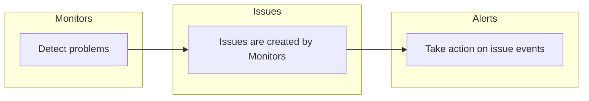

[Monitors](/product/monitors-and-alerts/monitors/) and [Alerts](/product/monitors-and-alerts/alerts/) are used to customize issue detection and action. **Monitors** focus on _when_ something becomes an issue; **Alerts** focus on _what to do next_ (notify, ticket, webhook).

For the full product overview, see [**Monitors and Alerts**](/product/monitors-and-alerts/).

## How They Work Together

**Monitors** watch signals you care about on top of default error detection,like scheduled jobs, URLs, metric thresholds on spans, and custom application metrics and create issues when their conditions are met. **Alerts** run when issues match the triggers and filters you configure, and carry out **actions** such as Slack messages, email, or creating work items in an integrated tool.

Typical flow:

1. A **Monitor** detects a problem → Sentry creates or updates an **issue**.
2. An **Alert** whose sources (Monitors) and filters (conditions) match that issue → runs actions (notifications, tickets, webhooks).

Alerts can be scoped to **Projects** or **Monitors**, so you can set one alert for multiple monitors or projects that your team owns. You can also multiple alerts for one monitor for uses like differing alerting needs for multiple teams or environments.

## Monitors

Monitors define when errors, performance problems, or operational failures become issues you triage in Sentry. They include:

- **Custom monitors** for [metrics](/product/monitors-and-alerts/monitors/#metric-monitor-settings), [cron jobs](/product/monitors-and-alerts/monitors/crons/), and [uptime checks](/product/monitors-and-alerts/monitors/uptime-monitoring/)
- **Default monitors** coming from your SDK integration like [issue grouping/fingerprint rules](/concepts/data-management/event-grouping/)

[Learn more about monitor types](/product/monitors-and-alerts/monitors/#types-of-monitors)

## Alerts

Alerts trigger when issue state or attributes match what you configure: for example, notify a Slack channel when a new issue appears, or open a Jira ticket when an issue is assigned and matches severity filters.

[Learn how to create and manage alerts](/product/monitors-and-alerts/alerts/)

## Getting Started

1. **Create or review [Monitors](/product/monitors-and-alerts/monitors/)** for the signals you need (cron, uptime, metrics, defaults).
2. **Create [Alerts](/product/monitors-and-alerts/alerts/)** with the right sources, triggers, filters, and actions.
3. **Add alerts to your team's workflow** at the project or monitor level to be notified when issues match your filters.

Learn more about configuring [Monitors and Alerts](/product/monitors-and-alerts/alerts/) and [**Creating alerts**](/product/alerts/create-alerts/).
