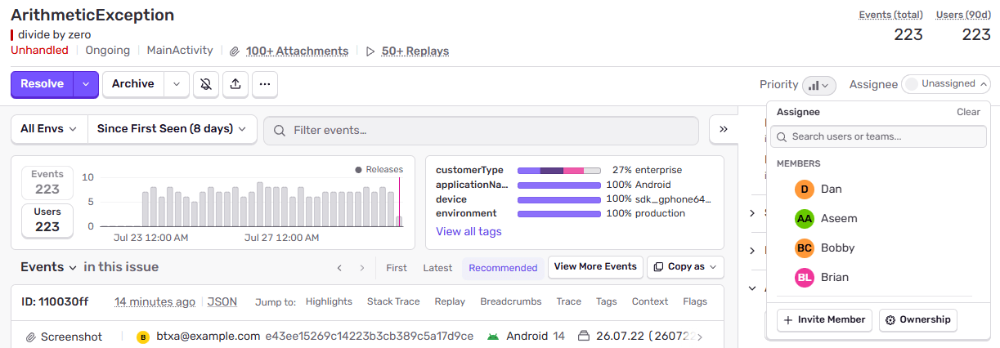
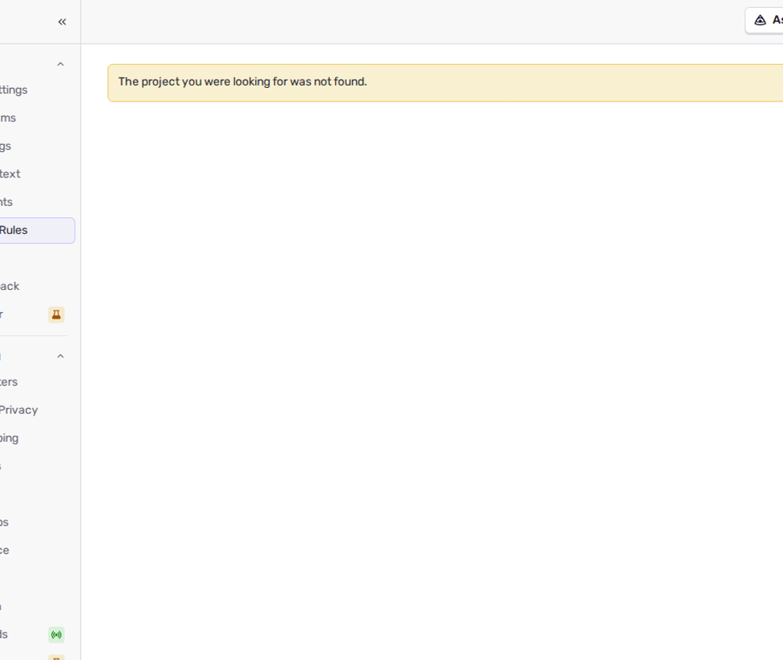
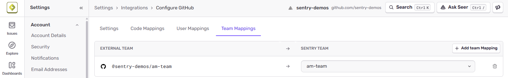
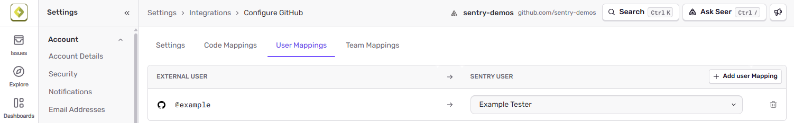
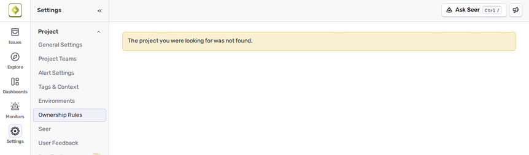

<Include name="only-error-issues-note.mdx" />

Sentry lets you define the "ownership" of an issue so it can automatically assign issues and route alerts to the right people. There are two ways to define ownership:

- **Ownership rules** - Custom rules you define per project that match issues based on file paths, URLs, modules, or event tags.
- **Code owners** - Import your [GitHub](https://docs.github.com/en/repositories/managing-your-repositorys-settings-and-features/customizing-your-repository/about-code-owners) or [GitLab](https://docs.gitlab.com/ee/user/project/code_owners.html) CODEOWNERS file to assign issues based on file paths in the event stack trace.

Ownership rules take precedence over code owners when Sentry assigns issues.

Once an issue has been assigned (whether manually or automatically), future auto-assignment will be turned off for that issue.

## Ownership Rules

You can set ownership by defining ownership rules per project. To configure ownership rules, go to your project's [Ownership Rules](https://sentry.io/orgredirect/organizations/:orgslug/settings/projects/:projectId/ownership/) settings.

You can also create ownership rules directly from an **Issue Details** page by opening the **Assignee** dropdown and clicking **Ownership** at the bottom. This opens the "Edit Ownership Rules" modal, which shows suggested paths and URLs based on the events in the issue.



### Rule Syntax

The general format of a rule is: `type:pattern owners`

**Types of matches:**

| Type | Matches Against | Example Pattern |
|------|----------------|-----------------|
| `path` | File paths in the event's stack trace | `src/javascript/*.[tj]sx` |
| `module` | Module names in the event's stack trace | `com.example.app` |
| `url` | The event's request URL | `https://www.example.io/v/[0-9]/checkout` |
| `tags.TAG_NAME` | A specific event tag | `tags.browser:Chrome 81.0.?` |

**Patterns** support unix-style [glob syntax](<https://en.wikipedia.org/wiki/Glob_(programming)>). Use `*` to match anything and `?` to match a single character. This is not regex.

**Owners** can be one or more Sentry user emails or team names (prefixed with `#`), separated by spaces:

```text
# Single owner
path:src/backend/*                  example@company.com

# Multiple owners
path:src/auth/*                     example1@company.com example2@company.com

# Team owner
path:src/api/*                      #backend-team
```

### Configuring Rules in Project Settings

You can add and edit ownership rules from your project's [Ownership Rules](https://sentry.io/orgredirect/organizations/:orgslug/settings/projects/:projectId/ownership/) settings by clicking "Edit Rules":



### Permissions

Teams _must_ have access to the project to become owners, unless the organization has [Open Membership](/organization/membership/#open-membership) enabled. To grant a team access to a project, go to your project's [Project Teams](https://sentry.io/orgredirect/organizations/:orgslug/settings/projects/:projectId/teams/) settings and click "Add Team".

To grant a user access to a project, the user must be a member of a team with access to the project. To add a user to a team, navigate to **Settings > Teams**, select a team, and click "Add Member".

## Code Owners

<Include name="feature-available-for-plan-business.mdx" />

You can import your CODEOWNERS file and use it alongside your ownership rules to assign Sentry issues. This requires **code mappings** from [stack trace linking](/integrations/source-code-mgmt/github/#stack-trace-linking) to be configured first, so Sentry can map file paths between your build output and your repository.

For example, you may build your program in a `dist/` folder that doesn't appear in your CODEOWNERS file, but does appear in your stack traces. Code mappings let Sentry normalize these file paths so CODEOWNERS rules match correctly.

### Setting Up Code Owners

1. Set up [code mappings](/integrations/source-code-mgmt/github/#stack-trace-linking) for your project.
2. Import your CODEOWNERS file from your project's [Ownership Rules](https://sentry.io/orgredirect/organizations/:orgslug/settings/projects/:projectId/ownership/) settings.
3. Configure [external team/user mappings](#external-teamuser-mappings) to map your source control identities to Sentry users and teams.

### Supported Syntax

Sentry supports GitHub CODEOWNERS file syntax, including exclusion rules (lines without owners that remove ownership from a path). You can find more details about the syntax [in GitHub's documentation](https://docs.github.com/en/github/creating-cloning-and-archiving-repositories/creating-a-repository-on-github/about-code-owners), including [details on unsupported syntax](https://docs.github.com/en/github/creating-cloning-and-archiving-repositories/creating-a-repository-on-github/about-code-owners#syntax-exceptions).

Sentry does not support [GitLab CODEOWNERS syntax](https://docs.gitlab.com/user/project/codeowners/reference) that isn't also supported by GitHub, such as sections and `!` negations.

### External Team/User Mappings

You need to map identities from your source control provider to Sentry users and teams so that CODEOWNERS rules can be resolved. Sentry automatically ignores rules that are missing team/user mappings.

Create these mappings by navigating to **Settings > Integrations > GitHub/GitLab > [Configuration] > Team Mappings/User Mappings**. Suggestions will come from any CODEOWNERS files on projects for the organization.





### Limitations

- CODEOWNERS files have a maximum size of **3MB**. If your file exceeds this, use wildcard rules to consolidate multiple entries.
- Sentry syncs your CODEOWNERS file periodically from your repository. Changes may not be reflected immediately.

## Evaluation Flow

Ownership rules and code owners are matched against individual events in an issue. Sentry evaluates an event by checking if _any_ of its in-app stack trace frames match a rule. Rules are evaluated in this order:

1. Code owners, top-to-bottom
2. Ownership rules, top-to-bottom

The **last rule that matches** is used for issue assignment. Since ownership rules are evaluated after code owners, they effectively take priority. If the last matching rule has multiple owners, Sentry assigns the issue to the first (leftmost) owner in that rule.

The order of stack trace frames in an event does not affect which rule is selected.

### Example

Sentry receives an event with the following stack trace:

- `models/UserModel.py` (frame 1)
- `backend/endpoints/auth/user.py` (frame 2)
- `backend/api/base.py` (frame 3)

**Code Owners:**

```bash
# Frontend
*.js                               @frontend-team
*.tsx                              @frontend-team

# Backend
backend/                           @engineering-team
models/                            @models-team
backend/api/                       @api-team
```

**Ownership Rules:**

```text
path:backend/endpoints/*           #api-team
path:backend/endpoints/auth/*      #auth-team #enterprise-team
```

Sentry evaluates the code owners top-to-bottom first, then ownership rules top-to-bottom. The matches, in order, are:

```
[
  "codeowners:backend/                #engineering-team",           # match on frame 2 and 3
  "codeowners:models/                 #models-team",                # match on frame 1
  "codeowners:backend/api/            #api-team",                   # match on frame 3
  "path:backend/endpoints/*           #api-team",                   # match on frame 2
  "path:backend/endpoints/auth/*      #auth-team #enterprise-team", # match on frame 2
]
```

The last matching rule is `path:backend/endpoints/auth/* #auth-team #enterprise-team`. Since there are multiple owners, Sentry assigns the issue to the first owner: `#auth-team`.

## Where It's Applied

Once ownership rules are configured, they're applied in the following ways:

### Suggested Assignees

On the **Issue Details** page, you'll see suggested assignees in the **Assignee** dropdown based on ownership rules matching the event and [suspect commits](/product/issues/suspect-commits/). You can manually assign the issue to a suggested assignee by selecting one. An event can have multiple suggested assignees if it matches multiple ownership rules.

### Auto-Assignment

You can automatically assign issues to their owners from your project's [Ownership Rules](https://sentry.io/orgredirect/organizations/:orgslug/settings/projects/:projectId/ownership/) settings. There are three auto-assignment options:

- **Auto-assign to suspect commits** - Prioritizes assigning to the author of a [suspect commit](/product/issues/suspect-commits/), then falls back to ownership rules and code owners.
- **Auto-assign to issue owner** - Assigns based on ownership rules and code owners only.
- **Turn off auto-assignment** - Disables automatic assignment entirely.



If an issue has been assigned in the past (manually or automatically), new events will not change the current assignee. If an issue has not been assigned and a new event matches multiple owners, Sentry assigns it to the owner(s) from the last matching rule.

Auto-assignment may be skipped if a project is creating too many new issues at a given time due to rate limits. Sentry will try to auto-assign the next time an event comes in for those skipped issues. If you're hitting this limit with non-recurring issues, consider reviewing your [issue grouping](/concepts/data-management/event-grouping/) settings.

## Troubleshooting

### Ownership Rules fail to save

Ensure that all teams and users referenced in your rules have the correct access to the project. Ownership rules will fail to save if a referenced team or user doesn't have access.

- To grant a team access to a project, go to **[Project Settings > Teams](https://sentry.io/orgredirect/organizations/:orgslug/settings/projects/:projectId/teams/)** and click "Add Team".
- To grant a user access, they must be a member of a team associated with the project. Navigate to **Settings > Teams**, select a team, and click "Add Member".

### Rules aren't matching as expected

- Verify that your rule patterns use [glob syntax](<https://en.wikipedia.org/wiki/Glob_(programming)>), not regex. For example, use `*` instead of `.*`.
- For `path` rules, check that the pattern matches the file paths as they appear in the stack trace, not necessarily the paths in your repository. Use the stack trace on the **Issue Details** page to see the exact paths Sentry is matching against.
- For `url` rules, check the full URL including the protocol (`https://`).
- For `tags` rules, confirm the tag key and value format (for example, `tags.browser:Chrome*`).

### Auto-assignment isn't working

- Confirm that auto-assignment is enabled in your project's [Ownership Rules](https://sentry.io/orgredirect/organizations/:orgslug/settings/projects/:projectId/ownership/) settings.
- If the issue was previously assigned (manually or automatically), new events won't trigger re-assignment. Unassign the issue first if you want auto-assignment to run again.
- Auto-assignment may be rate-limited during high-volume issue creation. Sentry will retry on the next event.

### Code owners rules aren't matching

- Verify that [code mappings](/integrations/source-code-mgmt/github/#stack-trace-linking) are configured correctly for your project.
- Check that [external team/user mappings](#external-teamuser-mappings) are set up. Rules with unmapped teams or users are silently ignored.
- CODEOWNERS files over 3MB are not supported. Consolidate rules using wildcards.
