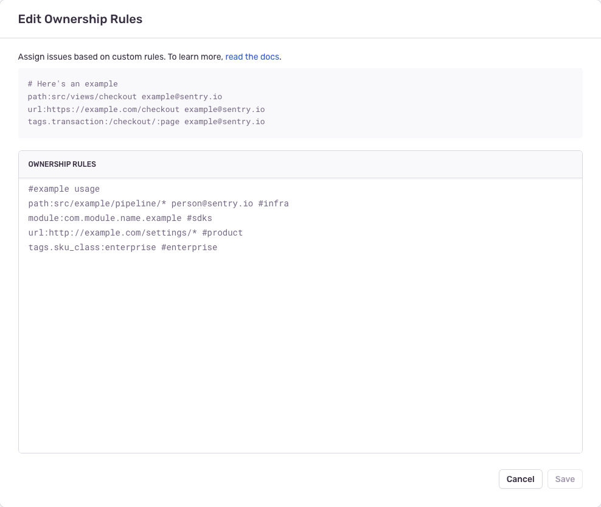

<Include name="only-error-issues-note.mdx" />

Sentry offers multiple ways to define the "ownership" of an issue. With ownership defined, we can automatically assign issues and send alerts to the owner. Sentry defines ownership with _ownership rules_ and _code owners_. Ownership rules can assign issues based on the file paths in the event stack trace, URL of the request, or event tags, and also allow you to override rules in code owners. Code owners functionality lets you import your [GitHub](https://docs.github.com/en/repositories/managing-your-repositorys-settings-and-features/customizing-your-repository/about-code-owners) or [GitLab](https://docs.gitlab.com/ee/user/project/code_owners.html) CODEOWNERS file and assign issues based on the file paths in the event stack trace.

Once an issue has been assigned, whether manually by a user or automatically by Sentry, future auto-assignment will be turned off for that issue.

### Ownership Rules

You can set ownership by defining ownership rules per project. To configure ownership rules, navigate to **[Project] > Settings > Ownership Rules**, or click on the "Create Ownership Rule" button on an **Issue Details** page.

Types of matches available:

1. Path: matches against all file paths in the event's stack trace
2. Module: matches against the module in the event's stack trace
3. URL: matches against the event's `url`
4. Tag: matches against event tags

The general format of a rule is: `type:pattern owners`

 - **`type`** - Can be either `path`, `module`, `url`, or `tags.TAG_NAME`, which matches the specified tag.
 - **`pattern`** - The pattern you're matching on, which supports unix-style [glob syntax](<https://en.wikipedia.org/wiki/Glob_(programming)>). For example, add `*` to match anything and `?` to match a single character. _This is not a regex._ For example:
   - `src/javascript/*.[tj]sx` for a `path` type
   - `com.example.app` for a `module` type
   - `https://www.example.io/v/[0-9]/checkout` for a `url` type
   - `Chrome 81.0.?` for a `tags.browser` type
 - **`owners`** - The owner or a list of owners, separated by a space. Owners can be identified by either the Sentry user's email or the name of the team, prefixed with `#`. For example:
   - `example@company.com`
   - `example1@company.com example2@company.com`
   - `#backend-team`

Teams _must_ have access to the project to become owners. To grant a team access to a project, navigate to **[Project] > Settings > Project Teams**, and click "Add Team".

To grant a user access to a project, the user must be a member of a team with access to the project. To add a user to a team, navigate to **Settings > Teams**, select a team, and click "Add Member".

You can add an ownership rule from **[Project] > Settings > Ownership Rules** and click "Edit Rules":



You can also add an ownership rule from the **Issue Details** page by clicking the cog icon in the "Assigned To" section of the sidebar:


When you create a rule from the **Issue Details** page, you'll see some suggested paths and URLs based on the events in the issue. Note that [sentry.io](https://sentry.io) doesn't suggest tags.

### Code Owners

<Include name="feature-available-for-plan-business.mdx" />


Import your CODEOWNERS file and use it alongside your ownership rules to assign Sentry issues. A prerequisite for this feature is the **Code Mappings** from [stack trace linking](/organization/integrations/source-code-mgmt/github/#stack-trace-linking).

To quickly setup a code mapping for a project:

1.  Go to an issue in your project. You should see the following option to link to your source code in the stack trace:
    
2.  When you click the link, a modal will open. Enter the source code URL from GitHub/GitLab corresponding to stack trace filename and we'll automatically create the code mapping and set up stack trace linking for the project.

Now that we have code mappings, we are able to transform the paths in your CODEOWNERS file to your expected build output. For example, you may build your program in a `dist/` folder, but that will not be in your CODEOWNERS. However the `dist/` prefix is captured in the stack trace's file paths. Code mappings allow Sentry to figure out how to normalize the file paths between your build output and the CODEOWNERS paths.

You can import and incrementally add the mappings between your "source control teams/users" and "Sentry Teams/users", using [external team/user mappings](/product/issues/ownership-rules/#external-teamuser-mappings). Sentry uses the "external team/user mappings" to convert the owners in your CODEOWNERS file into their equivalents in Sentry. Sentry will automatically ignore rules that are missing team/user mappings.

We support GitHub CODEOWNERS file syntax. You can find more details about the syntax [in GitHub's documentation](https://docs.github.com/en/github/creating-cloning-and-archiving-repositories/creating-a-repository-on-github/about-code-owners), including [details on unsupported syntax](https://docs.github.com/en/github/creating-cloning-and-archiving-repositories/creating-a-repository-on-github/about-code-owners#syntax-exceptions), with one exception: we do not support exclusions (lines without owners). 

Note that we do not support [GitLab CODEOWNERS syntax](https://docs.gitlab.com/user/project/codeowners/reference) that isn't also supported by GitHub. For example, we do not support sections, `!` negations, etc.

<Alert>

Ownership rules take precedence over the information provided by your CODEOWNERS file when Sentry assigns issues.

</Alert>

#### Limitations

We support CODEOWNERS files with a maximum size of 3MB. If your file exceeds this, we suggest using wildcard rules to consolidate multiple entries into one.

#### External Team/User Mappings


Create external team/user mappings for your GitHub/GitLab teams and users by navigating to **Settings > Integrations > GitHub/GitLab > [Configuration] > Team Mappings/User Mappings**. Suggestions will come from any CODEOWNERS files on projects for the organization.

## Evaluation Flow

Ownership rules and code owners are matched against individual events in an issue. Sentry evaluates an event by checking if _any_ of its in-app stack trace frames match a rule from:

1. Code owners, top-to-bottom
2. Ownership rules, top-to-bottom

The _last_ rule that matches for an event is used for issue assignment. If there are multiple owners in a rule, we take the leftmost owner. The order of in-app stack trace frames in an event is not used in determining the rule assignment.

### Example

Sentry receives an event with the following stack trace:
- `models/UserModel.py` (frame 1)
- `backend/endpoints/auth/user.py` (frame 2)
- `backend/api/base.py` (frame 3)

**Code Owners:**

```bash
# Frontend
*.js                               @frontend-team
*.tsx                              @frontend-team

# Backend
backend/                           @engineering-team
models/                            @models-team
backend/api/                       @api-team
```

**Ownership Rules:**

```text
path:backend/endpoints/*           #api-team
path:backend/endpoints/auth/*      #auth-team #enterprise-team
```

For this event, we:

1. Evaluate against the code owners top-to-bottom; we get three matches.
2. Evaluate against the ownership rules top-to-bottom; we get two matches.

The matches, in order, are:

```
[
  "codeowners:backend/                #engineering-team",           # match on frame 2 and 3
  "codeowners:models/                 #models-team",                # match on frame 1
  "codeowners:backend/api/            #api-team",                   # match on frame 3
  "path:backend/endpoints/*           #api-team",                   # match on frame 2
  "path:backend/endpoints/auth/*      #auth-team #enterprise-team", # match on frame 2
]
```

Sentry will return the last matching rule, which in this case is `path:backend/endpoints/auth/* #auth-team #enterprise-team`. Although there are two owners in the last matching rule, Sentry will assign the issue to the first owner, `#auth-team`. 

## Where It's Applied

Once ownership rules are configured, they're applied in the following ways:

### Suggested Assignees

On the **Issue Details** page, you'll see suggested assignees based on ownership rules matching the event, and [suspect commits](/product/releases/suspect-commits/). You can manually assign the issue to a suggested assignee by selecting one from the dropdown. An event can have multiple suggested assignees if it matches multiple ownership rules.


### Auto-Assignment

You can automatically assign issues to their owners by enabling the "Auto-assign to issue owner" setting in **[Project] > Settings > Ownership Rules**.


If an issue has been assigned in the past, manually or automatically, new events will not change the current assignee. If an issue has not been assigned and a new event has multiple owners, Sentry assigns it to the owner(s) from the last matching rule (regardless of the rule `type`).

Please keep in mind that auto-assignment may be skipped if a project is creating too many new issues at a given time due to rate limits. We'll try to auto-assign it the next time an event comes in for those skipped issues. If you are encountering this limit with non-recurring issues, you may want to take a look at [issue grouping](/concepts/data-management/event-grouping/) strategies.


## Troubleshooting

Ensure that all teams and users have the correct access to the project. If they don't, Ownership Rules will fail to save. To grant a team access to a project, navigate to **[Project] > Settings > Project Teams**, and click "Add Team". Users need to have at least member-level access to the team that's associated with the project. To grant a user access to the team that's associated with the project, navigate to **Settings > Teams**, select a team, and then click "Add Member".
