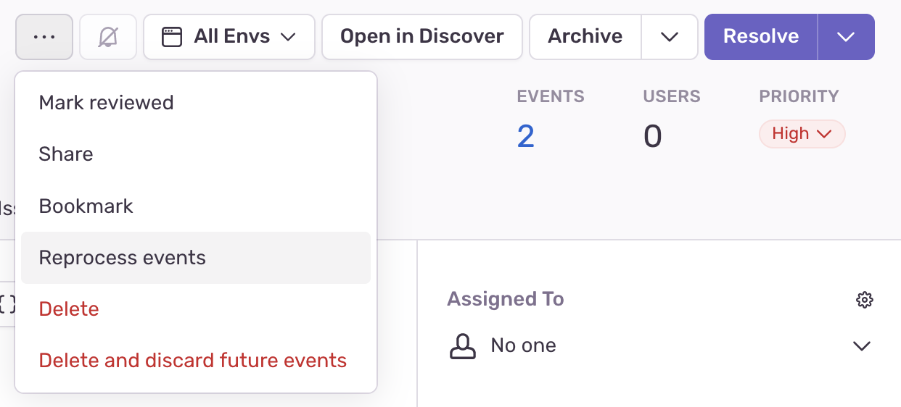

Sentry uses [debug information
files](/platforms/native/data-management/debug-files/) only after they have been uploaded. _Reprocessing_ allows you to apply debug information files to error events that have already occurred.

<Include name="feature-available-for-user-group-early-adopter.mdx" />

<Include name="only-error-issues-note.mdx" />

After becoming an Early Adopter, you will find a new action when viewing an issue:

The dialog requires two answers:

- How many events to reprocess: When left empty, all events are reprocessed
  and potentially move to other (new or existing) issues if the stack trace
  changed significantly. If you provide a number, for example, 20, then the 20 most recent events are
  reprocessed, and any remaining events are left as-is.

- What to do with remaining events: If you choose to reprocess, for example, only 20
  events out of 100, you can choose what happens to the remaining 80 events.
  The default is to keep them where they are (the issue you're viewing).
  Alternately, you may choose to delete them.

After pressing "Reprocess Events", **the issue is locked and hidden from
your issue stream while reprocessing is ongoing.** As data is migrated between
issues, [sentry.io](https://sentry.io) doesn't allow any actions, such as resolving or assigning the issue, to ensure
data consistency and to avoid data loss.

Note that you can still get to the issue manually by searching for
`is:reprocessing` (removing all other search terms) if you need to.

## Caveats

The dialog to start reprocessing notes a few caveats that you
should be aware of and understand before you begin reprocessing.

- **Data glitches.** During reprocessing you may observe temporary data
  inconsistencies across the entire product. You may observe that an event belongs to
  two issues at once, and appears in Discover queries twice.

  Those inconsistencies disappear when reprocessing is complete. However,
  depending on your platform and the number of events involved, reprocessing may take a
  while.

- **Attachment storage needs to be enabled.** If your events come from
  minidumps or unreal crash reports, you must have [attachment
  storage](/platforms/native/enriching-events/attachments/#crash-reports-and-privacy)
  enabled. **If the original minidump no longer exists in Sentry, sending an
  event through reprocessing will cause it to have no stack trace at all.**

- **Quota applies.** Every event you choose to reprocess counts against
  your plan's quota a second time. Rate limits and spike protection do not
  apply.

- **Debug files don't apply immediately.** When you upload debug information
  files, regardless of whether you upload to your own symbol server or to Sentry, the debug information files are
  applied only one hour after internal caches have expired. Please wait
  at least an hour after uploading DIFs before reprocessing.

- **Alerts do not apply, with caveats.** Issue alerts do not trigger for
  reprocessed events, and the new events are not subject to data forwarding.

  Metric alerts generally do not trigger either. However, they are subject to the
  data inconsistencies listed above. If you've created a metric alert with
  a 24-hour measurement window, and an event you reprocess happened in the last
  24 hours, it will temporarily be counted twice while events are reprocessing.
  This may trigger a metric alert.
